GAN背后的两种模型：**生成器**和**鉴别器**，二者不断对抗使得模型效果变好

generative models:生成器，包括GANs 

discriminative models：鉴别器，之前的SVM，CNN等模型就是经典的鉴别器

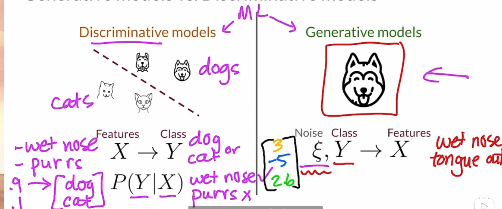

左边是识别器,通过特征判断**X**的类别

右边是生成器,通过噪声**ξ**和类别**Y**生成图片X,

GAN，全称 Generative Adversarial Nets，中文名是生成对抗式网络

变分自编码器（variational autoencoder, VAE）

###### VAE:

通过一个编码器Encoder和解码器Decoder来得到结果

1. 给Encoder喂食,输入真实数据,得到一个向量(理解为隐藏空间中的一个点)

2. 向量输入Decoder,输出图片和原真实图片比较(Decoder无法完全重建原始数据)

   注意,这里输入的向量通常是带噪音的以增强鲁棒性

3. 算loss然后修正编码器Encoder和解码器Decoder

训练结束后,选择隐藏空间中的一个随机点,即可生成一个虚假数据

###### GAN:

通过一个生成器generator和鉴别器discriminator来得到结果

1. 生成器generator:类似于Encoder,根据输入的向量来得到一个输出,但是没有decoder的输出值,而是直接用随机生成的噪音
2. 鉴别器discriminator同时识别生成器generator生成的数据和真实数据,并试着找出哪些是真实数据
3. 在不断竞争下生成器generator的输出逐渐趋于真实,而鉴别器discriminator的识别率(对于生成器generator的数据真假的识别率)不断提高
4. 训练完成后,随机输入的噪声可以得到一个类真实的输出

总结一下:生成器generator负责生成假数据以骗过鉴别器discriminator

鉴别器discriminator负责分类分出真假类


生成器根据噪声向量重建样本，该样本应与训练分布不可区分

生成器是主要的目标，一旦我们对它的结果满意，就可以丢弃鉴别器

由于这两个神经网络都是可微的，我们可以使用它们的梯度来引导它们朝着正确的方向

1-4 real-life-gans

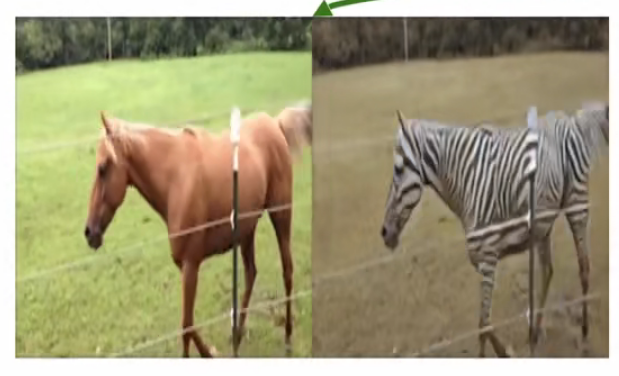

gan甚至可以将一个域转换为另外一个域,上面的图片将马的动作变成了斑马

当然也可以用于静物变动(比如之前的图片唱歌等),3D建模(输入描述(和噪音),输出建模)

1-5 intuition behind gans(gans背后的运算法则)

一开始生成器generator不知道怎么生成类似的图片,效果很垃圾

而一开始鉴别器discriminator也难以分辨真假

这两个模型在训练过程中相互竞争：生成器G正在努力欺骗鉴别器，而鉴别器D正在努力不被骗。两个模型之间的这种有趣的零和博弈促使两者都改进其功能。


**如果有一个伪随机数程序能够生成 [0,1] 之间的均匀随机数，那么如何由它来生成服从正态分布的伪随机数？比如怎么将 U[0,1] 映射成 N(0,1)？**

将 X∼U[0,1] 经过函数 Y=f(X) 映射之后，就有 Y∼N(0,1) 了。设 ρ(x) 是 U[0,1] 是概率密度函数，那么 [x,x+dx] 和 [y,y+dy] 这两个区间的概率应该相等，而根据概率密度定义，ρ(x) 不是概率，ρ(x)dx 才是概率，因此有

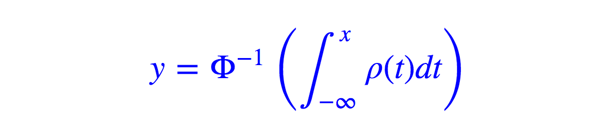

显然,这个函数相当复杂

现在我们将问题一般化：**如何找到映射 Y=f(X)，把服从均匀分布 X 映射到指定的分布？在一般情形下，这个指定的分布是通过给出一批具体的分布样本 Z=(z1,z2,…,zN) 来描述的（比如，给出一批服从正态分布的随机数，而不是给出概率密度**


).

GAN 也是希望把均匀的随机噪声映射成特定分布，这个特定分布由一组“正样本”描述。

**为什么 GAN 可以将噪声变换成正样本？事实上 GAN 并不是学习噪声到正样本的变换，而是学习均匀分布到指定分布的变换**

即从学习特征所对应的值 到 学习一个变换(f)

而这个变换当然相当复杂不好找,所以用一个神经网络G(X,θ)去拟合

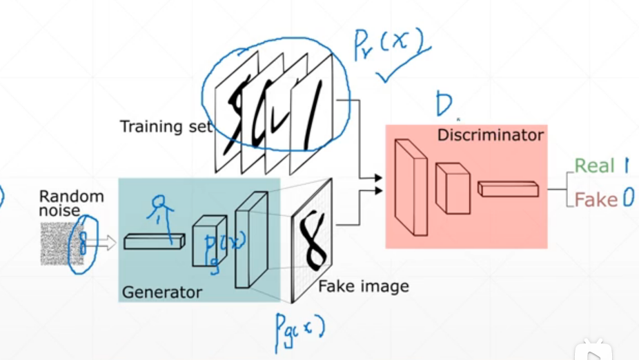

如上图, Generator训练到位时,Pg(x)≈Pr(x) ,即分布接近,使得真假难辨


https://blog.csdn.net/weixin_26752765/article/details/108133106论文的细述


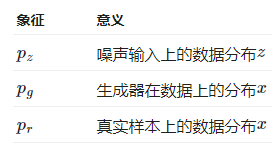

一方面，我们要确保鉴别器D对真实数据的决策是准确的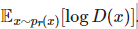 同时，给定一个假样本G(z),z～p_z (z)，判别器预计输出一个概率，D(G(z)), 而且要最大化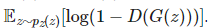


另一方面，对生成器进行训练以增加D产生一个假例子的概率，从而最小化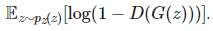

将这两个方面结合在一起时，D和G正在玩一个**极小极大游戏**，我们应该优化以下损失函数：

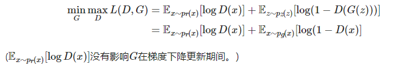

即对于G,希望这个L(D,G)小;对于D,希望这个L(D,G)大,二者共用一个L函数,不过求的梯度方向不一样

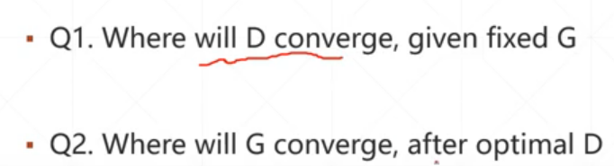

**先学D,再学G**,这两者的学习是有先后之分的

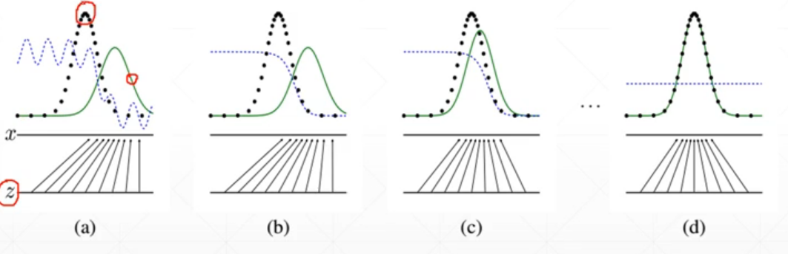

绿线为为G的生成值,黑线真实分布(distribution),蓝线为对假值和真值的区分

黑线不变的情况下绿线向黑线拟合,使得绿(G)和黑(R)难以被蓝(D)分开

真实数据的分布不会变，所以黑色线是真实数据分布，绿色线是生成数据的分布，蓝色是判别器的打分

图片下方为z到x的映射(正常情况下是一个深度神经网络)


###### 目标:

 回顾我们训练的最终目标：生成器必须能够欺骗鉴别器。 这意味着，G的分布*P_G，*必须等于数据集的分布*P_DATA。* 然而，这一点，我们可能不希望*P_G*恰好等于*P_DATA。* 要了解为什么会出现这种情况，请考虑数据集中存在异常值的情况。 如果我们训练生成器以产生具有精确分布p_data的 输出，由于这些异常值，我们的生成器将不可避免地产生一些错误的输出。 这就是为什么我们希望我们的分布近似相等。

即:


##### 最优鉴别器存在的证明 **(**Proof that the Optimal Discriminator Exists**)**

勾勒出我们的算法后，我们仍然需要证明它能够完成其设定的工作。 即，我们想证明我们的算法产生了最优的鉴别器，记为*D* *。因为D*是最大值,所以

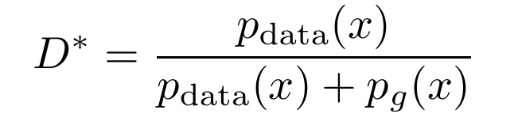

显然D*(x)=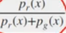∈[0,1]

对(the value function written using integrals使用积分编写的值函数**V**)

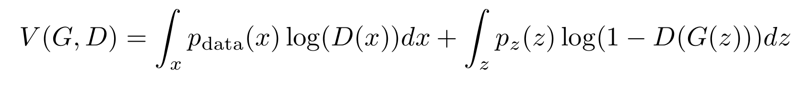

我们可以从此处进行“变量的更改”。 即，我们用*x*替换*G* ( *z* )并将分布从*p_z*更改为*p_g* 。 这实际上是根据*G*产生的输出来重写第二项(判别器D固定)。

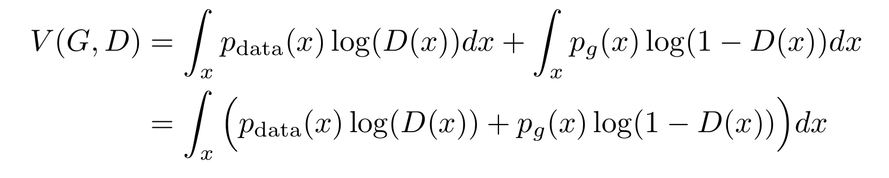

从而有上式,即简化了价值函数

而因为D被固定了,即Pr(x)和Pg(x)分布被固定,即积分部分为常量

由上面D*(x)为极值点可知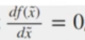,带入下面f(x)可知

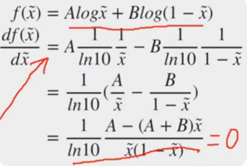

从而求出x 


信息量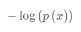,p为概率

信息熵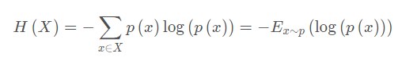

交叉熵: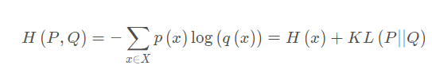

同样用于衡量相似度,CNN等常用

#### KL散度（Kullback-Leibler Divergenc）

也被成为相对熵

用量衡量P分布(真实分布)和Q分布(训练出来)的距离(不是真正意义的距离）
更像是衡量一个分布相比另一个分布的信息损失
越小越相似

对于离散随机变量，其概率分布P和Q的KL散度可按下式定义为：}{P(i)}.gif)

等价于

​                                         }{Q(i)}.gif)

即按概率P求得的P和Q的对数商的期望值。KL散度仅当概率P和Q各自总和均为1，且对于任何皆满足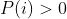及时，才有定义。

对于连续随机变量，其概率分布P和Q可按积分方式定义为：

​                                         }{q(x)}dx.gif) 

其中和分别表示分布和的密度。

##### 【特性】

◎ 相对熵的值为非负数：

​                                                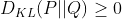

 尽管从直觉上KL散度是个度量或距离函数, 但是它实际上**并不是一个真正的度量或距离。因为KL散度*不具有对称性**：从分布P到Q的距离通常并不等于从Q到P的距离。

​                                            

##### 2. JS散度 	Jensen-Shannon divergence

##### 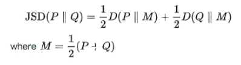

JS散度是**对称的**，另外，KL与JS都存在一个问题，在很极端的情况下，KL值没有意义，JS会趋于一个常数，这样在算法中梯度变为了0.

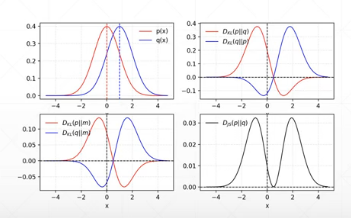


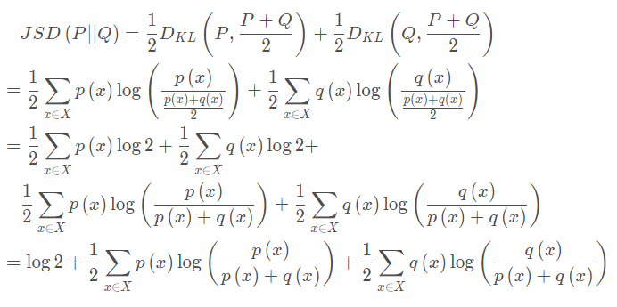

解一下得到 D_JS=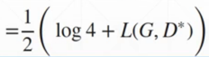

L(G,D*)参考上面讲的价值函数,就能发现刚刚好能消项

则得到价值函数L的方程

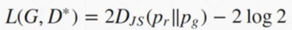

那么D*固定以后,G要得到L_min 时,D_js=0,即P_r=P_g

### 

#### 1.DC( **Deep Convolutional**)GAN

生成器和判别器**特征提取层用卷积神经网络代替**了原始GAN中的**多层感知机** 

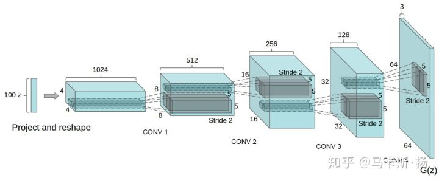

Transposed Convolutional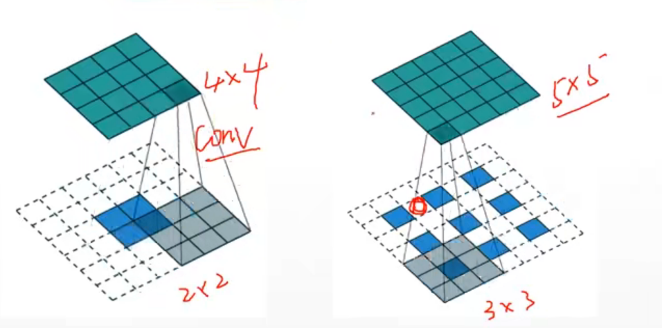

通过这样一个Convolutional,使得图像不断变大


Training Stability:训练稳定性问题:找不到合适的


刚开始未训练时,P_G and P_z 两个分布不重叠(overlap)的可能性非常大的

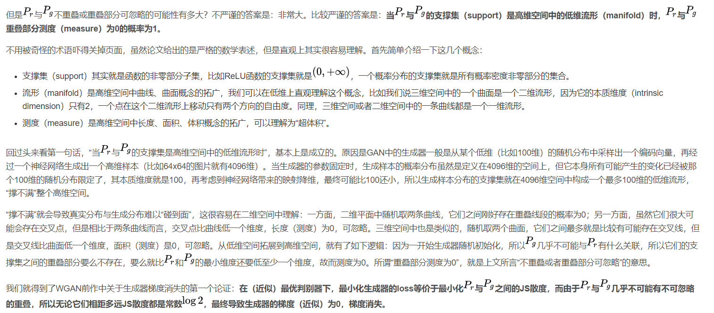

https://blog.csdn.net/omnispace/article/details/54942668,看看这个辅助理解

不重叠则导致了D_JS=log2,D_KL=∞,D_JS和D_KL的梯度=0,无法进行梯度更新

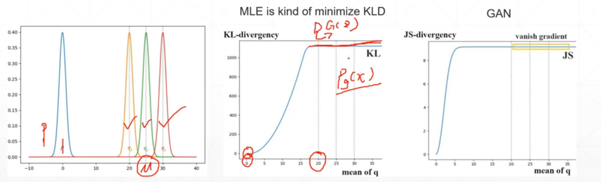

如图,对于q1,q2,q3,JS梯度都为0,即梯度弥散 

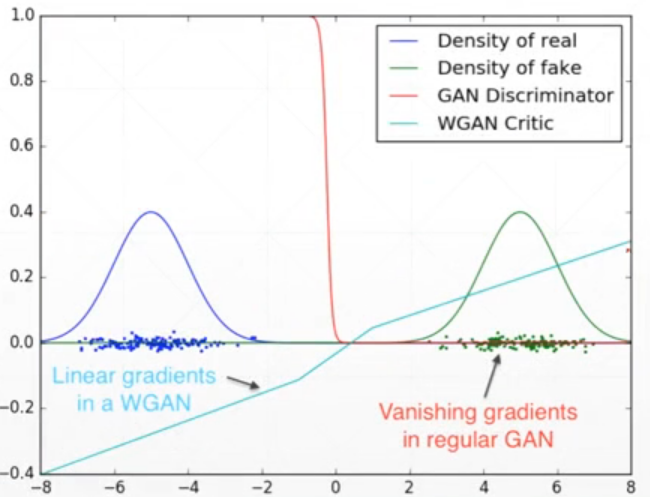

即**判别器越好，生成器梯度消失越严重。**

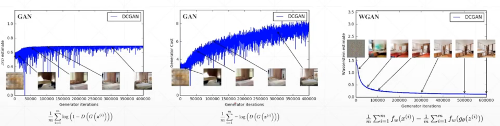

三图对比:

图一的D_JS在一定范围内不再变化,原因是进入了梯队弥散

图二是G的loss不断提升(正常)


#### 3、第二种损失形式的问题

生成器改进的损失形式：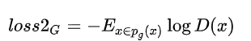

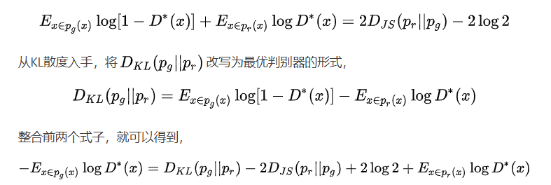

上式就是在最优判别器的情况下，生成器等价的目标函数，式子最后一项是不随生成器改变的，所以可以看到有问题的地方了！

第一，生成器的目标变成了，**要最小化生成分布与真实分布的KL散度，同时又要最大化两者的JS散度，这种矛盾的目标会让生成器的优化方向发生错误**。
 第二，第一项的KL散度，对两种分布拟合程度的刻画是不对称的，当%5Crightarrow%200%EF%BC%8Cp_g(x)%5Crightarrow%201)时，两者的KL散度会逼近无穷大。说明**当生成器输出了不太真实的样本时，为其自身带来的惩罚是巨大的，所以生成器就会倾向于生成一些重复但安全的样本，以避免惩罚，这导致了模型缺乏多样性，即模式崩溃**。


#### Wasserstein distance（EM距离的改进)

**Wasserstein距离相比KL散度、JS散度的优越性在于，即便两个分布没有重叠，Wasserstein距离仍然能够反映它们的远近。**


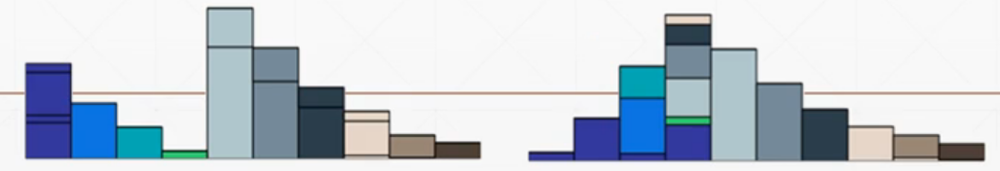

从左图变右图,需要分割长的方块,填补短的方块

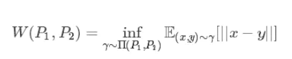

可以理解为Wasserstein距离就是把分布P_1搬到P_2所需要的最小消耗，因此也可以**用来表示神经网络拟合出的分布到真实分布之间的距离**  。

相比于KL散度和JS散度，EM距离的优势在于：**当两个分布没有重叠或者重叠部分很少时，也可以表示它们之间的距离，是一种平滑、积累的计算方式。**(缓解梯度弥散)

WGAN与原始GAN第一种形式相比，改了以下四点：

- 判别器最后一层去掉sigmoid
- 生成器和判别器的loss不取log
- 每次更新判别器的参数之后把它们的绝对值截断到不超过一个固定常数c
- 不要用基于动量的优化算法（包括momentum和Adam），推荐RMSProp，SGD也行

WGAN判别器的损失函数为：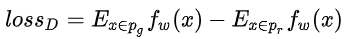

生成器的损失函数为：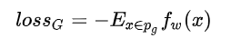

利用一个**参数数值范围受限的判别器** **神经网络**来最大化这个形式，就可以近似Wasserstein距离。

参数数值范围受限: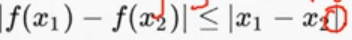

以上的限制条件使得参数的梯度较为平滑(∈(0,1))

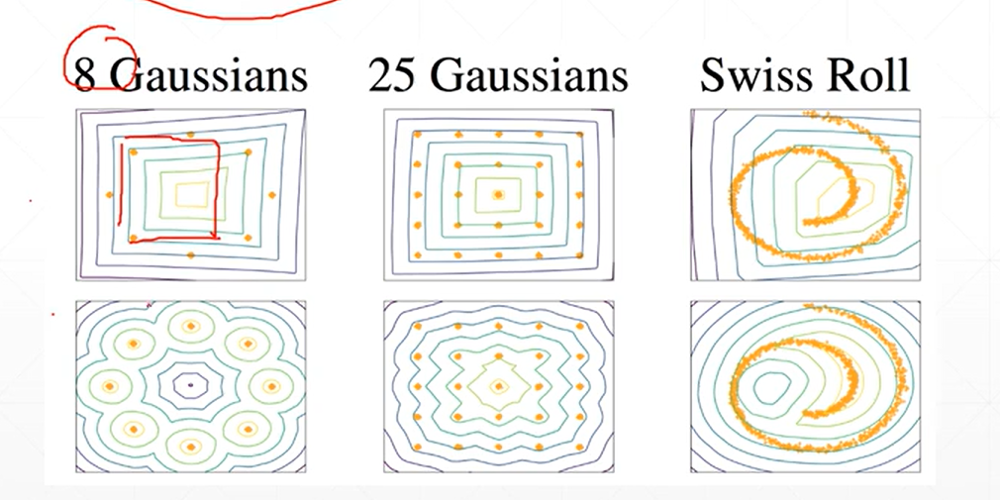

上面是加了regularization的,下面是没加的,对比一下显然是加了的更平整

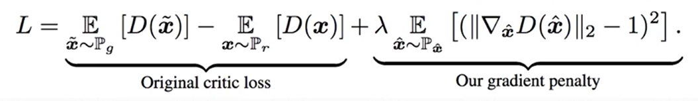

WGAN的loss由两部分组成,前部分和原GAN相同,

后部分满足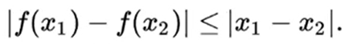,所以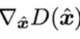最好处于(0,1),数学表达则是求(二范数-1)^2也作为loss,从而起到限制条件的效果,λ用于调整效果

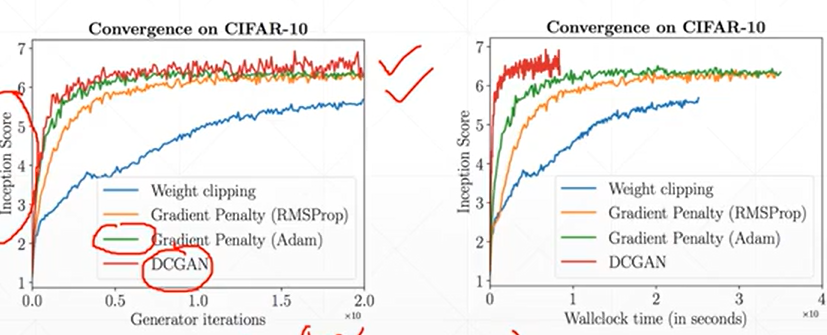

实际操作上,DCGAN效果是好于WGAN的,但是

DCGAN**需要精心设计,多次调参以避开梯度弥散**

而WGAN不需要复杂操作,简单便捷,毕竟简单通用才是第一位的


在./GAN project/gan.py	中，模拟了一次训练

而运行可发现，过了一下梯度就不更新了，loss_D 和loss_G固定为0.0 -1.0

符合我们上面描述的GAN的缺点

而具体的一些图表的表现见https://www.bilibili.com/video/BV1fK4y187uC?p=11&spm_id_from=pageDriver视频后半段即可

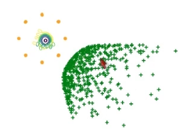

如图，预测点和实际点分隔远，导致loss无法收敛

### WGAN 

而GAN和WGAN'的区别在于，WGAN只需要加上一个约束量gp，gp由函数

```python
def gradient_penalty(D, xr, xf):
```

得到

```python
def gradient_penalty(D, xr, xf):
    """

    :param D:
    :param xr:[b,2]
    :param xf:[b,2]
    :return:
    """
    LAMBDA = 0.3

    # only constrait for Discriminator
    xf = xf.detach()
    xr = xr.detach()

    # [b, 1] => [b, 2]
    alpha = torch.rand(batchsz, 1).cuda()
    alpha = alpha.expand_as(xr)#拓展tensor的形状 

    interpolates = alpha * xr + ((1 - alpha) * xf)	
    #需要导数信息
    interpolates.requires_grad_()

    disc_interpolates = D(interpolates)
    
#和一般的神经网络不一样,需要输入输出等参数要自己设定
    gradients = autograd.grad(outputs=disc_interpolates, inputs=interpolates,
                              grad_outputs=torch.ones_like(disc_interpolates),
  #create_graph=True       
  #retain_graph=True   ,二阶求导需要保留梯度信息                       
                              create_graph=True, retain_graph=True, only_inputs=True)[0]

    #(gradients.norm(2, dim=1)求二范数后-1再平方求均值
    gp = ((gradients.norm(2, dim=1) - 1) ** 2).mean() * LAMBDA

    return gp

```


```python
interpolates = alpha * xr + ((1 - alpha) * xf)	
interpolates.requires_grad_()
```

是这部分

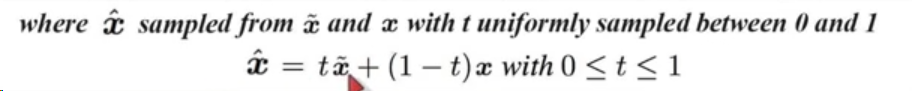

D(x)对x_hat求导,x是不需要求导的


函数对于下面公式

```python
gp = ((gradients.norm(2, dim=1) - 1) ** 2).mean() * LAMBDA
```

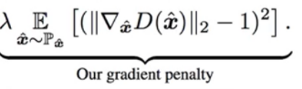

是这部分,.requires_grad_()因为要对它求导

再main函数中

```python
xf = G(z).detach()
```

因为xf由G生成,是有梯度信息的,这里不需要对G求导,所以需要截停
