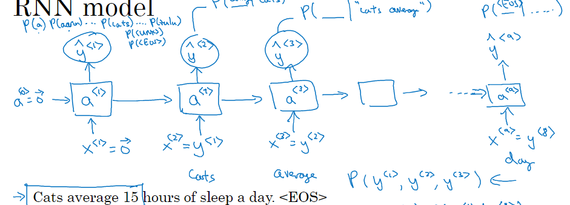
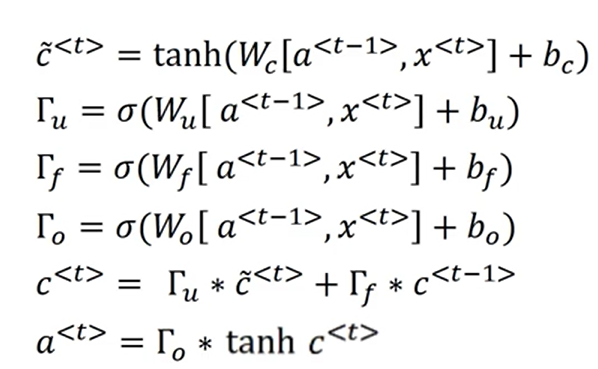

对于不同层的学习，允许使用不同的激活函数
一般而言tanh函数都优于Sigmoid函数，因为tanh函数的平均值为0，符合数据中心化，下一层学习中心化（除了输出层，输出0-1更合理）
然而，值较 大/小 时，tanh和sigmoid函数的梯度（斜率）很小， 所以
通常意义下，线性整流函数指代数学中的斜坡函数，即

而在神经网络中，Relu)线性整流作为神经元的激活函数，定义了该神经元在线性变换之后的非线性输出结果。换言之，对于进入神经元的来自上一层神经网络的输入向量，使用线性整流激活函数的神经元会输出
                                                            max(0,w^T x +b)
至下一层神经元或作为整个神经网络的输出（取决现神经元在网络结构中所处位置）

通常来说，用Rule来做激活函数学习比用tanh和sigmoid快得多(梯度不会随着数值增加而减缓，从而降低学习效率)，

sigmoid：除非在二元分类输出层，不然别用      dg(x)/dx=g(x)*(1-g(x))


tanh：大多数情况下比sigmoid更好用        dg(x)/dx=1-g^2(x)


relu or leaky Relu：最常用的默认激活函数     =0.01λ


对于深度学习而言，多次线性隐层与没有线性隐层是一样的，因为最终都可以直接由输出函数直接得到，线性隐层毫无效果
**非线性隐层才是关键**


back propagation反向传播：链式求导法则

梯度下降法如图所示


###### 随机初始化：
如果使用完全相同的w和b，会导致反向传播的导数完全相同，不随机化，归纳后绝大多数的激活函数的w都会变成相同的
（都在运行相同函数，对学习没有帮助）
所以w最好进行高斯随机化，而b则可以随机成0
w随机成较小接近与0的数最好，这样梯度较大，学习较快
###### 何初始化He Initialization
正向传播时，状态值的方差保持不变；反向传播时，关于激活值的梯度的方差保持不变。对应Relu 和 Prelu。
任意层的权重 w_l，应该按照均值为 0，且方差为**sqrt(2/n_l)** 的高斯分布进行初始化，这样才能保证每一层的输入方差尺度一致。
对Prelu，应该按照均值为 0，且方差为**sqrt(2/n_l/(1+a^2))** 的高斯分布进行初始化，这样才能保证每一层的输入方差尺度一致
API举例
```
 L = len(layers_dims) - 1 # integer representing the number of layers表示层数的整数
for l in range(1, L + 1):
        #(≈ 2 lines of code)
        # parameters['W' + str(l)] = 
        # parameters['b' + str(l)] =
        # YOUR CODE STARTS HERE
        parameters['W' + str(l)] = np.random.randn(layers_dims[l], layers_dims[l-1]) * np.sqrt(2./layers_dims[l-1])
        parameters['b' + str(l)] = np.zeros((layers_dims[l], 1))
```
#### 感知机:

   0
          {1   Σ符合条件
a=	    {
		  {0         others   

1. 线性，转化为二维图像中，则为仅一条直线可以划分的两个区域，输入x1，x2后在点若一个区域则输出0，在另外一个区域则输出1

2. 特性: 与 或 非 三种基本感知机

与门： 仅  x1=1且 x2=1时才输出1，即仅当符合x1=1且 x2=1时，加权综合才会超过给定阈值从而输出1
或门： 当  x1=1或 x2=1时才输出1，即仅当符合x1=0且 x2=0时，加权综合才会低于给定阈值从而输出0
非门：  以上对于x1 x2 的权重 w1,w2取负值时为非与门和非或门

3. 局限：感知机是线性的，所以在二维直角坐标系上输出的划分必然只由一条直线完成

异或门：仅当x1=1,x2=0或者x1=0,x2=1时有输出1，其余为0，由二维图像可知，这显然是不可能的

如图，一条直线显然无法划分异或门功能
4. 既然单层感知机能实现1条直线对区域的划分，那多个感知机的组合呢（多条直线划分区域）：


一般而言，通过

	与或非门->半加器全加器->ALU(算数逻辑单元)->CPU
的形式实现计算机的逻辑运算


### 神经网络

如图，最左边的是输入层，红色右边部分是输出层，中间x_1部分是中间(隐藏)层


##### 激活函数activation function:

	将输入的信号总和转换为输出信号


即输入值经过计算以后，再通过激活函数转换成新的输出(下一层的输入函数)

神经网络详情可见深度学习入门59页的内容

对于一个常规线性神经网络
w^[t]: (n^[t],n^[t-1])     即前面的是本层神经元数，后面是上一层神经元数，点乘的时候用转置即可
b^[t]: (n^[t],1)		
dw^[t]: (n^[t],n^[t-1])  	反向传播和正向传播维度相同
dz da同理

#### 为什么不大但足够深的神经网络好用
https://mooc.study.163.com/learn/2001281002?tid=2403041000#/learn/content?type=detail&id=2403379438&cid=2403403272
视频中举例:假设使用边缘检测函数充当神经元神经元间的激活函数(实际肯定更复杂)，把检测到的边缘组成面部的不同部分，多个神经元组合可以检测人脸的不同部分，最后组合就可以识别不同的人脸

如图：检索从小到大，从简单组成复杂 ，从低层次组合到高层次


### 反向传播：
dZ^[l]=dA^[l]*g^[l]'(z[l])
dW^[l]=dZ[l]*A^[l-1] T / m
db[l]=np.sim(dZ[l],axis=1,keepdims=True)/m
dA[l-1]=W^[l]T *dZ[l]

对于Logistic回归， 有:
da^[l]=-y/a +(1-y)/1-a  仅对最后一个输出单元

而为了向量化此坐标，就需要如图:

递归多次以得到初始一个向量化反向传播的方法

计算本层的值:
Z=np.dot(W,A)+b

A――上一层的激活（或输入数据）：
W――权重矩阵：形状的numpy数组（当前层的大小，前一层的大小）
b――偏置矢量，形状的numpy数组（当前层的大小，1）

（当前层的大小，前一层的大小)・(上一层的大小，示例数）=(当前层的大小,示例数）


以下部分为作业，讲述了构建神经网络以及其反向传播的函数的建立，例子详细且有中文!!!
https://zhuanlan.zhihu.com/p/406176413

##### 权重初始化
https://www.zhihu.com/question/25403372/answer/987392017
介绍了权重初始化的原因和方法
.png)

避免梯度爆炸和梯度消失，加快训练速度

##### Gradient cheak(梯度检测)
对于一个函数来说，通常有两种计算梯度的方式：

数值梯度（numerical gradient）;
解析梯度（analytic gradient）;
数值梯度的优点是容易编程实现，不要求函数可微，然而，数值梯度缺点很明显，通常是近似解，同时求解速度很慢，因此在设计机器学习目标函数时，通常设计成可微的函数，可以快速地求解其解析梯度，同时这个梯度是确切解。

1. 为何进行梯度检验？
神经网络算法使用反向传播计算目标函数关于每个参数的梯度，可以看做解析梯度。由于计算过程中涉及到的参数很多，反向传播计算的梯度很容易出现误差，导致最后迭代得到效果很差的参数值。

为了确认代码中反向传播计算的梯度是否正确，可以采用梯度检验（gradient check）的方法。通过计算数值梯度，得到梯度的近似值，然后和反向传播得到的梯度进行比较，若两者相差很小的话则证明反向传播的代码是正确无误的。


如图求一个数值梯度

梯度检验的步骤：

首先将每一层的w,b进行连接和组合来组成一个巨大的向量，所以这时J的参数就只有一个大θ

然后用for遍历大θ对大θ中的每一个θ做梯度数值逼近计算，最终得到一个向量dθapprox （这里应该可以使用numpy进行向量化计算，不用for循环遍历）

然后用欧式距离衡量向量dθapprox与向量dθ的相似性，如果计算出欧式距离处于一个较小的值(10^-5甚至更小)，那么我们的梯度检验就获得了成功，如果没有，就说明在反向传播的过程中某一个导数的计算出现了问题

1. 不要将其用到训练过程中 只是用来debug
2. 检验出来反向传播梯度计算有问题后，就应该查看源代码定位问题(看看是哪里的w误差最大)
3. 记住cost function的正则化项
4. 不要和dropput(随机失活)方法一起使用，用了每次的J变化很大，贼难判断有没有问题，(真的想用可以把概率设成1，直接跑一次)
5. 一般来说其会在经过一些训练后使用或者随机初始化后也可以用于检验一下
单层运算代码示例如下
```python
def gradient_check(x, theta, epsilon=1e-7, print_msg=False):   
	theta_plus =theta +epsilon                                # Step 1
    theta_minus =theta -epsilon                                  # Step 2
    J_plus =x*      theta_plus                             # Step 3
    J_minus =x* theta_minus                                  # Step 4
    gradapprox =(J_plus -J_minus)/2/epsilon                               # Step 5
  
    grad = backward_propagation(x, theta)   #这里在其他地方另设函数得到梯度
    
 

    numerator = np.linalg.norm(grad - gradapprox) #求俩grad差的范数                             # Step 1'
    denominator = np.linalg.norm(grad) + np.linalg.norm(gradapprox)   #求俩grad范数的和         # Step 2'
    difference = numerator/denominator 				#求difference								# Step 3'				

    if difference > 2e-7:
		print ("There is a mistake")
	else:
		print("works perfectly fine!")


```


## 机器学习
数据集的分割

分为training set，dev set 和test set
对于大量数据的数据集，dev和test的比例可以更小(有验证效果就可以了)

而偶尔会出现训练集和验证集数据来源不同的情况
此时要确保验证集和测试集的数据来自同一分布(因为你在其他地方得到的大量数据可能与你原始数据有很大程度不同的特征)
为了用dev or test 验证模型的优劣，尽可能保证同一分布
如果不需要无偏评估，可以没有test  

#### 偏差bias和方差variance
for example:
Training error  :1%
Dev error  :10%
这里是高方差variance

for example:
Training error  :10%
Dev error  :11%
这里是高偏差bias

for example:
Training error  :15%
Dev error  :30%
这里是高偏差bias&高方差variance

这里的high bias的高低取决于贝叶斯误差(一般情况下误差的最小值)

high bias ：bigger network	,train longer 	
high variance: more data,regularization（正则 化）
适度正则化有助于不太多 改变偏差并减少方差(防止过拟合，趋向简单的函数 )
##### L2regularization
J(cost)=J_0(原cost函数)+λ*(||w||_2)^2/2m
改变损失函数，使得函数的二范数也处在函数的考虑范围中(使模型更简单更平滑，详见范数  的原理)
λ(lambda)：正则化参数,python中一般用lambd来代替，防止和关键字冲突
||w||_2：参数矩阵的二范数

https://blog.csdn.net/qq_37388085/article/details/104775197?ops_request_misc=%257B%2522request%255Fid%2522%253A%2522163514898416780357289619%2522%252C%2522scm%2522%253A%252220140713.130102334.pc%255Fall.%2522%257D&request_id=163514898416780357289619&biz_id=0&utm_medium=distribute.pc_search_result.none-task-blog-2~all~first_rank_ecpm_v1~rank_v31_ecpm-1-104775197.first_rank_v2_pc_rank_v29&utm_term=weight_decay&spm=1018.2226.3001.4187

此网站介绍了l2正则化(偶尔也叫权重衰减weight decay）
此时cost，dw_[i],w_[i]等函数的定义式都要变化
具体公式如图

但是λ是需要多次搜索从而得到的，代价很高


### Dropout regularization(随机失活)
dropout是用于过拟合的，别还没拟合就随便用

每次forward和backward时，随机消去一些节点
可以使得模型被迫学习更多关于数据集的鲁棒性，输出*0.5时，仅需将训练模型翻倍，即可大幅度提升鲁棒性
在深度学习的Dropout正则化方法中，可以用于生成dropout随机向量（dl），例如（keep_prob表示保留神经元的比例）：
```
dl = np.random.rand(al.shape[0],al.shape[1]) < keep_prob
d1=d1/keep_prob
```
d1/keep_prob使得验证时直接令keep_prob=1即可
##### inverted dropout（反向随机失活）

```python
    Z1 = np.dot(W1, X) + b1
    A1 = relu(Z1)

	D1 = np.random.rand(A1.shape[0], A1.shape[1])     # Step 1: initialize matrix D1 = np.random.rand(..., ...)
    D1 = (D1 < keep_prob)                             # Step 2: convert entries of D1 to 0 or 1 (using keep_prob as the threshold)
    A1 = np.multiply(A1, D1)                          # Step 3: shut down some neurons of A1
    A1 = A1 / keep_prob

```
先进行线性运算，然后再用dropout(multiply 0或者1)
以上，随机对不同隐藏单元归零，梯度下降也是随机的
dropout的反向运算
```python
def backward_propagation_with_dropout(X, Y, cache, keep_prob):
	m = X.shape[1]
   (Z1, D1, A1, W1, b1, Z2, D2, A2, W2, b2, Z3, A3, W3, b3) = cache
	dZ3 = A3 - Y
    dW3 = 1./m * np.dot(dZ3, A2.T)
    db3 = 1./m * np.sum(dZ3, axis=1, keepdims=True)
    dA2 = np.dot(W3.T, dZ3)

    dA2 = np.multiply(dA2, D2)         # Step 1: Apply mask D2 to shut down the same neurons as during the forward propagation
    dA2 = dA2 / keep_prob # Step 2: Scale the value of neurons that haven't been shut down
    
    dZ2 = np.multiply(dA2, np.int64(A2 > 0))
    dW2 = 1./m * np.dot(dZ2, A1.T)
    db2 = 1./m * np.sum(dZ2, axis=1, keepdims=True)
    
    dA1 = np.dot(W2.T, dZ2)

    dA1 = np.multiply(dA1, D1)         # Step 1: Apply mask D1 to shut down the same neurons as during the forward propagation
    dA1 = dA1 / keep_prob  # Step 2: Scale the value of neurons that haven't been shut down
    
    dZ1 = np.multiply(dA1, np.int64(A1 > 0))
    dW1 = 1./m * np.dot(dZ1, X.T)
    db1 = 1./m * np.sum(dZ1, axis=1, keepdims=True)
```


测试的时候就不要dropout了，结果应该是准确的

为了防止某些层过拟合，设置更低的keep_pob是可行的，缺点是要更多的超参数，而甚至输入层和输出层也是可以dropout的 
缺点：调用dropout时不清楚损失函数是否真的减小了，最好每一次训练后都验证一次


##### 数据增强(data argumentation)
对原有数据进行处理从而得到新的数据(如此得到的新数据当然不如真数据可靠，但是可以作为数据过少或者真数据获得难度高时的备用选项)，如采集100000小时的车内说话录音十分困难，但100000小时的正常说话录音是十分简单的，将汽车噪声与正常说话录音叠加即可得到100000小时的车内说话录音(当然此数据不大准确，但是收集成本低，可以作为扩大数据集的手段(虽然这种数据信息较少，但是不完全是没用的，而且花费很少))

another example：
对于图片训练，方法有：左右翻转、随机裁剪、旋转、平移、噪声扰动、亮度对比度变换，色彩推移(Colorshift)等许多简单高效的方法；

其作用是增大数据集且提高泛化效果(鲁棒性)，随手百度都有很多讲解
###### early stopping
避免对training set和dev set过拟合导致和test set相距甚远
不需要多次尝试λ，降低运算量
#### Normalizing input(归一化输入)
μ：均值   σ^2方差(通过每一批数据计算得到的值，
x_[i]`=(x^[i]-μ)/σ^2 

通过以上公式，使得均值为0,方差为1 (这里的μ和 σ^2应该是整个数据集的而非仅仅只是训练集的)
从而使得值域在0附近，使得有如下图，可以避免选择大学习率导致左图的弥散情况，提高学习速度

## some for machine learning strategy
机器学习策略部分内容
为了快速筛选出有效方法来训练模型，分析机器学习问题


#### 正交化
为了调整某些参数时不会影响其他部分的表现，每一个调整都是独立的

##### 循环修正
为了达到最好效果，不断提出修正并尝试，以找出最合适的参数

 

如图，有多个评估指标，难以快速筛选出最需要的，可以考虑F1分数(即对部分数据加权or其他处理，得到明确单一指标来衡量)

有多个指标，选择一个作为优化指标(考虑其他条件符合时它最大化)是合理的，尽可能优化它 ，其余为满足指标，同样容易得出结果

为了避免测试时效果不理想，可以考虑将所有数据混合训练，避免训练目标与实际目标不匹配

有的筛选效果可能更好，但是error中有部分结果是完全不能接受的，也需要淘汰(如猫猫图中夹杂furry，公司不可能接受)，从任务条件上考虑这种算法是不合格的，所以评估指标不一定能完全展现算法的优劣，此时要改变开发集，测试集(more data ，改标签)或者改变评估指标(加权重，增大furry的惩罚权重)。

所以面对问题时我们可以先定义一个大致的权重，再分开考虑怎么改善系统在该指标的表现

再者，有时测试集和训练集的元素很完美很符合通用特征，但实际应用中存在部分极端例子，这十分容易导致结果与测试效果大相径庭，因此偶尔使用极端化例子(符合正态分布or高斯分布?)，选用在test上表现不是最好的模型反而可能更好


rt:开发测试集与实际应用差距很大，开发测试集都是高质量图像，用户上传低质量图像时的实际效果难以预估，此时应改变开发测试集，使测试数据更符合实际数据，结果更契合实际结果

###### 分类
规模小：7:3    6:2:2                  train训练   dev开发    test测试
大规模：98:1:1   十万百万级

###### 人的尺度:
识别精度在人的平均水平以下时，人能轻松指导模型更改的方向，让人去修改模型方向
在人的水平以上后，工具不一定好用了
而模型精度在理论上只能逼近贝叶斯最优误差(理论最优值
)

对下图，左边的误差与人差距较大，需要加大数据集规 
模或者延长训练时间
右边表现与人差不多，需要正则化开发集和训练集，让开发误差更接近训练误差
右边的可避免误差(avoidable bias)0.5%，方差是2%，所以优化更容易，潜力更大的方差


所以，有预期地计算贝叶斯误差而非简单地将贝叶斯误差等同于0，有助于我们筛选接下来的优化方案(方差or精准度)，不至于长期进展缓慢 

### 修改方案(猫狗分类)

比如方案中将部分狗识别成了猫，那就应该修改识别器，或者收集更多数据来修改现有模型?or重新训练一个专门识别狗的模型?

#### 误差分析
为了快速了解接下来的方向，对识别结果进行分析

for example:对100张错误识别的图片进行人工识别，如果其中中仅有5张是狗图片，那么即使训练的再好，也只能修正这5张狗图片的误差，这显然是不划算的；而如果其中有50张是狗图，那这种修改显然是合适的(虽然这里我们使用了人工干预了训练的结果和方向，但是这样的误差分析有助于我们节省大量时间，找到更好的方向)

#### 清除错误标记

经常会有错误标记在数据集中，面对这种情况，我们该怎么做，是否值得花时间去修改呢

基于深度学习的鲁棒性，即使不修改极少数符合随机误差的错误也是可行的，这对模型的精度影响不大

但是，如果这些错误标签**严重影响**了模型精度，那么就应该花时间去修改错误的标签


如图:左边时因为标签错误产生的误差为0.6%，然而总误差为10%，此时当然不值得
右边因为标签错误产生的误差为0.6%，然而总误差为2%，标签错误占比为30%，此时应当修改标签了

注意:此时开发集不能用于筛选哪个分类器更优，它是用于筛选两个不同的模型而不能这么用
修正开发集的标签时最好一并修改训练集的标签，从而保证两者来自相同的分布

机器学习并不能完全交给机器(即使交给机器真的很方便)，但是人工干预也是必要的(深度学习的部分观点与之相反)，能提升效率，减少误差

#### 实际应用难题1
在训练时，我们使用的数据可能和实际我们在验收时使用的数据不完全一样，而训练数据的数量远大于验收(类)数据，直接使用大量数据可能导致验收效果差，直接使用验收数据 数据量太少了，结果也不好。
对此，我们可以取部分验收类数据作为dev set 和test set，剩下的和大量数据混合作为training set，这样你的训练就是朝着验收类进行

如下图


之前有做语音识别类的数据，现在做车载识别的应用
由于环境，重点词汇不同(车载重点为路径，导航地点等)，关于此类的数据较少，因此零dev和test都用目标数据

#### 当dev set和training set来自不同数据时(数据不匹配的无奈之举)

for example:
Training error  :1%
Dev error  :10%
因为训练的模型从未见过Dev中的数据，难以判断9%的差距是方差还是数据本身的差距


training-dev set：same distribution as training set ,but not used for training

如图，在原本的training set 中再分出一小部分作为training-dev set,训练时不参与，和dev set一同进行验证
如左上图中所示，training-dev error和dev error 差距不大，则误差与训练无关，方差问题很大
右上training-dev error和training error 差距不大，和dev error差距大，则误差与数据有关
左下training-dev error，dev error和training error 差距不大，但是和贝叶斯最优误差(人的误差)差距大，即模型训练不行
右下不仅误差大，模型与dev集也不匹配


即使如此，用了training-dev error也依然没能很好解决(数据不匹配的问题（系统性的方法几乎没有）
以下是一些可以考虑的方法(不一定好用)
### address data mismatch(应对数据不匹配)


应对方法: 
人工调整
引入相似数据(与新环境相似)，收集更多数据，合成数据(如汽车噪音与人声合成)

如下：

在安静环境中录音再合成显然成本比在车上录音低得多，而车上的纯噪音也是十分容易得到的
当然，尽可能使用更多汽车噪声，以免对汽车噪声合成素材过拟合

在使用合成数据时一定要谨慎，合成的数据再多，特征点总量是不变的，十分容易使得数据过拟合


## 迁移学习(transfer learning)
迁移学习：在一个任务中得到的知识，用在另外一个有相似需求的任务中

#### Fine-tuning卷积网络
Fine-tuning卷积网络。替换掉网络的输入层（数据），使用新的数据继续训练。Fine-tune时可以选择fine-tune**全部层或部分层(一般从后往前）**。通常，前面的层提取的是图像的通用特征（generic features）（例如边缘检测，色彩检测），这些特征对许多任务都有用。后面的层提取的是与特定类别有关的特征，因此fine-tune时常常只需要Fine-tuning后面的层。
即数据不够多时，使用预定的网络，dine-tuning一下就有结果，不必从头开始训练网络
用于:来原问题数据很多，但是目标问题数据少
(这也是yolo标准模型的调用方法?)
如图，仅修改了输出层的函数


### multitask learning(多任务学习)
同时开始，同时令神经网络做几件事，希望其他任务有助于总任务


如图，输出端输出多个元素的 0 or 1，计算交叉熵时求总数求的是所有元素的交叉熵，Y是二维矩阵，包含所有元素的判断值

make sense
1.任务共用低层次特征:如图像边缘识别，这个对于所有图像识别都是可以共用的
2.每个任务的数据量接近or差距非常大，而关键目标的数据很少，总量大，就可以使用此方法增加数据量，提升算法性能
3.对于足够大的网络，多任务学习的效果都要好于单一学习


### end-to-end deep learning（端到端学习） 
```
相对于深度学习，传统机器学习的流程往往由多个独立的模块组成，比如在一个典型的自然语言处理（Natural Language Processing）问题中，包括分词、词性标注、句法分析、语义分析等多个独立步骤，每个步骤是一个独立的任务，其结果的好坏会影响到下一步骤，从而影响整个训练的结果，这是非端到端的。
而深度学习模型在训练过程中，从输入端（输入数据）到输出端会得到一个预测结果，与真实结果相比较会得到一个误差，这个误差会在模型中的每一层传递（反向传播），每一层的表示都会根据这个误差来做调整，直到模型收敛或达到预期的效果才结束，这是端到端的。
两者相比，端到端的学习省去了在每一个独立学习任务执行之前所做的数据标注，为样本做标注的代价是昂贵的、易出错的。
端到端指的是输入是原始数据，输出是最后的结果，中间只有一个神经网络。
```
面对巨大的数据，无需打磨每一步的工具，仅需不断输入数据，让模型自己完善即可  

简化了打磨工具的时间(管他工具到底通不通用，每个问题自己一个工具都行，因为极大幅度降低了造工具的成本)

举例:翻译
传统翻译流程长，分步多(分割句子，语义分割，代指划分……)
而end-to-end简单方便，可以轻易收集大量x-y的数据集(10个数量级以上轻轻松松)，效果非常好

###### 优:
1.让数据说话，完全与模型使用者主观想法无关
2.无需手工调参，降低使用门槛

###### 缺：
1.需要非常大量数据(前期困难效果差)
2.完全排除了手工设计的东西，在数据较少时效果十分不理想   (即使有的时候真的很好用，也只能让模型自己学习不能手动调整)


通过end-to-end learning 可以忽略很多关键点，但前景有限(数据难以到达**足够大**，足够可能永远不够)

而且端到端学习也应仔细选择x和y，以达到自己想要的数据并有效减少所需数据量

##### basic recipe for ML 

正常来说，我们有很多方法来增加bias，减少variance或增加variance，减少bias，因此权衡两者的重要性是很重要的  
而训练一个更大的网络几乎没有坏处(**除了时间**)

先看是不是高误差，再看是不是高方差(或者都有问题？)
high bias(高误差):tarining data problem   (train longer or get bigger network)

high variances(高方差):more data ，regularization(正则化)


#### 优化算法
加快训练速度，提升效率


###### mini-batch grad descent(mini-batch梯度下降)
详见深度学习入门.md
一次batch就可以下降一次梯度，原版要遍历一次所有数据才能下降一次梯度
速度快，效果好，大量数据同时用，同时处理整个mini-batch  
如图，对于每一个mini-batch的损失函数有可能会上升，都是总体呈现下降趋势(每个mini-batch的情况不尽相同，总体下降就行)


蓝字为完整训练后再梯度下降(batch),紫色为单次梯度(每一个样本都求一次grad)，绿色为mini-batch,速度最快，效果相对不差

cost=(1/batch_side)*Σ J(y^i,yi)
这样的cost不用每个数据都改一次参数，也不用浪费太多时间在遍历完所有数据后再修改一次
一般而言，mini-batch的大小为2^n，约为总的3%~25 %，哪个更好都可以试试，以此找到最合适的方法
一般在64-512之间
batch_size=1：随机梯度下降法
##### 移动指数加权(移动)平均 
公式：v[t]=βv[t-1]+(1-β)*θ[t]

即前一加权平均的β倍+这一项的(1-β)倍，调整β可以得到不同效果
β越小越接近当前值，即v[t]越接近当前值(0.5左右就已经很小了，0.9才勉强算大)
比如β=0.9：约等于10天的平均值
β=0.98：约等于50天的平均值
β=0.5：约等于2天的平均值

注意：这里的天数算法是这样算的：β^d=1/e		d(ay)是约等于的天数

我们可以看到指数加权平均的求解过程实际上是一个递推的过程，那么这样就会有一个非常大的好处，每当我要求从0到某一时刻（n）的平均值的时候，我并不需要像普通求解平均值的作为，保留所有的时刻值，类和然后除以n。

而是只需要保留0-(n-1)时刻的平均值和n时刻的温度值即可。也就是每次只需要保留常数值，然后进行运算即可，这对于深度学习中的海量数据来说，是一个很好的减少内存和空间的做法。
每一个元素θ[x]对于v[t]权重示意图


此方法的v[t]其实并不完全是平均值，而且β越大曲线越靠右(平均过头了，前面的均值没能继承到前面的值，所以会偏小，整体右移)
###### 指数加权平均的偏差修正  
 在后期，预测几乎是准确的(加权完的值大约是1)，但是由于前期差距过大，因此需要补上偏差来弥补
当然如果不介意偏差，忽略也不是不行(反正对后面的数据没啥影响，前面的数据有时候是没用的，不要就行了)
公式：  v[t]=(βv[t-1]+(1-β)*θ[t]）/(1-β^t)

###### 动量梯度下降
v_dW=β*v_dW+(1-β) *dW
W=1-av_dw
b=b-av_db

β=0.9是个不错的值，初始化尝试的时候可以试试

公式和上面很像(因为根本一模一样，只是β很小)，减少摆动，允许使用大学习率
见隔壁torch或者深度学习入门那里。
v_dW=β*v_dW+dW 这个公式也是可行的，但是改β的时候还要改a，调参的时候性价比不高，不如原公式，了解一下别懵逼就行
当然这个的β推荐值也是=0.9

###### RMSProp
RMSProp算法的全称叫 Root Mean Square Prop，是Geoffrey E. Hinton在Coursera课程中提出的一种优化算法，在上面的Momentum优化算法中，虽然初步解决了优化中摆动幅度大的问题。所谓的摆动幅度就是在优化中经过更新之后参数的变化范围，如下图所示，蓝色的为Momentum优化算法所走的路线，绿色的为RMSProp优化算法所走的路线。

为了进一步优化损失函数在更新中存在摆动幅度过大的问题，并且进一步加快函数的收敛速度，RMSProp算法对权重 W 和偏置 b 的梯度使用了微分平方加权平均数。
其中，假设在第 t 轮迭代过程中，各个公式如下所示：

算法的主要思想就用上面的公式表达完毕了。在上面的公式中 s_dw和 s_db分别是损失函数在前 t-1轮迭代过程中累积的梯度梯度动量， ββ 是梯度累积的一个指数。所不同的是，RMSProp算法对梯度计算了 微分平方加权平均数。这种做法有利于消除了摆动幅度大的方向，用来修正摆动幅度，使得各个维度的摆动幅度都较小。另一方面也使得网络函数收敛更快。（比如当 dWdW 或者 dbdb 中有一个值比较大的时候，那么我们在更新权重或者偏置的时候除以它之前累积的梯度的平方根，这样就可以使得更新幅度变小）。为了防止分母为零，使用了一个很小的数值ε来进行平滑，一般取值为 10^(-8)。

**这个方法主要用于优化垂直方向上的波动(与指向最低点垂直)**

###### Adam
一种可以使用类似于物理中的动量来累积梯度，另一种可以使得收敛速度更快同时使得波动的幅度更小。那么讲两种算法结合起来所取得的表现一定会更好。Adam（Adaptive Moment Estimation）算法是将Momentum算法和RMSProp算法结合起来使用的一种算法,公式如下


推荐参数：
α：手调
β1=0.9
β2=0.999
ε=10^(-8)

##### learning rate decay 学习率衰减


##### 机器学习基础


#### 卷积
如图是一个边缘检测的卷积核(奇数为主，正好可以得到中间的点，偶数没有中间点)


对于从亮到暗和从暗到亮的不同边缘，得到的矩阵颜色相反(如果不感兴趣可以取绝对值abs()）

边缘检测的滤波器不止一种，甚至可以将滤波器当作参数进行backwards来学习

和全连接层比，优势在哪：
参数共享(参数量少)：每一层的参数都是一致的(f,s，p等等)，大大减少参数量
稀疏链接：右边的每个输出仅与前面的f*f个元素有关，不像全连接层一样和之前所有的参数都有关
平移不变性：对于全连接网络，对同一对象进行平移很有可能导致结果不同，但卷积滤波会先检测特征，平移的特征几乎是没有变化的，符合人的识别习惯，对比**fc**更有优势
避免过拟合：使用参数共享可以避免对图像特征的过拟合(关注点从像素点转移到了特征上，鲁棒性显然是更强的)
##### padding
使得卷积使能利用上边缘的像素点，不至于被抛弃， 
"same"输入和输出的矩阵相同
valid卷积：p=0

##### strided convolutions 卷积步长


####	卷积有效

3个卷积核 组成的卷积核组对应一次卷积，得到一份二维数据
多个卷积核组得到的被处理后的数据组成out


即在以前的线性运算前面再加一层卷积(当然也可以考虑在每一次运算前加一个正则化)

在已知一些卷积核的作用后(如找出垂直边缘的)，使用相同卷积核(相同参数)在不同图片中也能得到相同效果(即使参数很少)，因而可以避免过拟合现象
如下是一个单层卷积网络(仅卷积层)


#### 池化pooling
减小模型大小，提高计算速度，提高提取特征的鲁棒性
取得在池化的核当中计算得到的值(这个计算一般是确定的，没有参数需要学习)
 Max pooling 和average pooling都是很常见的

###### 
有些时候，pooling是不属于layer(层)的，因为它不能自己learning
所以我们一般将conv(卷积层)和pool(池化层)看作是一个layer(卷积-池化-卷积-池化……n个全连接)
大多数超参数不要自己去选，而是可以参考别人的文献(特别是有的人做的工作和你差不多)

input层和pool层显然是没有参数的
卷积层参数较少，绝大多数参数在Fullly connect(全连接层)
激活值不要下降的太快
作业如下
https://blog.csdn.net/haoyutiangang/article/details/80893357?spm=1001.2014.3001.5501
#### 为什么要实例探究

学会借用别人的东西，比如做自动汽车驾驶，可以借用人，狗，猫，障碍物识别的模型，同时**可以试着读一些论文了 **

###### LeNet-5
1.使用普通卷积(没有padding)
2.使用平均池化(而非如今常见的max池化)
3.随着网络加深，channal不断增多
4.**卷积-池化结构**，很常用
5.使用sigmoid和tanh作为激活函数
6.各层之间有关联
7.每个过滤器的信道数和上一层的信道数相同(使用复杂计算以减轻计算机的计算)
8.每次**卷积-池化**后，都使用一次激活函数


此论文**LeNet-5**的**第二**第三段建议精读，讲述了不少实验结果

###### AlexNet
1.使用了same卷积
2.参数很多
3.能处理非常相似的基本构造模块(有same，用了padding，有此特性？)
4.使用ReLU函数
5.使用了复杂的方法在2块GPU上处理数据――局部响应归一化层LRN(现在可以考虑其他的)
5. 使用LRN，中文翻译为局部区域归一化,对降采样的特征图数据进行如果，其中LRN又存在两种模式:

5.1 源码默认的是ACROSS_CHANNELS ，跨通道归一化（这里我称之为弱化），local_size：5（默认值），表示局部弱化在相邻五个特征图间中求和并且每一个值除去这个和.

官方给的是内核是3*3大小，该过程就是3*3区域的数据进行处理（求均值，最大/小值，就是区域求均值，区域求最大值，区域求最小值），通过降采样处理，我们可以得到

（ [55-3] / 2 + 1 ) = 27 ，也就是得到96个27*27的特征图,然后再以这些特征图，为输入数据，进行第二次卷积.
**当然不一定很好用就是了，详情见百度**

###### VGG-16
1.专注于构建卷积层		CONV=3x3	s=1，same		MAX-POOL=2x2，s=2
2.不断卷积-池化……使得channal越来越多，w和h越来越小(每次w和h减半，通道数翻倍)，有规律性
3.需要训练的数据量巨大
4.卷积和池化有规律：每一次w和h减半，c加倍，

论文：LeCun et	1998.Gradient-based learning applied to document recognition
Krizhevsky el al,2012.ImageNet classification with deep convolutional neural networks
Simonyan & Zisserman 2015. Very deep convolutional networks for large-scale image recognition

##### 先进一点的网络
###### ResNet
经实验，发现传统网络在一定深度以后，随着深度加深，误差反而越来越大，因此需要新的处理方法来阻止误差的增长

1. 由残差块(extra residual)构成
2. short cut(extra shortcuts捷径，跳远链接skipped connections )，以此解决网络过深时出现的精度变低问题
3. 如图为两层恒等残差块，当然也有三层恒等残差块，一次跳过3个隐藏层而不是2层
4. 通过配置不同的通道数和模块里的残差块数可以得到不同的ResNet模型，结构简单，修改方便
4. 正常情况下是A[l+2]=g(Z[l+2])		,Z[l+2]=W[l+2]*A([l+1]+b[l+2]
使用残差网络A[l+2]=g(Z[l+2]+a[l])=g(w[l+2]*a[l+1]+a[l+2]+a[l])

如果z[l+2]=0，那么a[l+2]=a[l]。因为我们假定使用Relu激活函数，并且所有激活值都是负的。结果表明，残差块学习这个恒等式函数残差块并不难。加入残差块后，我们可以得出a[l+2]=a[l]，这说明即使增加两层它的效率也不逊色与简单的神经网络。所以给大型神经网络增加两层，不论是把残差块添加到神经网络的中间还是末端位置都不会影响网络的实现。当然我们不仅要保持效率还要提升。想象一下，如果这些隐层单元学到一些有用信息，那么它可能比学习恒等函数变现的更好。而哪些不含有残差的普通网络情况就不一样了，当层数越来越深时，就算选择学习恒等函数的参数都很困难。所以很多层最后的表现不但没有更好反而更糟。残差网络起作用的主要原因就是这些残差块学习恒等函数非常容易。你能确定网络性能不会受到影响，很多时候甚至会提高效率。另一点值得去说的是，假设z[l+2]与a[l]具有相同维度，所以Resnet使用了许多相同卷积，这个a[l]的维度等于这个输出层的维度。

当需要对输入和输出维数进行变化时（如改变通道数目），可以在shortcut时对x做一个线性变换Ws，如下式，然而实验证明x已经足够了，不需要再搞个维度变换，除非需求是某个特定维度的输出，如下面的resnet网络结构图中的虚线，是将通道数翻倍。
即A[l+2]=g(Z[l+2]+W_s*a[l])
如下处理(正则化，或者也可以直接zero_padding(这里先不演示))
如图为不同网络示意图的比对
			
            if n_in != n_out:
                shortcut = conv2d(x, n_out, 1, stride=stride, scope="conv_4")
                shortcut = batch_norm(shortcut, is_training=is_training, scope="bn_4")
            else:
                shortcut = x


5. 

###### 解惑1*1卷积层
1* 1的卷积就是多个feature channels线性叠加，nothing more!只不过这个组合系数恰好可以看成是一个1* 1的卷积。这种表示的好处是，完全可以回到模型中其他常见N*N的框架下，不用定义新的层。

因为是多个feature channels的线性叠加(然后在用一次激活函数)，所以可以用来压缩或者扩张channal（在池化或者卷积扩张性价比低，多次3* 3或者5*5显然不如1 *1算的快）


##### 重量级――谷歌inception网络
###### inception层的构建
1. 过滤器大小怎么选，要不要池化？这些问题都要自己解决吗？让inception网络替你搞定(当然这也让网络更复杂了)
2. inception层：代替人工来确定卷积层中的过滤器类型，以及是否需要卷积和池化 
如下，只需要将所有可能的结果链接起来就行，然后inception层会自己学习到底要用哪些组合

3. 当然，要计算这么多参数(明显参数翻了n倍)，增加channal的成本这么高，那么就需要1*1卷积层登场了，通过1 *1卷积后再进行卷积等计算，降低成百上千倍的计算成本，
如下使用 1 *1卷积得到bottle layer(两边channal大，中间小)，比直接计算极大减少数据量
bottle的channal大小一般取决于channal最小的结果(如上图bottle的channal应该≤32)，

经研究，合理构建瓶颈层不会影响性能(并提高运算速度 )

###### 谷歌inception网络的具体结构

1. 如上图，多次使用inception层以构建inception网络
2. 设置多个出口(全连接层)以防止过拟合
3. 多个变种(v2,v3,v4以及使用shortcuts)，但是核心仍然是inception层，这个显然更体现深度学习的思想


## 实践

当你需要做一个项目(project)，可以先直接在Google上面**找相关的github开源项目**，**借助其中的已经初始化好的模型**来训练自己的数据集(前期训练相当痛苦，参数设置和漫长的初始化可以套别人的)，使用迁移训练等方法借助大众的力量
###### 数据不多时：
```
比如有一个十分好用的网络，你已经确定了它的效果十分好，可以考虑freeze(冻结前面的所有参数)=1(trainableParameter=0(可训练参数))，仅训练最后一个softmax层的权重。甚至可以提前将前面的所有值计算好(最后一个softmax的输入值)，最后直接仅训练一个单softmax分类器

这样的做法面对小数据集时十分有效(毕竟你也没多少数据可以训练)
```

###### 当你有一定量数据时
可以考虑改变较多的参数和卷积-池化层(而非仅仅改变softmax输出层)，可以放弃然后改成自己的，也可以用别人的然后训练它们的参数(即将数据当成初始化的数值)
你有的数据越多，要冻结的层越少，可以自己训练的层就越多，效果也会越好

##### 如果数据够多(很多很多)
甚至可以全当成初始值(代替随机初始化)然后自己对全部参数进行训练，这样当然是最好的(数据量和时间你懂的)

所以，手工工程hand engineered features真的不好吗，当然不是。在数据不够多的时候，手工工程可以很大幅度提高准确率以及效率。手工工程和数据集labeled data都是模型构成的重要知识来源。

###### 比赛小技巧
1.同时训练多个网络，输出时平均这些网络的输出
2.Multi-crop 多个crop平均 
3.试着借用他人的模型以使用迁移学习(超参数，衰减率等)
4.

### 对象检测
#### 对象分类定位object localization
判断目标在图片中的具体位置 ：除了之前的softmax以外，还要再输出bx,by,bh,bw四个代表被检测对象的边界框的参数化表示
而训练标签中也应该包含边框参数。（当然，还可能包含一个物品有无的标签Pc）
损失函数J=(y1^-y1)^2+(y2^-y2)^2+……		这里随便用了方差，实际用应用回逻辑回归
如果Pc=0，那后面的项自然就不存在了

把输出当成回归任务
###### landmark detection特征点检测
输出：批量添加输出单元，用以输出要识别的各个特征点的(x,y)坐标值(标注的时候每个特征的标注顺序必须一致)
作业・如下
https://blog.csdn.net/haoyutiangang/article/details/81009544?spm=1001.2014.3001.5501

4.3
##### 特征点检测
卷积神经网络可以标记图片上的某些特征点的位置

比如识别人脸的各个特征点(眼角, 嘴角，鼻尖，下巴等)来识别人们的面部表情
比如通过身体上一系列特征点识别运动员的姿态
如果要识别 m 个特征点，则卷积神经网络的softmax 输出需要有2m+1个元素，第一个代表是否出现该目标，其余每2个元素表示一个特征点的 x坐标和 y 坐标。


##### 目标检测

1. 先做一个鉴别的网络输出y：是1否0
2. 再做一个窗口滑动检测sliding window detection(以某个步幅和大小截取图片)，对滑动截取的区域进行识别
3. 增大窗口包含的的像素数量，重复2，直至y=1时输出截取的部分
小步幅会处理更多数据，大步幅容易错过信息

turning FC layer into convolutional layer 将全连接层变成卷积层


使用卷积代替滑动操作convolution implementation of sliding windows
图

当然这么做可能边界框的位置不够准确
如下图，划分存在明显的不均匀


#### bounding box predictions边框预测和边框回归(Bounding Box Regression)
有的时候，滑动匹配得到的边框并非最优解(步长大了导致没能取得最好的结果，甚至最优解的图片并不是正方形，而是梯形)

###### yolo algorithm(You only look once)意思是你只看一次
将输入图片细化分割成多个格子，然后用算法将检测出的目标的中点，在中点所在的标签标中标出，标签为类似如下的m*n *8向量

```
将一幅图像分成SxS个网格(grid cell)，如果某个object的中心 落在这个网格中，则这个网格就负责预测这个object。

```
如果有中点，则第一项为1，其他的分别为中点坐标xy，框的高和宽h,w，c_1……c_n为类别，仅为1or0，有m *n个这样的标签平铺
这个框不包含中点，则第一项是0，后面的数据都没有意义了(没有目标了还看啥)。反正只算中点所在的框，那就只有一个框包含这个图像的中点。(bx,by,bh.bw的单位为为单个分割框的高和宽，即bx,by∈(0,1),一定要在格子里面,bh.bw>0)

如果你现在要训练一个输入为100×100×3的神经网络，现在这是输入图像，然后你有一个普通的卷积网络，卷积层，最大池化层等等，最后你会有这个，选择卷积层和最大池化层，这样最后就映射到一个3×3×8输出尺寸。所以你要做的是，有一个输入x，就是这样的输入图像，然后你有这些**3×3×8的目标标签**y。当你用反向传播训练神经网络时，将任意输入x映射到这类输出向量y。

首先这和图像分类和定位算法非常像，我们在本周第一节课讲过的，就是它显式地输出边界框坐标，所以这能让神经网络输出边界框，可以具有任意宽高比，并且能输出更精确的坐标，不会受到滑动窗口分类器的步长大小限制。
其次，这是一个卷积实现，你并没有在3×3网格上跑9次算法，或者，如果你用的是19×19的网格，19平方是361次，所以你不需要让同一个算法跑361次。
相反，这是单次卷积实现，但你使用了一个卷积网络，有很多共享计算步骤，在处理这3×3计算中很多计算步骤是共享的，或者你的19×19的网格，所以这个算法效率很高。
因为这是一个卷积实现，实际上它的运行**速度非常快**，可以达到**实时识别**

#### 交并比函数IoU(intersession over union)评价对象检测算法
通过交并比函数计算两个边框交集与并集之比，一般而言，IoU≥0.5就说检测正确了(判断阈值),当然判断标准自己定就vans了
可以作为yolo的其中一个评判标准
而且可以作为下一个算法(非极大值抑制)的判断机制
#### 非极大值抑制(Non-Maximum Suppression)拒绝多次检测同一目标
以目标检测为例:多个区域觉得自己是目标的中心点，目标检测的过程中在同一目标的位置上会产生大量的候选框，这些候选框相互之间可能会有重叠,此时我们需要利用非极大值抑制找到最佳的目标边界框，消除冗余的边界框，使得每个目标仅有一个框。DEMO：

这样，可以考虑设置阈值:p_c<0.6的框全不要(置信度太低不要，测得不准)，IoU>0.7(甚至更多)的也不要(相似的太多，很可能是同一物品)

即抑制接近, 但不是最大的对于同一区域其他预测结果

改改IOU，就能删掉超过阈值的边框(太小的IoU阈值容易导致附近的 边框全部被去除)
检测多类目标(c_1,c_2……)，对每一类都进行一次非极大值抑制即可(车的框做一次抑制，人的框做一次抑制，不同类别的抑制相互独立)

#### anchor box锚框
以上理论存在一个缺点：每个格子有且仅能检测一个对象

anchor box会使用多个类似形状的box来对目标进行匹配，使得不同形状的框可以匹配不同的目标(对中心点相同但形状差异巨大的目标进行筛选)，使得anchor box和检测box的IoU最大的box为此物品代表的box，从而处理多个物品在同一box中的情况 
即识别出box后，与现有anchor box进行比对，矩阵中会多一个维度用于anchor box的选择，从而实现一个区域内检测多个多类目标
同时，使用anchor box也可以提高算法的针对性(检测车，形状肯定是扁长的；行人肯定是高瘦的，以此对输出做针对性处理)
box的形状可以手工选择，当然更好的方法也有(k-means algorithm，先形成聚类，再选出最具代表性的anchor box)

如图，增加输出的维度，从3*3 *8到 3 *3 *n *8 (多的n代表n个anchor box)，

或者如图，变为3 * 3 * 16(16可以变成8 *2，当然也可以像这个图一样直接堆叠起来)
缺点：       
1. 不同物体对应的anchor box形状可能相近
2. 可能物体数量大于anchor box数量


##### (region)R-CNN带区域的卷积网络
使用图像分割算法segmentation algorithm，在找出的色块(候选区域)中使用分类器而非对每一个区域都使用一次分类，然后输出label和bounding box(不会直接使用图像分割算法给出的色块，会自己筛选一次)

如上图，先进行图像分割(分成多个部分)，然后对每个特定区域(当然一般不会直接使用这样的区域，而是进一步运算)再进行CNN
fast R-CNN
使用滑动窗口的卷积实现，提高运算速度，然而在得到聚类的过程仍然缓慢

FASTER R-CNN
使用卷积神经网络来得到分类色块，进一步提高速度
这些算法相对全部CNN减少了运算时间和记录空间，相对于YOLO，区域分割更加灵活，有效提高运算效率(然而还是比YOLO慢不少就是了)
#### YOLO
1. 先划分多个区域(m * m)，每个区域有n组向量(n个anchor box)
2. 将向量中P_c较小的方框去掉 
3. 对每一个类别进行一次极大值抑制
第三周作业详情见本文件夹中的.md文件

**region proposal候选区域 set of algorithms算法集**


4.4
### 人脸识别
#### 识别与验证
验证：一对一，难度小，精确度高
识别：一对多，难度大，

#### one-shot learning一次识别
在识别人时常常会遇到这种情况：每个人只有一张照片，怎么识别是其中哪个或者哪个都不是呢？
1. 将照片放入CNN，得到n+1(所有人+谁也不是)个标签		当然这样效果并不好，因为数据太少，训练出来的模型效果不好精度差 ，而且如果加入了新人，重新训练一次也不大划算
2. 构建一个"sinilarity"函数
different=d(img1,img2)<τ(阈值)	判断为真
										>τ(阈值)	判断为假
从而实现识别功能(不再想尽办法去让模型提取特征，学习概念，而是通过卷积网络进行图片特征比对，这样减少了工作量，也能解决模型性能问题)


如图，求上面的一个模型，输出矩阵，求n范数
然后相同的d小，不同的d大，然而怎么得到这样的呢，使用三元组函数。
#### 三元组损失函数triplet loss function
目标：训练一个函数，使得anchor(锚)图像和positive图像的输出值的范数小(距离近)，和negative图像的输出值的范数大(距离远)
转换为数学形式：
loss(A,P,N)=max(||f(A)-f(P)||^n-||f(A)-f(N)||^n+α ,0)    	恒成立(f为0向量的情况显然是毫无意义的，设为α而不
							->d(A,P)	   ->d(A,N)
是0为了避免全为0或者全相等的情况出现,α应为一个较小的负值)，而增大阿尔法能拉大 **anchor(锚)图像和positive图像对** 和，**anchor(锚)图像和negative图像对** 之间的差距
loss=∑loss(A,P,N)

一般而言，会取一个用户约10张以上照片(成对的A和P，当然P不止1)，通过以上loss函数来训练模型

为什么使用同样背景(更难区分的图片)的训练更有效：背景相同，则d(A,P)和d(A,N)更接近，训练难度更大，从而迫使模型增大d(A,P)或者减小d(A,N)，这样增加了区分度，提高了准确性
而random的选择则有可能会导致模型(问题)太简单，在复杂环境下失效，而且也会降低学习效率，延长训练时间

而这个领域因为已经比较成熟(有大量数据训练而成的模型了，使用别人已经做好的预训练模型显然会很好)
参考论文： FaceNet: A Unified Embedding for Face Recognition and Clustering

#### 二分类实现人脸识别(binary classification)

在上面的模型后面添加一个这样的层，实现二分类(0 or 1)

以上公式是新增层执行的函数，得到的y^ 将用于判断是否是同一个人(得到连续的值，再通过分段离散化即可)
当然不仅仅是abs(绝对值)，平方  ||f(x^i)_k-f(x^j)_k||^n (n范数)……都是可行的，具体操作看需求吧
而且，数据库中并不需要储存图片数据，仅需**储存处理好的f((x^(j))**即可，减轻运算量
论文：deepface closing the gap to human level performance

#### 神经风格转换
draw in the style of the image(一张图像提供特征content，一张图像提供风格style，两者组合得到新照片generated image)
 
以上是神经网络深度检测的最大化激活图像，象征着学习到的特征。
从layer1~layer5，从简单(线条，颜色等简单几何图形)到复杂(识别图像的抽象特征)

而为了实现如上中的神经风格转换效果，我们需要得到一个损失函数loss去优化我们的模型，使得梯度下降法可用
G(loss)=αd(C,G)+(1-α)d(S,G)    #d是指类似上面讲过的different函数，即判断两个图片不同度的函数
			内容cost		 风格cost
G=G_0 -(δJ(G))/δG


即左边两张图在梯度下降过程如右图，从一片乱码到最后达成神经风格转换

##### 内容cost函数
浅层会检测线条，颜色等特征，深层则会去寻找更加抽象的特征(是否有狗，有桥)
所以layer数不能太少，也不能太多(太少检测宽松，效果拉；太多检测严格，变化不大，做不到风格变化)


如图，将原图和变更后的图片使用模型处理，如果两个模型的同一层的某个结点的输出值相近，即提取到了同一特征，则可以判断在两图在这一层此结点相近。而距离||a||^n  n范数则是象征着两个结点的相似程度(越小越相近）  
上图蓝色箭头指着的部分为上上图所说的middle layer，即选择模型中靠中间的层的输出值来比较两图像

##### 风格损失函数
与上面的内容损失函数不太一样，对于风格，我们更注重generated image特征间的相关性correlate是否与style image的相同或相近(即我们关心激活函数输出值之间的相关性，而不关心激活函数的输出值) 
框内都是激活函数的输出值，即提取到的特征

相关性举例：
相关性高：红框是竖条纹时，黄框很有可能是橙色(概率高)
相关性低：红框是竖条纹时，黄框几乎不可能可能是橙色(概率低)

而实际情况下，不仅仅是同一层同一channal内的，还包括channal和channal之间，甚至是层与层之间,从而通过这样一个correlate来判断风格的相似程度


以上是一个gram矩阵的公式，实际上

就是做如上变化，使得

即loss(S,G)=||G^[l](S)-G^[l](G)||^2 _F(求二范数)= ∑ _k-∑ _k1(G^[l](S)-G^[l](G))^2

即如下图：

如图，做了一个归一化而已
而为了得到总的J_style，仅需将每一层的J_style加起来即可(同时考虑高级特征和低级特征)

论文：a neural algorithm of artistic style


#####	推广至一维或三维
实际上，卷积等特征提取器在一维或者三维乃至更高维度的信息上依旧能发挥提取特征的作用
使用LCM或者序列模型等来处理效果仍然不错，下一章会讲


## 序列模型sequence models与循环神经网络RNN
输入的数据的顺序是有信息的(交换顺序后信息可能不一样),输出的信息可以是无顺序的信息,可以与原信息不相同

尝试1:输入句子,用onehot标记每一个词(在词表内),然后卷积池化全连接...最后输出onehot来表示每一个词是否为名字的一部分
缺点:不同句子的输入输出长度不同,而且作为序列的前后联系消失了,前面学到的特征不能快速在后面推广


### RNN循环神经网络


如上图，后者的激活层受前面的激活层的影响

如果想要前面也受后面的影响，请考虑BRNN双向循环网络


a^t的定义如上图，a^0一般是0向量或者是均值为0的高斯分布(方差小(如0.01))

将W_aa和W_ax合并,则表达为


而合并后可表达为一个简单的矩阵乘法,即如下图,以此减少变量和运算量


对于RNN的反向传播，定义一个元素损失函数element-wise loss

*L*<t>(y^<t>,y<t>)=-y<t>*logy^<t>-(1-y<t>) * log(1-y^<t>)

y<t>:如果是对应字符则为1，否则为0

y^<t>：y<t>是名字的概率

loss函数的公式与交叉熵的定义类似(看看前面就知道了)

*L*为在时间步t(或在t对应的单词上时),某个单词的预测值的损失函数


如图所示, 总损失函数*L*=∑ L<t>，即各个时间步t的损失函数之和

这个反向传播过程中，t是不断减少的(正向传播变大)

所以又叫做**基于时间的反向传播算法，即Back-Propagation Through Time,BPTT**


参考一下吧


### 另一种神经循环网络RNN

以上都是T_x = T_y的情况,那有没有**T_x != T_y**的情况呢?当然是有的

最简单的比如句子翻译(many to many)

比如给你一句话，输出一个0~100分的分值用于判断说话人的心情好坏(many to one)

当然也有one to many等 (甚至输入为空也不是不行)


一般而言,这种一对多的RNN会将上一层的输出作为下一层的输入  


上图是一些RNN模型的简图

 

### 语言模型和序列生成


如图,识别一段语音,将识别到的多个句子分别放入模型中,得到是该语句的概率,从而实现语音识别句子


老规矩,用one hot标记各个词汇(词库中有的).对于词库没有的,使用UNK(即unknow word)代替,而在句子后面则加上**EOS用于分割句子**(或者使用句号来识别句末也是可行的)



预测如图,参考前面所有的预测单词来预估后面的单词

而最后预估的结果的概率


即各个单词预测概率的积


在很特殊的情况下，会存在使用字符(英文字母等)作为输入的RNN(容易丢失前后关系，但不易输入和输出不认识的单词)，而且对算力要求十分昂贵

正常情况下都是用单词作为输入。


第一行是单词的dictionary	第二行是字母的dictionary,其余和之前的差不多


#### 带有神经网络的梯度下降

for example:

```
The cat is full.
The cats are full.
```

对于这个句子,相对比较容易让模型知道用is 还是用are(因为距离很近,信息很明确)

```
The cat which has ate a lot of food is full.
The cats which have ate a lot of food are full.
```

然而面对这样的句子,are和cats离得比较远,信息影响也就不够大了,此时的正向传播和反向传播的影响都比较小(层数较深导致的梯度消失)

即RNN模型中局部影响十分明显(y5受y4和y3影响较大,y2和y1则没那么大)

所以反向传播时,后面的Loss也很难影响到前面的参数(仅指现在的basic RNN)

capturing long-range dependencies 捕获长期依赖关系


当然梯度爆炸也是有可能出现的,但是梯度爆炸比较容易观察到(出现大量NAN参数),而且使用梯度缩放或Gradient Clipping梯度修剪就能比较好地鲁棒地解决这个问题,所以这里没有重点去说

#### 梯度裁剪的使用

常见的梯度裁剪有两种

- 确定一个范围，如果参数的gradient超过了，直接裁剪
- 根据若干个参数的gradient组成的的vector的L2 Norm进行裁剪

第一种方法，比较直接，对应于pytorch中的nn.utils.clip_grad_value(parameters, clip_value). 将所有的参数剪裁到 [ -clip_value, clip_value]

第二中方法也更常见，对应于pytorch中clip_grad_norm_(parameters, max_norm, norm_type=2)。 如果所有参数的gradient组成的向量的L2 norm 大于max norm，那么需要根据L2 norm/max_norm 进行缩放。从而使得L2 norm 小于预设的 clip_norm

### GRU Gated Recurrent Unit 门控循环网络

作用:捕获更长的长期依赖,避免梯度消失

设计一个


最简单的GRU设计如上图

Γ(garmma)即门

由于sigmoid函数,Γ大多≈0或1,从而实现门的功能(控制是否更换记忆细胞c)

通过记忆细胞(memory cell,简称c),从而将关键的信息带到后续序列中

对比LSTM:参数少,效果也没差多少

当然还有一个标准版的GRU，也是目前最常用的版本如下图


### LSTM



如图，使用了三个门Γu(updata)更新门	Γf(forget)遗忘门 和Γo(output)输出门

即(1-Γu)的部分使用遗忘门单独替代了

输出也不再是单纯输出ct而是由输出门控制


具体模式如图


多个这样的结构结合一下，如上图 

peephole connection偷窥孔连接


门值不仅接收h和x，还接受c<t-1>,即记忆还能影响门值


### 双向神经网络bidirectional RNN(BRNN)

缺点:需要完整的数据序列才能预测任意位置

such as:一个语音识别系统,需要等那个人一句话讲完了,获取到整个语音表达,才能尝试去处理这段语音


一个正向一个反向,两个RNN共同作用输出y

y不仅受到前面的影响,也受到了来自后面的影响

而一般会将BRNN和GRU一起用


#### deep RNN example

一般而言,RNN不会太深.由于序列时间性,浅层的RNN复杂度丝毫不逊色于深层(超过100层)的CNN.(毕竟一个a就有两个输入)


如图,一般y也并不直接输出,而是各个y独立再进行一些运算(和其他y不相连),最后得到输出值

而这些标准的RNN结构也可以用GRU或LSTM来优化,甚至用BRNN取代

