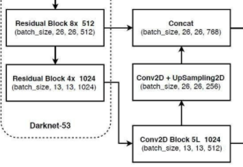
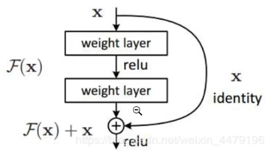

原代码都在./yolo3-pytorch-master/nets中


主干特征提取网络Darknet-53

压缩高和宽，channal通道数扩张(下采样)，特征层反映了输入图片的 特征

白色到红色：进行两次卷积		75=3*(20+1+4)		13 *13分割的网格

20:目标种类对应的置信度	3：网格内的先验框	1：是否存在物体 		4：(将框移到合适的位置上(调整参数))  



如图：这里是对最底层的结果进行上采样，然后和倒数第二层进行堆叠，构建特征金字塔(将底层特征和上层特征合并)，进行多尺度特征融合，提取更有效的特征


残差网络：

前面的和处理后的相加(具体看deep learning书即可)

./yolo3-pytorch-master/nets/darknet.py:中

```python
model = DarkNet([1, 2, 8, 8, 4])
```

这里是各个残差块被使用的次数(图里有写)

其余详见代码部分


