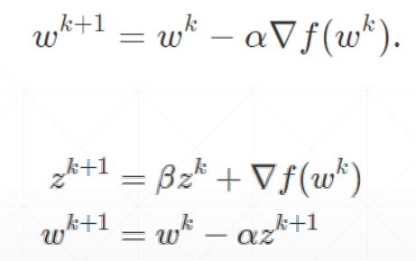
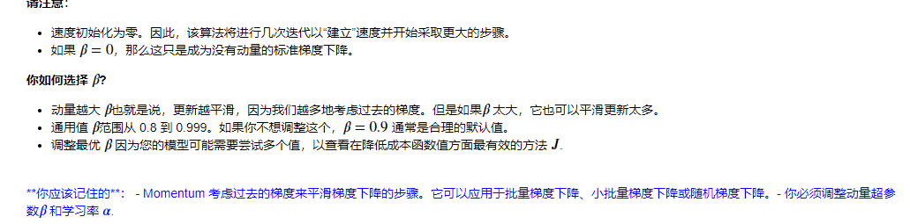
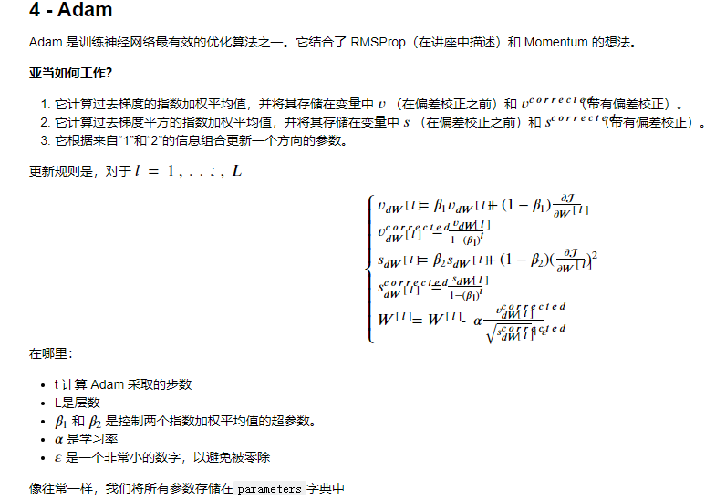
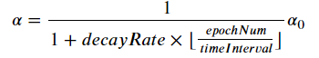

```python
# GRADED FUNCTION: update_parameters_with_gd

def update_parameters_with_gd(parameters, grads, learning_rate):
    """
    Update parameters using one step of gradient descent
    
    Arguments:
    parameters -- python dictionary containing your parameters to be updated:
                    parameters['W' + str(l)] = Wl
                    parameters['b' + str(l)] = bl
    grads -- python dictionary containing your gradients to update each parameters:
                    grads['dW' + str(l)] = dWl
                    grads['db' + str(l)] = dbl
    learning_rate -- the learning rate, scalar.
    
    Returns:
    parameters -- python dictionary containing your updated parameters 
    """

    L = len(parameters) // 2 # number of layers in the neural networks

    # Update rule for each parameter
    for l in range(L):
        ### START CODE HERE ### (approx. 2 lines)
        parameters["W" + str(l + 1)] = parameters["W" + str(l + 1)] - learning_rate * grads["dW" + str(l + 1)]
        parameters["b" + str(l + 1)] = parameters["b" + str(l + 1)] - learning_rate * grads["db" + str(l + 1)]
        ### END CODE HERE ###
        
    return parameters
```

##### 如上实现标准梯度下降

它的一个变体是随机梯度下降 (SGD)，它相当于小批量梯度下降，其中每个小批量只有 1 个示例。您刚刚实施的更新规则不会改变。改变的是你一次只计算一个训练样本的梯度，而不是整个训练集。下面的代码示例说明了随机梯度下降和（批量）梯度下降之间的区别。

- **（批量）梯度下降**：

```python
X = data_input
Y = labels
parameters = initialize_parameters(layers_dims)
for i in range(0, num_iterations):
    # Forward propagation
    a, caches = forward_propagation(X, parameters)
    # Compute cost.
    cost = compute_cost(a, Y)
    # Backward propagation.
    grads = backward_propagation(a, caches, parameters)
    # Update parameters.
    parameters = update_parameters(parameters, grads)
```

- **随机梯度下降**：

```python
X = data_input
Y = labels
parameters = initialize_parameters(layers_dims)
for i in range(0, num_iterations):
    for j in range(0, m):
        # Forward propagation
        a, caches = forward_propagation(X[:,j], parameters)
        # Compute cost
        cost = compute_cost(a, Y[:,j])
        # Backward propagation
        grads = backward_propagation(a, caches, parameters)
        # Update parameters.
        parameters = update_parameters(parameters, grads)
```

# GRADED FUNCTION: random_mini_batches


```python
def random_mini_batches(X, Y, mini_batch_size = 64, seed = 0):
    """
    Creates a list of random minibatches from (X, Y)
    
Arguments:
X -- input data, of shape (input size, number of examples)
Y -- true "label" vector (1 for blue dot / 0 for red dot), of shape (1, number of examples)
mini_batch_size -- size of the mini-batches, integer
Returns:
mini_batches -- list of synchronous (mini_batch_X, mini_batch_Y)
"""
np.random.seed(seed)            # To make your "random" minibatches the same as ours
m = X.shape[1]                  # number of training examples
mini_batches = []
    
# Step 1: Shuffle (X, Y)
permutation = list(np.random.permutation(m))
shuffled_X = X[:, permutation]
shuffled_Y = Y[:, permutation].reshape((1, m))

inc = mini_batch_size

# Step 2 - Partition (shuffled_X, shuffled_Y).
# Cases with a complete mini batch size only i.e each of 64 examples.
num_complete_minibatches = math.floor(m / mini_batch_size) # number of mini batches of size mini_batch_size in your partitionning
for k in range(0, num_complete_minibatches):
    # (approx. 2 lines)
    # mini_batch_X =  
    # mini_batch_Y =
    # YOUR CODE STARTS HERE
    mini_batch_X = shuffled_X[:,k * mini_batch_size:(k + 1) * mini_batch_size]
    mini_batch_Y = shuffled_Y[:,k * mini_batch_size:(k + 1) * mini_batch_size]
    # YOUR CODE ENDS HERE
    mini_batch = (mini_batch_X, mini_batch_Y)
    mini_batches.append(mini_batch)
    

# For handling the end case (last mini-batch < mini_batch_size i.e less than 64)
if m % mini_batch_size != 0:
    #(approx. 2 lines)
    # mini_batch_X =
    # mini_batch_Y =
    # YOUR CODE STARTS HERE
    mini_batch_X = shuffled_X[:,num_complete_minibatches * mini_batch_size:]
    mini_batch_Y = shuffled_Y[:,num_complete_minibatches * mini_batch_size:]
    
    #补上最后一份因为不能整除而剩下的数据
    
    # YOUR CODE ENDS HERE
    mini_batch = (mini_batch_X, mini_batch_Y)
    mini_batches.append(mini_batch)

return mini_batches
```

以上是对所有数据进行一次随机分组，接下来使用这份随机后的数据集的mini_batch就变成了random_mini_batches

一般而言，使用2^n作为batch有助于提高速度

###### GRADED FUNCTION: initialize_velocity
  初始化速度

```python
def initialize_velocity(parameters):
    """
    Initializes the velocity as a python dictionary with:
                - keys: "dW1", "db1", ..., "dWL", "dbL" 
                - values: numpy arrays of zeros of the same shape as the corresponding gradients/parameters.
    Arguments:
    parameters -- python dictionary containing your parameters.
                    parameters['W' + str(l)] = Wl
                    parameters['b' + str(l)] = bl
Returns:
v -- python dictionary containing the current velocity.
                v['dW' + str(l)] = velocity of dWl
                v['db' + str(l)] = velocity of dbl
"""

L = len(parameters) // 2 # number of layers in the neural networks
v = {}

# Initialize velocity
for l in range(1, L + 1):
    # (approx. 2 lines)
    # v["dW" + str(l)] =
    # v["db" + str(l)] =
    # YOUR CODE STARTS HERE
    v["dW" + str(l)] =np.zeros_like(parameters["W" + str(l)])
    v["db" + str(l)] =np.zeros_like(parameters["b" + str(l)])
    # YOUR CODE ENDS HERE
    
return v
```

> np.zeros_like(W)

构建一个形如W的0矩阵


​    
```python
# GRADED FUNCTION: update_parameters_with_momentum

def update_parameters_with_momentum(parameters, grads, v, beta, learning_rate):
    """
    Update parameters using Momentum
Arguments:
parameters -- python dictionary containing your parameters:
                parameters['W' + str(l)] = Wl
                parameters['b' + str(l)] = bl
grads -- python dictionary containing your gradients for each parameters:
                grads['dW' + str(l)] = dWl
                grads['db' + str(l)] = dbl
v -- python dictionary containing the current velocity:
                v['dW' + str(l)] = ...
                v['db' + str(l)] = ...
beta -- the momentum hyperparameter, scalar
learning_rate -- the learning rate, scalar

Returns:
parameters -- python dictionary containing your updated parameters 
v -- python dictionary containing your updated velocities
"""

L = len(parameters) // 2 # number of layers in the neural networks

# Momentum update for each parameter
for l in range(1, L + 1):
    
    # (approx. 4 lines)
    # compute velocities
    # v["dW" + str(l)] = ...
    # v["db" + str(l)] = ...
    # update parameters
    # parameters["W" + str(l)] = ...
    # parameters["b" + str(l)] = ...
    # YOUR CODE STARTS HERE
    v["dW" + str(l + 1)] = beta * v["dW" + str(l + 1)] + (1 - beta) * grads['dW' + str(l + 1)]
    v["db" + str(l + 1)] = beta * v["db" + str(l + 1)] + (1 - beta) * grads['db' + str(l + 1)]
    # update parameters
    parameters["W" + str(l + 1)] = parameters["W" + str(l + 1)] - learning_rate * v["dW" + str(l + 1)]
    parameters["b" + str(l + 1)] = parameters["b" + str(l + 1)] - learning_rate * v["db" + str(l + 1)]
    
    # YOUR CODE ENDS HERE
    
return parameters, v
```

为梯度下降法赋予动量，使其容易拜托局部最低点，代码如上，v即为下面的β







绝大多数变量的初始化，都可以直接使用np.zeros_like()来解决(根据得到的数据性质来决定其形状，形状变了也无妨)


​    
```python
# GRADED FUNCTION: schedule_lr_decay

def schedule_lr_decay(learning_rate0, epoch_num, decay_rate, time_interval=1000):
    """
    Calculates updated the learning rate using exponential weight decay.
Arguments:
learning_rate0 -- Original learning rate. Scalar
epoch_num -- Epoch number. Integer.
decay_rate -- Decay rate. Scalar.
time_interval -- Number of epochs where you update the learning rate.

Returns:
learning_rate -- Updated learning rate. Scalar 
"""
# (approx. 1 lines)
# learning_rate = ...
# YOUR CODE STARTS HERE

learning_rate=learning_rate0/(1+decay_rate*np.floor(epoch_num/time_interval))
# YOUR CODE ENDS HERE
return learning_rate
```

上面是学习率衰减的公式，中括号实际上

是一个高斯函数，即np.floor，返回不大于输入参数的最大整数

然后就是adam，实在看不懂咋整的，代码也老是有错，下次一定,当然我们可以直接使用torch或者 TensorFlow自动搞定，就不需要手动取创建模型了

