一个简单的liner function表达的信息不够多也不够灵活，然而使用piecewise(分段) liner function 可以轻松解决这个问题。（而liner function也可简单看作是sigmoid function的一个近似值）

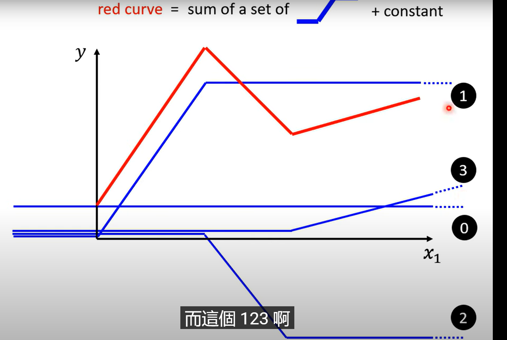

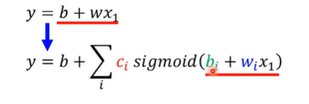

如上图一得到公式，使用多个来组合得到折线函数

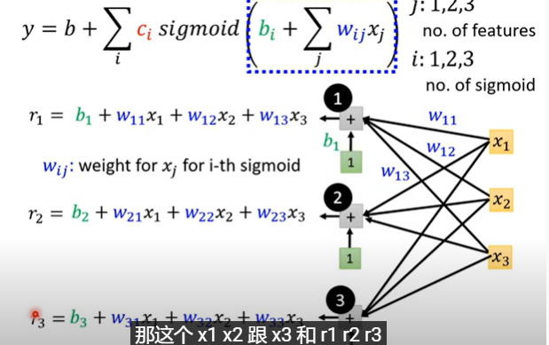

如上图函数得到一个类似全连接的模型

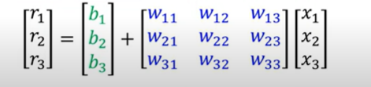

矩阵表示法(numpy计算加快计算速度)

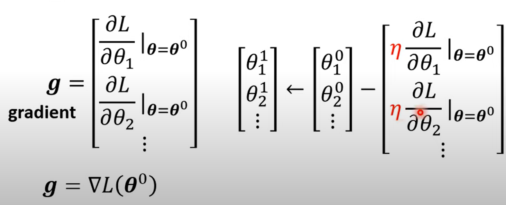

然后得到梯度，反向求导，更新参数θ

random batch  随机选择一个batch，用batch得到的L1，L2...来更新参数，batch小容易算，更新的快，但是不一定和整个数据N的方向吻合(然而多个batch的L修正后方向必然与整个N的方向接近且计算时间更短)

一个N分多个batch，遍历一次所有的batch叫做一个epoch，更新一次叫update

hyper parameter：超参数，自己人手定义的参数

rectified liner unit：ReLU，像纯直线没了上半部分的sigmoid，不怕梯度消失，且易于求导           

而两个relu相加，则得到一个hard sigmoid(类似直线的sigmoid)，因此二者是可以互相表示的

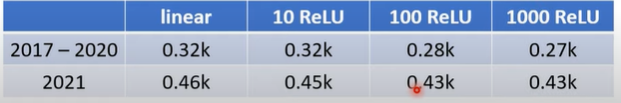

而下图也可以看出，多个relu组成的复杂模型在一定程度上可以提高模型复杂度，从而实现更准确地预测

然而复杂度的提升并不一定带来准确度的提升

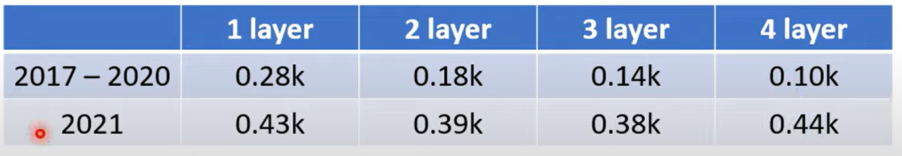

而layer的提升显著降低了Loss，而且增加的参数量并不多(和100个ReLU比的话)

然而层数太多导致的overfitting问题(留着下面讲)。当然这里必然是三层的比较好

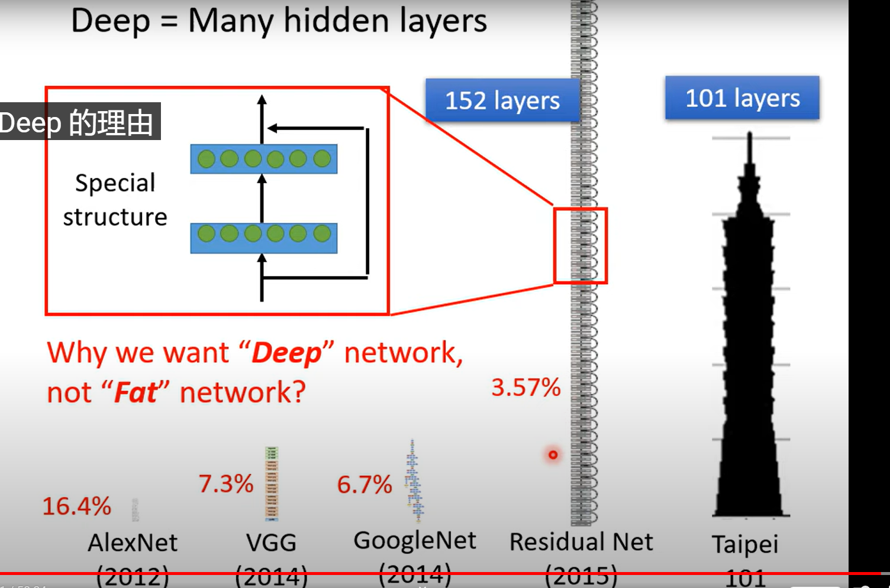

为什么network变deep而不是变宽，deep的网络能从小到大地提取特征，精简参数量，提高运算速度

2.

训练时的小技巧：

1. loss太高？	尝试换个模型结构，改变输入结构(特别是x_n和x_m有相关性时)从而试着降低loss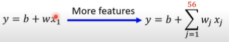

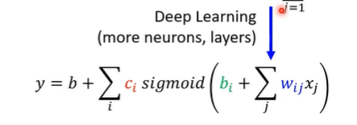

而使用更多参数和更深的层数也有助于降低loss(增加层数能使得参数较少)

此方法针对model bias(模型偏差)，即需要修改模型

2. 找到了局部最小值而非全局最小值

optimization issue(最优化失败)

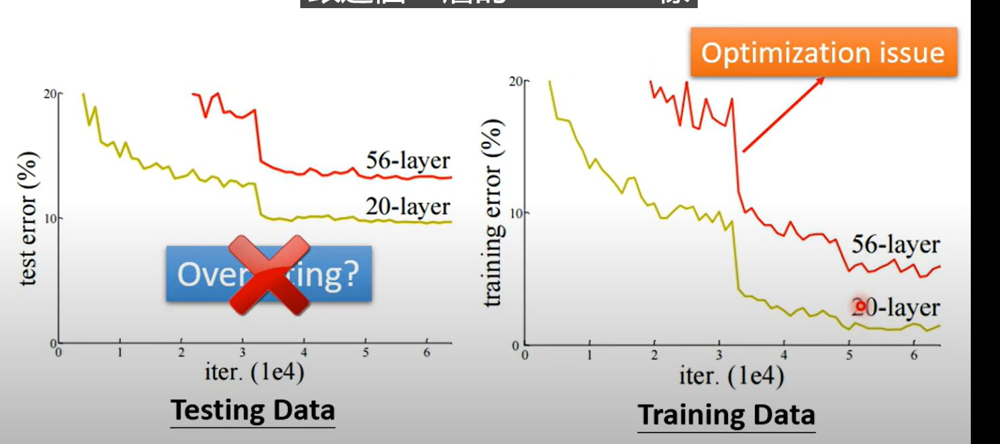

试着训练一个20层和56层的模型，56层无论是在training 还是在test上面效果都不如20层

所以肯定是optimization issue

**所以，一般在大模型训练之前，我们会先训练一个小层级的模型甚至是使用SVM等比较好optimization 的模型，用于验证高层数模型是否存在optimization issue的情况，以此节省时间**

3. overfitting(training的loss小，test的loss大)

   方法：简化模型，增加数据量，数据增强(data augmentation)

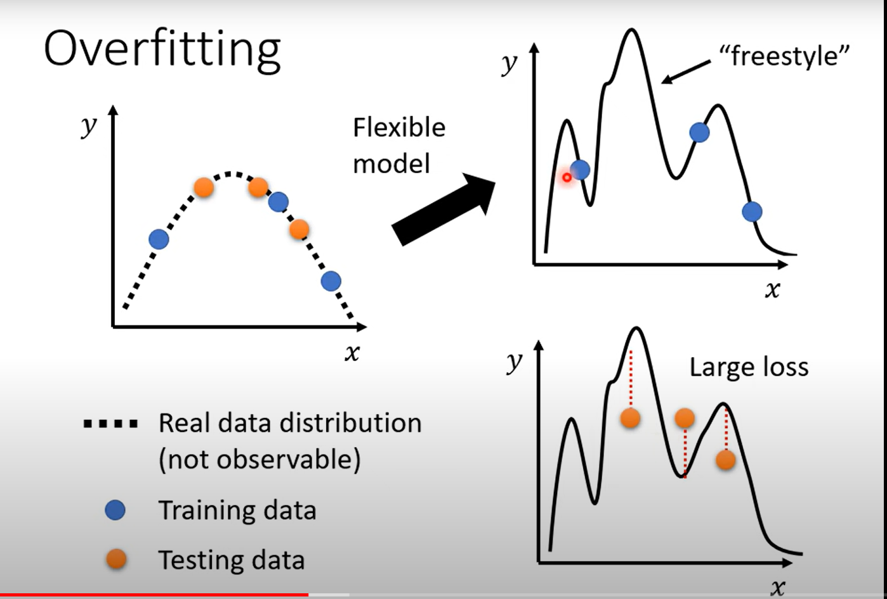

复杂的模型学习到了不是共性的特征，因此简化模型和增加数据量都有助于降低loss

1. data augmentation时要注意，augment得到的数据最好符合正常数据应有的样子  

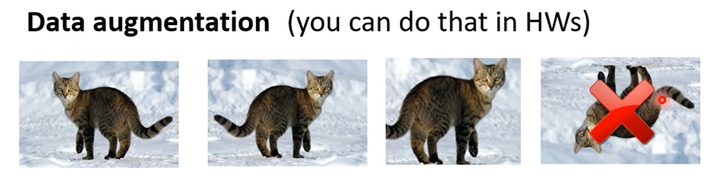

如图，左右翻转，放大图片部分显然是合适的(容易识别出仍是猫)，然而上下颠倒后的猫的特征不符合我们人习惯认识的特征，因此一般仅做左右翻转，局部放大(缩小)

而对于需要识别**人在车上说话的声音的训练**，可以将正常开车的声音和人说话的声音进行合成，从而轻松得到大量人在车上说话的声音 的数据（车上录声音的数据少，正常说话的数据多），以此增加数据也是可行的

2. 简化模型

这个取决于自己对模型的理解(不懂就去查论文,总有一款适合你)

比如 减少神经元  共享参数 early stopping reguarization(正则化,可以参考吴恩达) Dropout