 使用.ipynb文件：cmd 输入ipython notebook 

http://localhost:8888/notebooks/d2l-zh%20(1)/pytorch/index.ipynb

地址如上 

## 一般而言,复杂一点的模型比过于简单的模型更好,起码复杂模型可以通过正则化解决过拟合问题,太简单就麻烦了

### 数据操作：

一些简单的切片

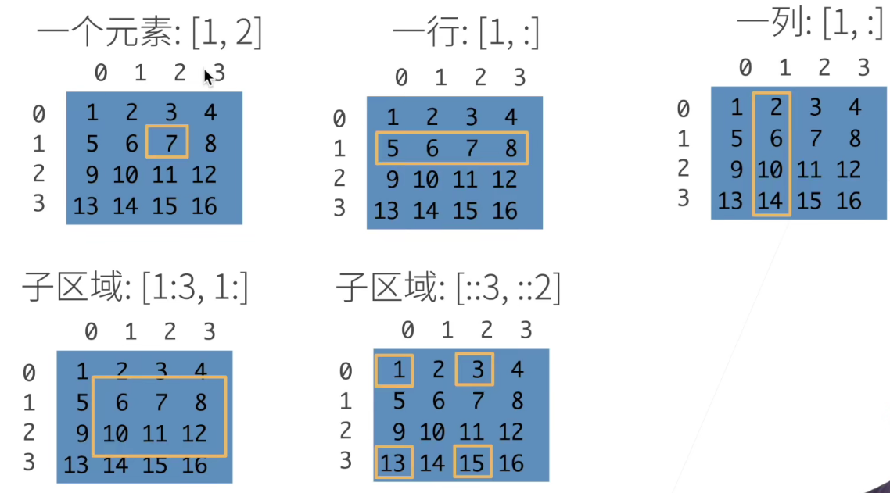


```
X = torch.arange(12, dtype=torch.float32).reshape((3,4))
Y = torch.tensor([[2.0, 1, 4, 3], [1, 2, 3, 4], [4, 3, 2, 1]])torch.cat((X, Y), dim=0)
torch.cat((X, Y), dim=1)
```

输出

```python
(tensor([[ 0.,  1.,  2.,  3.],
         [ 4.,  5.,  6.,  7.],
         [ 8.,  9., 10., 11.],
         [ 2.,  1.,  4.,  3.],
         [ 1.,  2.,  3.,  4.],
         [ 4.,  3.,  2.,  1.]]),#第0维(行合并)(dim=0)
 tensor([[ 0.,  1.,  2.,  3.,  2.,  1.,  4.,  3.],
         [ 4.,  5.,  6.,  7.,  1.,  2.,  3.,  4.],
         [ 8.,  9., 10., 11.,  4.,  3.,  2.,  1.]]))#第1维(列合并)(dim=1)
```

torch.zeros()和torch.ones()	全0和全一的tensor变量

两个tensor直接+-*/以及**,是在做对应元素的运算(允许广播)

torch.exp()	e的对应次方

torch.sum()	生成只有一个元素的张量(对所有元素求和 )

广播：仅有一个值的维度自动(广播)扩展


### 数据预处理

下面我们将数据集按行写入CSV文件中。

```python
import os

os.makedirs(os.path.join('..', 'data'), exist_ok=True) #创建文件夹
data_file = os.path.join('..', 'data', 'house_tiny.csv')
#创建house_tiny.csv文件
with open(data_file, 'w') as f:
    f.write('NumRooms,Alley,Price\n')  # 列名
    f.write('NA,Pave,127500\n')  # 每行表示一个数据样本
    f.write('2,NA,106000\n')
    f.write('4,NA,178100\n')
    f.write('NA,NA,140000\n')
```

创建一个人工数据集，并存储在csv（逗号分隔值）文件`../data/house_tiny.csv`中

NA代表未知数

###  读取数据集

```python
import pandas as pd
os.makedirs(os.path.join('..', 'data'), exist_ok=True)
data_file = os.path.join('..', 'data', 'house_tiny.csv')


data = pd.read_csv(data_file)
print(data)
```

使用pandas库读取 上面写入的文件数据

### 2.2.2. 处理缺失值

注意，“NaN”项代表缺失值。为了处理缺失的数据，典型的方法包括*插值*和*删除*，其中插值用替代值代替缺失值。而删除则忽略缺失值。在这里，我们将考虑插值。

通过位置索引`iloc`，我们将`data`分成`inputs`和`outputs`，其中前者为`data`的前两列，而后者为`data`的最后一列。对于`inputs`中缺少的数值，我们用同一列的均值替换“NaN”项。

```python
inputs, outputs = data.iloc[:, 0:2], data.iloc[:, 2]
inputs = inputs.fillna(inputs.mean()) #均值替换NAN
print(inputs)
```

以上将数据按列分开,并用均值替换NAN(如果可以的话)

```
   NumRooms Alley
0       3.0  Pave
1       2.0   NaN
2       4.0   NaN
3       3.0   NaN
```

对于`inputs`中的类别值或离散值，我们将“NaN”视为一个类别。由于“巷子”（“Alley”）列只接受两种类型的类别值“Pave”和“NaN”，`pandas`可以自动将此列转换为两列“Alley_Pave”和“Alley_nan”。巷子类型为“Pave”的行会将“Alley_Pave”的值设置为1，“Alley_nan”的值设置为0。缺少巷子类型的行会将“Alley_Pave”和“Alley_nan”分别设置为0和1。

```
inputs = pd.get_dummies(inputs, dummy_na=True)
#dummy_na=True,保留分类变量中的缺失值，将其单独作为一列,去掉则不保留
print(inputs)
```

将所有输出类型作为特征，然后用**类hot-one**编码输出

输出：

```
   NumRooms  Alley_Pave  Alley_nan
0       3.0           1          0
1       2.0           0          1
2       4.0           0          1
3       3.0           0          1
```

保留分类变量中的缺失值，将其单独作为一列， 加dummy_na = True，不保留直接去掉就行

```python
x, y = torch.tensor(inputs.values), torch.tensor(outputs.values)
print('3.转换为张量：')
print(x)
print(y)

```


```python
3.转换为张量：
tensor([[3., 1., 0.],
        [2., 0., 1.],
        [4., 0., 1.],
        [3., 0., 1.]], dtype=torch.float64)
tensor([[       nan, 1.2750e+05],
        [2.0000e+00, 1.0600e+05],
        [4.0000e+00, 1.7810e+05],
        [       nan, 1.4000e+05]], dtype=torch.float64)
```

如上,将从csv中读取到的数组转化为了tensor类型的数


```python
print('4.矩阵的计算')
A = torch.arange(20, dtype=torch.float32).reshape(5, 4)
B = A.clone()  # 通过分配新内存，将A的一个副本分配给B

A+=1
print('A:', A)
print('B:', B)
print('A + B:', A + B)  # 矩阵相加
print('A * B:', A * B)  # 矩阵相乘
```

输出:

```
4.矩阵的计算
A: tensor([[ 1.,  2.,  3.,  4.],
        [ 5.,  6.,  7.,  8.],
        [ 9., 10., 11., 12.],
        [13., 14., 15., 16.],
        [17., 18., 19., 20.]])
B: tensor([[ 0.,  1.,  2.,  3.],
        [ 4.,  5.,  6.,  7.],
        [ 8.,  9., 10., 11.],
        [12., 13., 14., 15.],
        [16., 17., 18., 19.]])
```

A.clone()得到的副本不会随着A的后续改变而改变

B=A.sum(axis=0,keepdims=True)	仅沿着第0维求和,keepdims=True用来使得维度不变,从而可以让A/B,这个在求均值时也是可行的

torch.dot(x, y) 向量点乘(对应位置相乘再求和)	torch.mv(A, x)向量相乘	(仅一维张量)

torch.mul()  矩阵的点乘											torch.mm()是矩阵乘法

torch.sum(x * y)通过这样的方式也可以表达向量点乘(当然老老实实用函数最好)

torch.norm(u) 向量的𝐿2范数:	平方和再开根

torch.abs(u).sum() 向量的𝐿1范数	绝对值和

剩余详见03-liner……


注意:reshape处理的tensor如果是连续的，则于view相同，在原地址改变；如果不连续，reshape会生成一个新的tensor

幸运的是，(**执行原地操作**)非常简单。我们可以使用切片表示法将操作的结果分配给先前分配的数组，例如`Y[:] = <expression>`。为了说明这一点，我们首先创建一个新的矩阵`Z`，其形状与另一个`Y`相同，使用`zeros_like`来分配一个全0的块。

````python
Z = torch.zeros_like(Y)
print('id(Z):', id(Z))
Z[:] = X + Y
print('id(Z):', id(Z))
````

输出：

```python
id(Z): 140272150341696
id(Z): 140272150341696
```

使用此方法以覆盖以前的内存，节省空间


#### 矩阵计算

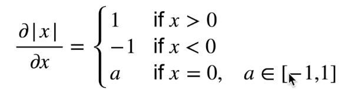

对于不可微的函数,有如上亚导数


标量y对于向量x的求导,有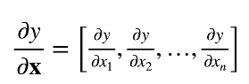

举个例子,y=(x1)^2+2(x2)^2,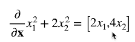

求导得到一个向量


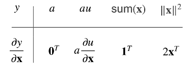

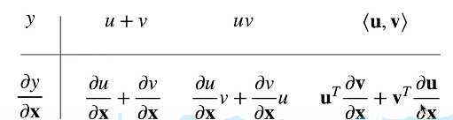

如上是一些矩阵的求导(也没必要死记,不了解就算了)


因为向量所在位置不同而导致矩阵的方向不同

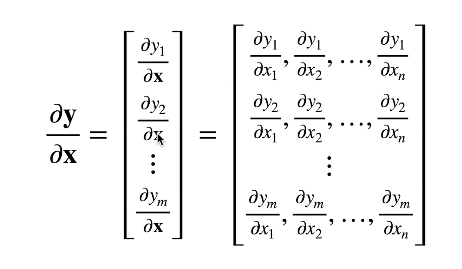

如上则是一个向量除以向量的例子

### 自动求导(从标量到向量)

原理：链式法则

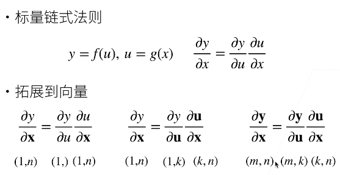

标量*向量=向量，向量 *向量=向量

隐式构造：系统将你每一步的计算记录下来，不用自己手动计算

pytorch是反向求导back propagation  

反向传播：计算复杂度O(n),内存复杂度O(n)

正向积累：计算复杂度O(n),内存复杂度O(1)，但是需要扫描每一层的所有参数，所以不如反向传播(一般而言)

代码参考05-autograd

```python
print('1.自动梯度计算')
x = torch.arange(4.0, requires_grad=True)  # 1.将梯度附加到想要对其计算偏导数的变量
print('x:', x)
print('x.grad:', x.grad)
y = 2 * torch.dot(x, x)  # 2.记录目标值的计算
print('y:', y)
y.backward()  # 3.执行它的反向传播函数
print('x.grad:', x.grad)  # 4.访问得到的梯度
print('x.grad == 4*x:', x.grad == 4 * x)

```

输出如下:

```python
1.自动梯度计算
x: tensor([0., 1., 2., 3.], requires_grad=True)
x.grad: None
y: tensor(28., grad_fn=<MulBackward0>)
x.grad: tensor([ 0.,  4.,  8., 12.])
x.grad == 4*x: tensor([True, True, True, True])
y: tensor(6., grad_fn=<SumBackward0>)
x.grad: tensor([1., 1., 1., 1.])
x: tensor([0., 1., 2., 3.], requires_grad=True)
x.grad: tensor([0., 2., 4., 6.])
```

执行y.backward以后,即可输出x.grad(即x对于y的梯度)

 requires_grad=True用于保留梯度信息,要留着

```python
x.grad.zero_()
```

用于梯度清零,不清零会使得之前计算的梯度和以后计算的梯度叠加


部分没做笔记的部分详见代码

## D:\numpy+deep learning\李沐课件\dive_into_deep_learning-main\ch02


batchsize越小收敛反而越好,过大的batch反而不好,因为噪音对神经网络并不是坏事,小batch利于深度神经网络不过拟合

正则项不放在损失函数内,正则化方法非常多

##### All models are wrong, some are useful. 机器学习很多是硬去抓规律的。所以即使找到了全局最优解,也不一定真的就有良好的泛化性.这也是为什么SGD看起来慢而且效果不一定理想,但却是最常见最通用的优化器之一

现在的优化方法，主要是凸优化的，非凸问题解决的不很好。(凸优化都好久没看过了,有空去温习一下)


detach()函数	所有的运算子会自动加入计算图求梯度，detach可以把不需要求梯度的运算分离开


da ta-iter写法有可能导致内存过大(很小可能)


indices不一定要转化成tensor,因为tensor可能是列表或者元组实现的，就像列表底层是元组实现的，只要能达到目的工具是什么样不那么重要


*Adaptive* Boosting自适应增强,Adam等都可以用于判断收敛


一般而言深度学习的问题都是没有显式解的,有显式解的问题也不需要深度学习来解决


#### 分类与回归

回归：预测一个连续值		分类：预测一个离散值(类)


对于分类问题,我们并不需要预测值的置信度特别高,重点是**真类的置信度远大于其他类**,满足此条件的情况下即使置信度不高也无妨


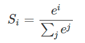

softmax函数如上

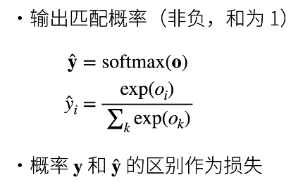

使用指数函数,更能突出置信度高的值


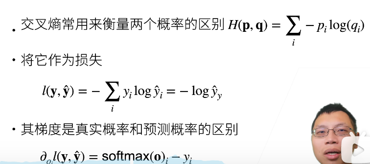

因为我的真实标签是one-hot变量，只有一个为1，所以只需要求真实标签为1对应的那个预测值,即可求出loss'


一些简单的Loss损失函数

L2 Loss	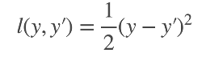

常用,效果也不差


L1 Loss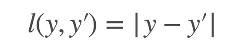

不大常用,因为0点处不可导,要借助亚导数,不划算


Huber's Robust Loss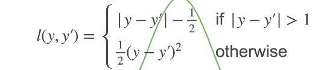

结合了以上L1 L2	loss函数


### 以midist为例,下载并载入数据集

```python
def load_data_fashion_mnist(batch_size, resize=None):  #@save
    """下载Fashion-MNIST数据集，然后将其加载到内存中"""
    trans = [transforms.ToTensor()]
    if resize:
        trans.insert(0, transforms.Resize(resize))
    trans = transforms.Compose(trans)
    mnist_train = torchvision.datasets.FashionMNIST(
        root="../data", train=True, transform=trans, download=True)
    mnist_test = torchvision.datasets.FashionMNIST(
        root="../data", train=False, transform=trans, download=True)
    return (data.DataLoader(mnist_train, batch_size, shuffle=True,
                            num_workers=get_dataloader_workers()),
            data.DataLoader(mnist_test, batch_size, shuffle=False,
                            num_workers=get_dataloader_workers()))
```

如上,通过data.DataLoader函数载入了训练集和测试集,shuffle=True控制是否进行反向传播(test集是不能用来训练的)


```python
def train_ch3(net, train_iter, test_iter, loss, num_epochs, updater):  #@save
    """训练模型（定义见第3章）"""
    animator = Animator(xlabel='epoch', xlim=[1, num_epochs], ylim=[0.3, 0.9],
                        legend=['train loss', 'train acc', 'test acc'])
    for epoch in range(num_epochs):
        train_metrics = train_epoch_ch3(net, train_iter, loss, updater)
        test_acc = evaluate_accuracy(net, test_iter)
        animator.add(epoch + 1, train_metrics + (test_acc,))
    train_loss, train_acc = train_metrics
    assert train_loss < 0.5, train_loss
    assert train_acc <= 1 and train_acc > 0.7, train_acc
    assert test_acc <= 1 and test_acc > 0.7, test_acc
```

提前定义一个训练函数(需要的参数几乎都可以在nn. 的函数中找到)


详见http://localhost:8888/notebooks/d2l-zh%20(1)/pytorch/chapter_linear-networks/softmax-regression-scratch.ipynb


nn.CrossEntropyLoss = nn.softmax + nn.log + nn.NLLLoss，也就是api自带的的交叉熵损失函数已经把softmax自动算了.

###  感知机


即输入经过运算,达成条件输出1,否则输出0(即实现一个二分类)


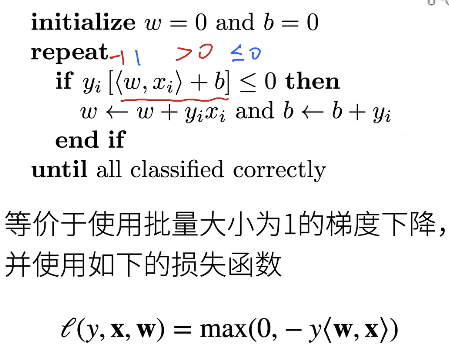

异号则输出为负,所以需要更新

下面的loss函数则是:如果上面的yi[<w,xi>+b]<0,则loss=-yi[<w,xi>+b]

所以是批量batch为1的梯度下降

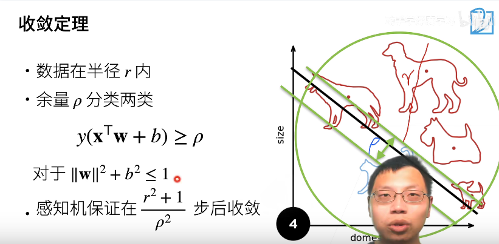

感知机的收敛:在r为半径的区域内,分类误差小于预设余量 or 步数超过……步后收敛


#### 多层感知机:低维度的平面不能分割的事物,通过多层感知机升维来解决

而且通过隐藏层和激活函数(sigmoid,tanh,relu)得到了非线性模型


#### 训练误差和泛化误差

训练误差training loss：模拟考，可以总结经验（可以用于训练）,太小不一定好,可能是过拟合

泛化误差：期末考（不能用于训练）,越小越好


训练training_data,验证dev_data,测试test_data	不要混淆

**dev是不可以用于训练的**,属于是在训练过程中查看训练效果的方法

千万不要和training_data混在一起

 mnist_dev = torchvision.datasets.FashionMNIST(
        root="../data", train=False, transform=trans, download=True)

而test集只能跑1次,即模型解决后的那次


- dev用来统计的那一评估指标、调节参数，选择算法；而test用来在最后整体评估模型性能
- dev和训练集一起被输入到模型算法中，但又不参与模型训练，可以一边训练一边根据dev查看指标


k折交叉验证

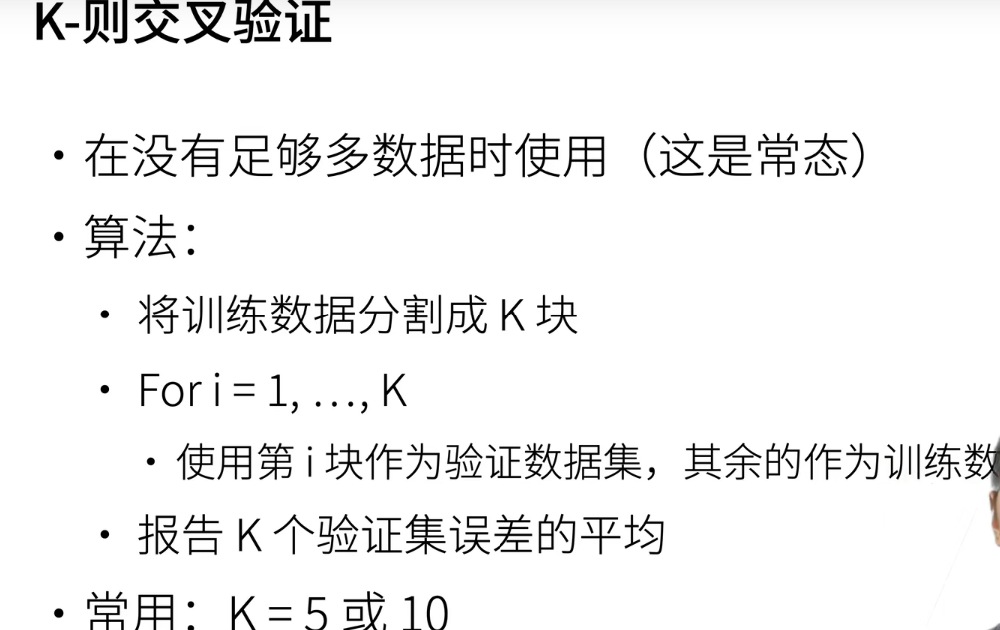

数据不够用的时候的做法,当然这个时候数据增强也合适

数据够的时候算10次就太折磨了,别傻憨憨的


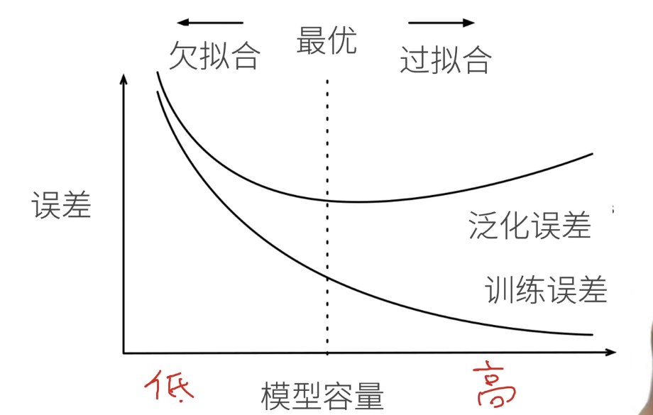


一图解模型容量(复杂度),和两类误差间的关系


而复杂度的计算可以由——参数个数和参数选择范围来预估(没有一个准确的值或公式比较 )


VC维:对于一个分类模型,VC等于一个最大的数据集的大小.不管如何给定标号,都存在一个模型对它进行完美分类(理论上)


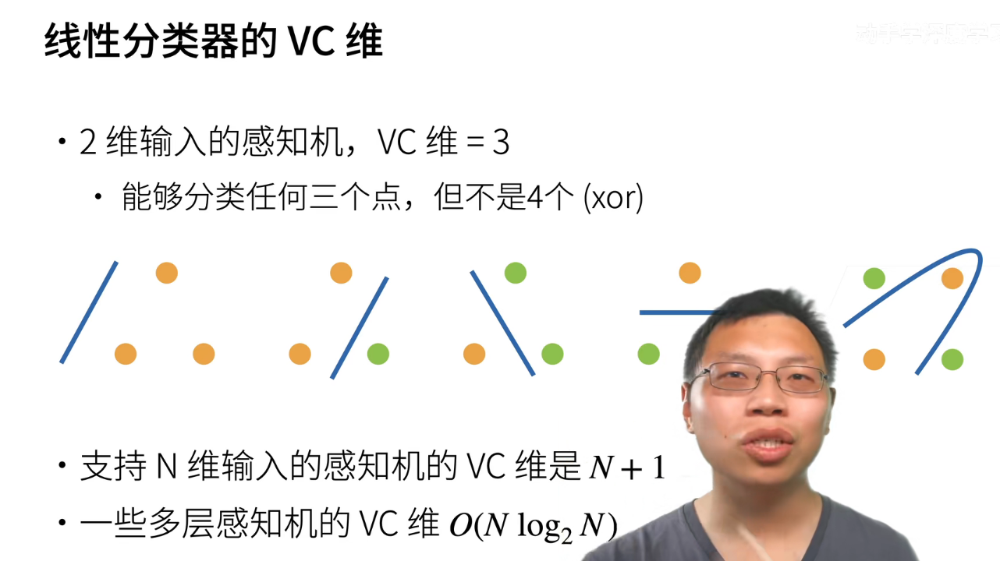

二维感知机的VC维是3,即能区分**任意**3个点的分类,但是4个点存在xor关系(异或),所以不是4


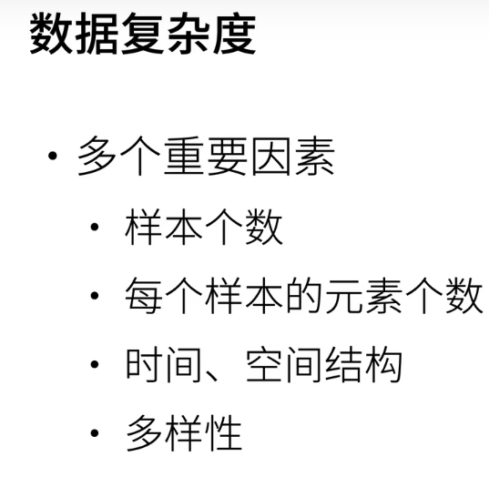

这个就更加不好衡量,因素太多了


kernel_SVM对于庞大的数据集(十万百万个点)效果并不大好,神经网络在这方面效果好

因为大的SVM训练太贵了,没必要用SVM拟合

SVM的可解释性较好(有明确的数学解释),但是能力不如神经网络


##### 权重衰退与限制

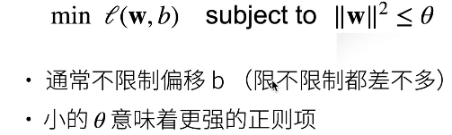

通过这样的参数范围限制开控制模型容量 


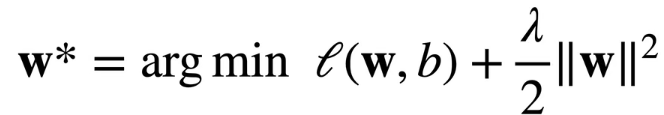

就是说，l2正则项会对大数值的权值进行惩罚，鼓励权值分散，将所有额特征运用起来，而不是依赖其中的少数特征


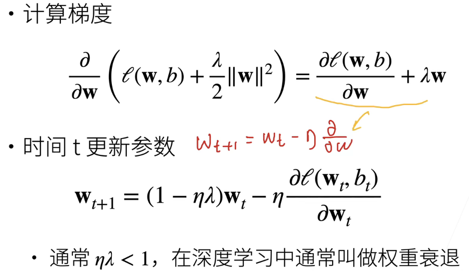

防止卡在坑的两边下降不到最优点

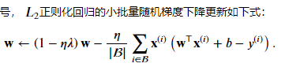

权重衰退限制了模型参数大小,从而控制模型复杂度  

  

#### dropout丢弃法

仅在全连接层使用

sigmoid和softmax这两个激活函数跟dropout的顺序有讲究，但是relu没有，因为relu就是一个线性的函数，先除以（1-p）或者后除以（1-p）其实没有影响。不过，sigmoid和softmax的话，得先dropout然后再进激活函数，因为对于输入做dropout和对输出做dropout是不一样的


如上dropout,使得输出值改变(毕竟少了一些层),但是期望不变(x_i除以了不被dropout的概率(1-p))

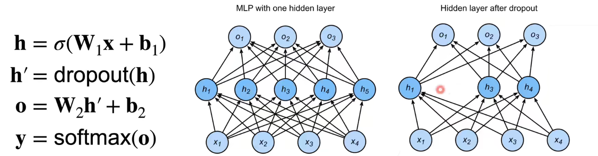

如上,进行了一次dropout,,减少了隐藏层的数目,降低了复杂度

dropout基本上是每个batch换一次模型(重新选择输出被置零的神经元)

奥卡姆剃刀:实现目标的函数越简单越好

以下为dropout的函数

```python
def dropout_layer(X, dropout):
    assert 0 <= dropout <= 1
    # 在本情况中，所有元素都被丢弃
    if dropout == 1:
        return torch.zeros_like(X)
    # 在本情况中，所有元素都被保留
    if dropout == 0:
        return X
    mask = (torch.rand(X.shape) > dropout).float()
    return mask * X / (1.0 - dropout)
```

然后再通过以下api即可将参数进行变化

```
dropout_layer(X, 0.)
```

0.修改为隐藏一个神经元的概率


```python
class Net(nn.Module):
    def __init__(self, num_inputs, num_outputs, num_hiddens1, num_hiddens2,
                 is_training = True):
        super(Net, self).__init__()
        self.num_inputs = num_inputs
        self.training = is_training
        self.lin1 = nn.Linear(num_inputs, num_hiddens1)
        self.lin2 = nn.Linear(num_hiddens1, num_hiddens2)
        self.lin3 = nn.Linear(num_hiddens2, num_outputs)
        self.relu = nn.ReLU()

    def forward(self, X):
        H1 = self.relu(self.lin1(X.reshape((-1, self.num_inputs))))
        # 只有在训练模型时才使用dropout
        if self.training == True:
            # 在第一个全连接层之后添加一个dropout层
            H1 = dropout_layer(H1, dropout1)
        H2 = self.relu(self.lin2(H1))
        if self.training == True:
            # 在第二个全连接层之后添加一个dropout层
            H2 = dropout_layer(H2, dropout2)
        out = self.lin3(H2)
        return out


net = Net(num_inputs, num_outputs, num_hiddens1, num_hiddens2)
```

网络多一个is_training的参数,在训练时才使用dropout,而且先dropout再relu

注意,使用class的写法更好,更加面向对象,当然这里一层层写不建议这么做

```python
dropout1, dropout2 = 0.2, 0.5
num_epochs, lr, batch_size = 10, 0.5, 256
loss = nn.CrossEntropyLoss(reduction='none')

train_iter, test_iter = d2l.load_data_fashion_mnist(batch_size)
trainer = torch.optim.SGD(net.parameters(), lr=lr)
d2l.train_ch3(net, train_iter, test_iter, loss, num_epochs, trainer)

net = nn.Sequential(nn.Flatten(),
        nn.Linear(784, 256),
        nn.ReLU(),
        # 在第一个全连接层之后添加一个dropout层
        nn.Dropout(dropout1),
        nn.Linear(256, 256),
        nn.ReLU(),
        # 在第二个全连接层之后添加一个dropout层
        nn.Dropout(dropout2),
        nn.Linear(256, 10))

def init_weights(m):
    if type(m) == nn.Linear:
        nn.init.normal_(m.weight, std=0.01)

net.apply(init_weights);


trainer = torch.optim.SGD(net.parameters(), lr=lr)
d2l.train_ch3(net, train_iter, test_iter, loss, num_epochs, trainer)
```

然后直接调用就行

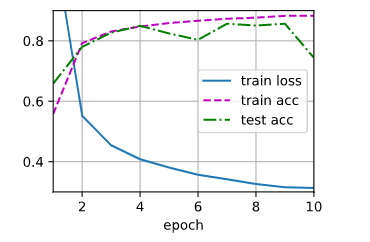

不dropout的情况(把dropout1, dropout2=0就行)

dropout固定住randon seed的情况下可重复性不低,这也是比较好的地方 


优点:dropout的超参数**P**比**权重衰退的λ**好调参,所以用的人更多 


#### 数值稳定性的两个常见问题:

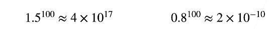

​						梯度爆炸														梯度衰减

##### 

#### 梯度爆炸

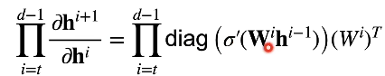

如图，梯度的链式法则决定了梯度很容易爆炸或者消失 

梯度爆炸很有可能导致超出值域(infinity),从而无法继续训练

而且——

```
大学习率-->大参数->大梯度
小学习率->训练不动
```

所以在训练过程中不断调整学习率也是有必要的 

#### 梯度消失

### 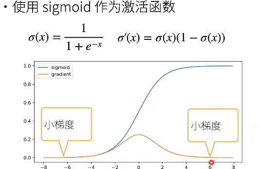

在x过大及过小时梯度非常小,从而会有多个小梯度相乘(链式法则),最后导致梯度接近0

产生的问题 

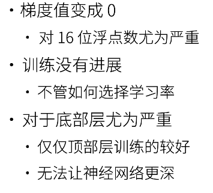

#### 让训练更稳定

1.梯度值在合理范围内

2.乘法变加法 ResNet,LSTM

3.归一化(梯度归一化,梯度裁剪)

4.设置合理的初始权重和激活函数 

对于小网络,N(0,0.01)作为初始没问题,但是大网络就要考虑一下了.

##### 数值调整

1. 调整各层得到:相等的方差和均值

   Xavier初始，参考以下网站

https://blog.csdn.net/shuzfan/article/details/51338178

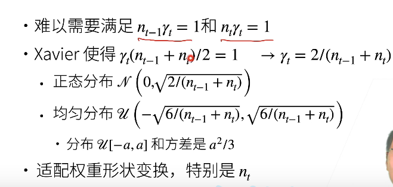

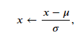

```python
all_features[numeric_features] = all_features[numeric_features].apply(
    lambda x: (x - x.mean()) / (x.std()))
```

通过这个代码实现正则化数据(上面的公式 ),一般而言这个方法只能正则自己的training_data


通过这样的计算，使得数据均值为0，方差为1(即实现了一个正则化)


目前的绝大多数手段只能缓解数值不稳定，不能解决数值不稳定问题

均值方差做限制，阻止了极大或极小值出现的概率

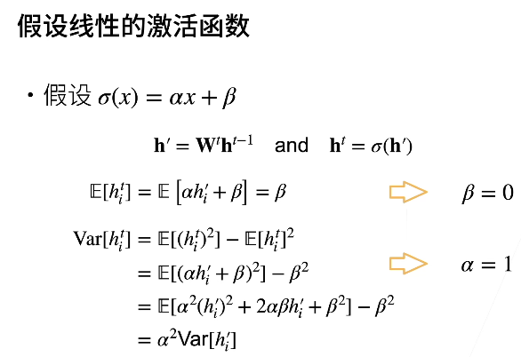


如图，即所需的激活函数必须过圆点（β=0)


而通过泰勒展开可知，sigmoid函数不过原点，所以需要一些平移和放缩进行调整

### 神经网络基础

##### 5.模型构造

实例:

http://localhost:8888/notebooks/d2l-zh%20(1)/pytorch/chapter_deep-learning-computation/model-construction.ipynb

```python
class MLP(nn.Module):
    # 用模型参数声明层。这里，我们声明两个全连接的层
    def __init__(self):
        # 调用MLP的父类Module的构造函数来执行必要的初始化。
        # 这样，在类实例化时也可以指定其他函数参数，例如模型参数params（稍后将介绍）
        super().__init__()	#继承父类的初始化函数,得到大量的函数
        self.hidden = nn.Linear(20, 256)  # 隐藏层
        self.out = nn.Linear(256, 10)  # 输出层

    # 定义模型的前向传播，即如何根据输入X返回所需的模型输出
    def forward(self, X):
        # 注意，这里我们使用ReLU的函数版本，其在nn.functional模块中定义。
        return self.out(F.relu(self.hidden(X)))
```

以上为定义一个命名为MLP的类,类包含继承的函数

```python
net = MLP()
net(X)
```

使用这样的两行代码即可轻松调用MLP


## [**顺序块**]

```python
class MySequential(nn.Module):
    def __init__(self, *args):
        super().__init__()
        for idx, module in enumerate(args):
            # 这里，module是Module子类的一个实例。我们把它保存在'Module'类的成员
            # 变量_modules中。module的类型是OrderedDict
            self._modules[str(idx)] = module

    def forward(self, X):
        # OrderedDict保证了按照成员添加的顺序遍历它们
        for block in self._modules.values():
            X = block(X)
        return X
```


1. 一种将块逐个追加到列表中的函数。
2. 一种前向传播函数，用于将输入按追加块的顺序传递给块组成的“链条”。

```python
net = MySequential(nn.Linear(20, 256), nn.ReLU(), nn.Linear(256, 10))
net(X)
```

当`MySequential`的前向传播函数被调用时， 每个添加的块都按照它们被添加的顺序执行。 现在可以使用我们的`MySequential`类重新实现多层感知机。(产生了和默认`Sequential`类相同的功能)


以上的两个对象都调用了一些方法,生成了相同的网络结构


```python
class FixedHiddenMLP(nn.Module):
    def __init__(self):
        super().__init__()
        # 不计算梯度的随机权重参数。因此其在训练期间保持不变
        self.rand_weight = torch.rand((20, 20), requires_grad=False)
        self.linear = nn.Linear(20, 20)
        self.net = nn.Sequential(nn.Linear(20, 64), nn.ReLU(),
                                 nn.Linear(64, 32), nn.ReLU())
    def forward(self, X):
        X = self.linear(self.net(X))
        # 使用创建的常量参数以及relu和mm函数
        X = F.relu(torch.mm(X, self.rand_weight) + 1)
        # 复用全连接层。这相当于两个全连接层共享参数
        X = self.linear(X)
        # 控制流
        while X.abs().sum() > 1:
            X /= 2
        return X.sum()
    
net =  nn.Sequential(FixedHiddenMLP(), nn.Linear(1, 20))
net(X)
```

这样可以将while放在神经网络的计算中(一般都不这么做,为了表达这个forward的灵活性而已)，甚至可以调用nn.Sequential定义的层。

而且nn.Sequential()同样可以调用自定义的块中定义的层进行定义新的层

 

### 总结

使用

```python
class FixedHiddenMLP(nn.Module):
    def __init__(self):
        super().__init__()
        
        
    def forward(self, X):
```

这样的形势可以灵活定义各个层,好用且简单

### 参数管理

http://localhost:8888/notebooks/d2l-zh%20(1)/pytorch/chapter_deep-learning-computation/custom-layer.ipynb

```python
import torch
from torch import nn

net = nn.Sequential(nn.Linear(4, 8), nn.ReLU(), nn.Linear(8, 1))
X = torch.rand(size=(2, 4))
net(X)
print(net[2].state_dict())
print(net[2]. bias)
print(net[2]. bias.data)
```

通过print(net[2].state_dict())函数输出第三层( nn.Linear(8, 1))的参数

net[2]. bias输出的是本层的bias(偏差),但是偏差是含有梯度属性的(因为没有训练,所以梯度为None), bias.data可以调用到bias的值(也就可以进行修改了)

同理,net[2]. weight.grad	可以访问其梯度信息

```python
print(*[(name, param.shape) for name, param in net[0].named_parameters()])
```

一次性访问第一层所有的参数(删掉[0]即可访问所有的层的所有参数)

所以

```python
net.state_dict()['2.bias'].data
```

一样可以访问第三层的bias参数


```python
def block1():
    return nn.Sequential(nn.Linear(4, 8), nn.ReLU(),
                         nn.Linear(8, 4), nn.ReLU())

def block2():
    net = nn.Sequential()
    for i in range(4):
        # 在这里嵌套
        net.add_module(f'block {i}', block1())
    return net

rgnet = nn.Sequential(block2(), nn.Linear(4, 1))
rgnet(X)

print(rgnet)
```

这样可以输出rgnet(由)的各层信息


```python
def init_normal(m):
    if type(m) == nn.Linear:
        nn.init.normal_(m.weight, mean=0, std=0.01)
        nn.init.zeros_(m.bias)
net[0].apply(init_normal)	#对任一层或整个net使用apply都是可行的
net[0].weight.data[0], net[0].bias.data[0]

```

 nn.init.normal_	带下划线的函数会直接替换掉m.weight的值(换成均值为0,方差为0.01)

nn.init.zeros_替换掉m.bias

net.apply(init_normal)	对这个网络调用这个函数

nn.init.constant_(m.weight, 1)	修改为全1(api算法下是可行的)

```python
shared = nn.Linear(8, 8)
net = nn.Sequential(nn.Linear(4, 8), nn.ReLU(),
                    shared, nn.ReLU(),
                    shared, nn.ReLU(),
                    nn.Linear(8, 1))
net(X)
```

share层:参数一定永远相等(以上为一个share层的一般写法,且必须要有一个变量而不是直接用nn.定义层)

#### 

#### 自定义层

```python
class CenteredLayer(nn.Module):
    def __init__(self):
        super().__init__()

    def forward(self, X):
        return X - X.mean()
```

最简单的,通过这个函数定义的层的参数改变了(均值为0)

```python
net = nn.Sequential(nn.Linear(8, 128), CenteredLayer())

Y = net(torch.rand(4, 8))
Y.mean()#看看均值是不是真的=0
```

自定义的层也可以作为组件合并到更复杂的模型中


下面我们继续定义具有参数的层， 这些参数可以通过训练进行调整。 我们可以使用内置函数来创建参数，这些函数提供一些基本的管理功能。 比如管理访问、初始化、共享、保存和加载模型参数。 这样做的好处之一是：我们不需要为每个自定义层编写自定义的序列化程序。      

```python
class MyLinear(nn.Module):
    def __init__(self, in_units, units):
        super().__init__()
        self.weight = nn.Parameter(torch.randn(in_units, units))
        self.bias = nn.Parameter(torch.randn(units,))
        
    def forward(self, X):
        linear = torch.matmul(X, self.weight.data) + self.bias.data
        return F.relu(linear)
    
    
linear = MyLinear(5, 3)
linear.weight
linear(torch.rand(2, 5))

net = nn.Sequential(MyLinear(64, 8), MyLinear(8, 1))
net(torch.rand(2, 64))
```

这样的类,仅接收输入和输出的大小,参数由 self.weight,self.bias定义

我们可以[**使用自定义层直接执行前向传播计算**] (linear(torch.rand(2, 5)))

我们还可以(**使用自定义层构建模型**)，就像使用内置的全连接层一样使用自定义层。(最后一步)


### 读写文件

http://localhost:8888/notebooks/d2l-zh%20(1)/pytorch/chapter_deep-learning-computation/read-write.ipynb

```python
import torch
from torch import nn
from torch.nn import functional as F

x = torch.arange(4)
torch.save(x, 'x-file')
x2 = torch.load('x-file')
```

数据的保存和读取

```python
class MLP(nn.Module):
    def __init__(self):
        super().__init__()
        self.hidden = nn.Linear(20, 256)
        self.output = nn.Linear(256, 10)

    def forward(self, x):
        return self.output(F.relu(self.hidden(x)))

net = MLP()
X = torch.randn(size=(2, 20))
Y = net(X)

torch.save(net.state_dict(), 'mlp.params')

clone = MLP()
clone.load_state_dict(torch.load('mlp.params'))
clone.eval()
```

将模型保存为.params文件并读取

```
model.eval()
```

我们通常会加上Dropout层和batch normalization层，在模型预测阶段，我们需要将这些层设置到预测模式，model.eval()就是帮我们一键搞定的，如果在预测的时候忘记使用model.eval()，会导致不一致的预测结果。


各层之间的输入和输出大小可以参考其他人的模型来找到一个比较适合的大小 

我记得PyTorch的官方教程，说不要直接调用.forward()，会导致未预期的结果不一样，可以去看看官方自己写的那本书,而.forward()函数会自己调用

##### 17.使用和购买 GPU【动手学深度学习v2】

```python
import torch
from torch import nn

torch.device('cpu'), torch.device('cuda'), torch.device('cuda:1')
```

torch.device('cuda')使用cudaGPU				 torch.device('cuda:1')	选择第一块GPU


```python
torch.cuda.device_count()
```

我们可以(**查询可用gpu的数量。**)


```python
def try_gpu(i=0):  #@save
    """gpu(i)如果存在，则返回gpu(i)，否则返回cpu()"""
    if torch.cuda.device_count() >= i + 1:
        return torch.device(f'cuda:{i}')
    return torch.device('cpu')

def try_all_gpus():  #@save
    """返回所有可用的GPU，如果没有GPU，则返回[cpu(),]"""
    devices = [torch.device(f'cuda:{i}')
             for i in range(torch.cuda.device_count())]
    return devices if devices else [torch.device('cpu')]

try_gpu(), try_gpu(10), try_all_gpus()
```

模板,有GPU用GPU,没有GPU就选CPU


```python
x = torch.tensor([1, 2, 3])
print(x.device)
```

我们可以[**查询张量所在的设备。**] 默认情况下，张量是在CPU上创建的。


```python
X = torch.ones(2, 3, device=try_gpu())
```

这种方法定义tensor从而将数据放在GPU上(显存里面), try_all_gpus()返回多个device,所以不能用


```python
Z = X.cuda(1)
Y = torch.rand(2, 3, device=try_gpu(1))
print(X)
print(Y)
print(Z)
#A=X + Y
A=Y + Z
```

如上,如果X和Y的数据不在同一块GPU上时,需要通过.cuda(i)来创建一个在另一GPU的相同的新数据，使用在同一GPU上的数据才能进行计算


```python
net = nn.Sequential(nn.Linear(3, 1))
net = net.to(device=try_gpu())
```

把默认建好的模型转移到GPU上

一般而言,如果数据的计算在GPU上做的比较好,那么数据放进GPU的代码向前挪是合理的

但是有的运算tensor不支持,那就做完再放回去呗


## 卷积 

 原则:

1. 平移不变性:在两个不同的地方使用,效果应该差不多甚至一样

2. 局部性:卷积每次操作仅与卷积核覆盖范围有关,卷积核以外的部分没有影响

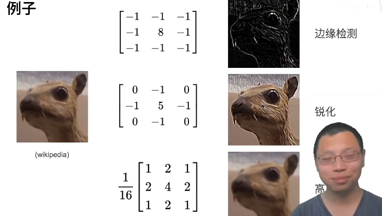

kernel的学习取决于网络认为哪种kernel对学习有利


为什么kernel不是越大越好？

在感受野相同的情况下，核越小，计算量越小。用更深的层而不是更大的kernel来得到相同的感受野效果更好

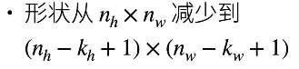

1. 填充：学习边缘信息使其不被丢弃；卷积以后形状不变(变成想要的形状)

   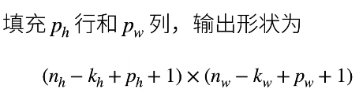

   ```python
   conv2d = nn.Conv2d(1, 1, kernel_size=3, padding=1)
   ```

   padding=1			所有侧边各填充1个像素

   ```python
   conv2d = nn.Conv2d(1, 1, kernel_size=(5, 3), padding=(2, 1),stride=2)
   ```

   使用padding参数进行填充,使用stride参数选择步幅(默认为1)

   上下各填充2行,左右各填充1行

2. 步幅:每次卷积计算跨一定格数的步幅

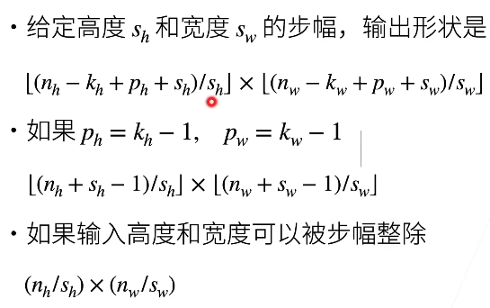

步幅会使得高和宽大幅度衰减,所以一般仅在层与层之间才

##### 卷积实际上是信息的有损压缩,而我们要做的就是在	信息量, 计算速率 以及准确性 中找到平衡点

一般而言,我们可以直接套用经典的神经网络结构,当然对于特殊形状的输入,可能需要对输入做一次处理,然后再输入网络中

一般而言,网络并不是非常非常重要的部分(resnet 及其各个变种间的误差已经做的非常好了)

 多个小kernel的结果与少量大kernel接近,但是运算量更少

# easy is best

简单的模型更通用,更改到其他数据集上也更方便 


#### 卷积层多输出通道

使用多个kernel进行卷积,得到多个charnel的结果(每个核生成一个charnal)(有的kernel提取边缘,有的放缩图像,有的锐化图像……，多个核提取各种不同的信息,从而在pooling中实现信息融合)

就是把图片当做一个向量，加权平均，信息融合，与一层mlp中的一个神经元干的是一件事


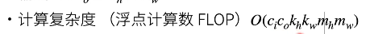

通过这个公式参考计算的复杂度 

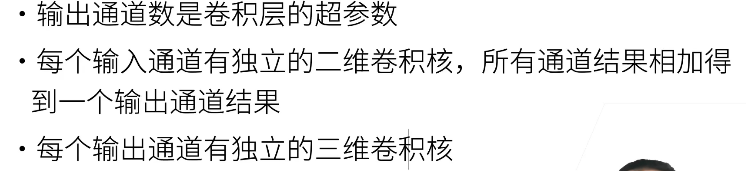

**zip()** 函数用于将可迭代的对象作为参数，将对象中对应的元素打包成一个个元组，然后返回由这些元组组成的列表。

如果各个迭代器的元素个数不一致，则返回列表长度与最短的对象相同，利用 * 号操作符，可以将元组解压为列表。


```python
def corr2d_multi_in(X, K):
    # 先遍历“X”和“K”的第0个维度（通道维度），再把它们加在一起
    return sum(d2l.corr2d(x, k) for x, k in zip(X, K))
X = torch.tensor([[[0.0, 1.0, 2.0], [3.0, 4.0, 5.0], [6.0, 7.0, 8.0]],
               [[1.0, 2.0, 3.0], [4.0, 5.0, 6.0], [7.0, 8.0, 9.0]]])
K = torch.tensor([[[0.0, 1.0], [2.0, 3.0]], [[1.0, 2.0], [3.0, 4.0]]])

print(corr2d_multi_in(X, K))
```

一个基础的2*2卷积

输出：

```
tensor([[ 56.,  72.],
        [104., 120.]])
```

从而实现了一个2*2的卷积

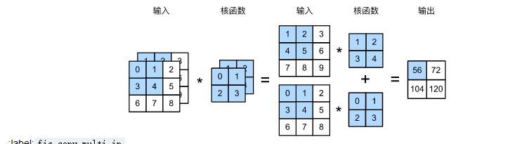

示意图如此


```python
def corr2d_multi_in_out(X, K):
    # 迭代“K”的第0个维度，每次都对输入“X”执行互相关运算。
    # 最后将所有结果都叠加在一起
    return torch.stack([corr2d_multi_in(X, k) for k in K], 0)

K = torch.stack((K, K + 1, K + 2), 0)
print(K.shape)
print(corr2d_multi_in_out(X, K))
```

输出:

```
tensor([[[ 56.,  72.],
         [104., 120.]],

        [[ 76., 100.],
         [148., 172.]],

        [[ 96., 128.],
         [192., 224.]]])
```

做了一个多输出的设计(从1个kernel变成了3个kernel)


```python
def corr2d_multi_in_out_1x1(X, K):	#用reshape做全连接
    c_i, h, w = X.shape
    c_o = K.shape[0]
    X = X.reshape((c_i, h * w))
    K = K.reshape((c_o, c_i))
    # 全连接层中的矩阵乘法
    Y = torch.matmul(K, X)
    return Y.reshape((c_o, h, w))

X = torch.normal(0, 1,    (3, 3, 3))
K = torch.normal(0, 1, (2, 3, 1, 1))

Y1 = corr2d_multi_in_out_1x1(X, K)		#全连接
Y2 = corr2d_multi_in_out(X, K)			#卷积
assert float(torch.abs(Y1 - Y2).sum()) < 1e-6#对比 Y1 Y2相等,则不报错
```

即这两个函数对于X和K的计算是等效的


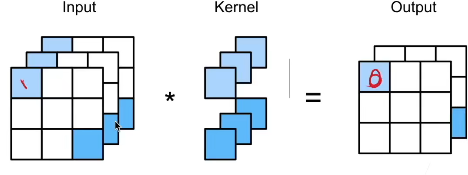


做了一个1*1的卷积

1*1卷积,仅融合信息,不改变形状(可视为一个卷积层(操作类似))

1X1的核，相当于将图片在每个chanel下被拉成了向量，chanel变batch_size


一般而言,2步长的卷积使得长宽减少一半,从而拓宽一倍的通道数以减少参数的同时保留更多的信息(即下采样的常规做法)

卷积对位置信息非常敏感,而通过池化层可以弱化卷积对位置信息的敏感度


3d卷积在视频领域比较常用,对图片(含深度信息)效果比2d(2d卷积再相加)好一点,但是复杂度大很多,所以视频领域的计算仍然不大理想 

### pooling池化 

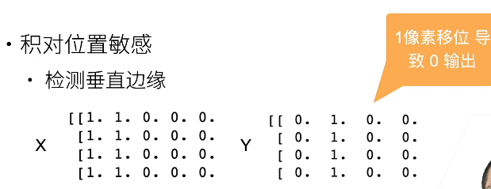

这不完全是好事，我们更期望卷积核有一定的平移不变性(泛用性),否则换了个位置就不能用,那就需要非常非常多的卷积核.效果就不好了

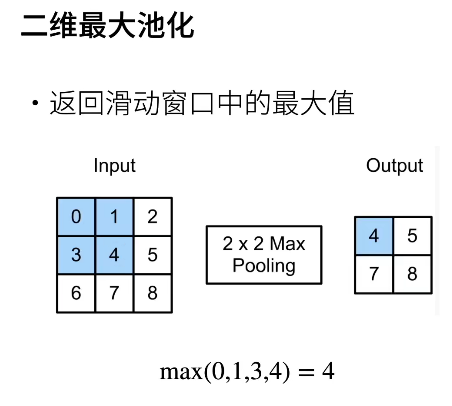

最大池化层(当然还有平均池化层等)如上图所示

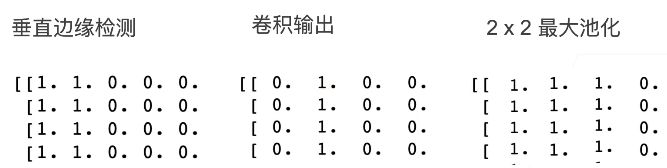

对比以下,池化允许小幅度的偏移,判定比卷积更宽松

和**卷积的区别**:没有可学习的参数(不需要梯度来学习其参数,但是最大池化仍有和梯度相关的信息max id需要记录,以此判断哪个参数需要更新)


#### 最大值池化max pooling 

max pooling也要满足梯度之和不变的原则，max pooling的前向传播是把patch中最大的值传递给后一层，而其他像素的值直接被舍弃掉。那么反向传播也就是把梯度直接传给前一层某一个像素，而其他像素不接受梯度，也就是为0。所以max pooling操作和mean pooling操作不同点在于需要记录下池化操作时到底哪个像素的值是最大，也就是max id，

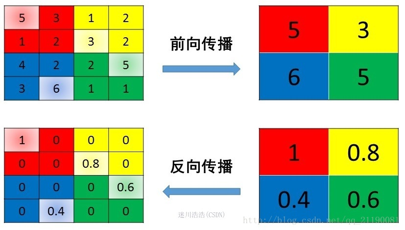


#### 平均池化mean pooling

mean pooling的前向传播就是把一个patch中的值求取平均来做pooling，那么反向传播的过程也就是把某个元素的梯度等分为n份分配给前一层，这样就保证池化前后的梯度（残差）之和保持不变，还是比较理解的，图示如下 ： 


mean pooling比较容易让人理解错的地方就是会简单的认为直接把梯度复制N遍之后直接反向传播回去，但是这样会造成loss之和变为原来的N倍，网络是会产生梯度爆炸的。

##### 代码

```python
def pool2d(X, pool_size, mode='max'):
    p_h, p_w = pool_size
    Y = torch.zeros((X.shape[0] - p_h + 1, X.shape[1] - p_w + 1))
    for i in range(Y.shape[0]):	#按行
        for j in range(Y.shape[1]):	#按列
            if mode == 'max':
                Y[i, j] = X[i: i + p_h, j: j + p_w].max()
            elif mode == 'avg':
                Y[i, j] = X[i: i + p_h, j: j + p_w].mean()
    return Y

X = torch.tensor([[0.0, 1.0, 2.0], [3.0, 4.0, 5.0], [6.0, 7.0, 8.0]])
pool2d(X, (2, 2))
```

没有多通道,没有padding,没有stride的简单池化


```python
X = torch.arange(16, dtype=torch.float32).reshape((1, 1, 4, 4))
pool2d = nn.MaxPool2d(3)
pool2d(X)
```

默认情况下，(**深度学习框架中的步幅与汇聚窗口的大小相同**)。 因此，如果我们使用形状为`(3, 3)`的汇聚窗口，那么默认情况下，我们得到的步幅形状为`(3, 3)`


```python
pool2d = nn.MaxPool2d(3, padding=1, stride=2)
pool2d(X)
```

[**填充和步幅可以手动设定**]。


当然，我们可以(**设定一个任意大小的矩形汇聚窗口，并分别设定填充和步幅的高度和宽度**)。

In [8]:

```python
pool2d = nn.MaxPool2d((2, 3), stride=(2, 3), padding=(0, 1))
pool2d(X)
```

Out[8]:

```
tensor([[[[ 5.,  7.],
          [13., 15.]]]])
```


##### 多通道

```python
X = torch.cat((X, X + 1), 1)

pool2d = nn.MaxPool2d(3, padding=1, stride=2)
pool2d(X)
```

输出:

```
tensor([[[[ 5.,  7.],
          [13., 15.]],

         [[ 6.,  8.],
          [14., 16.]]]])
```

一般而言，池化层放在卷积层后面

窗口重叠和不重叠区别不大 

在考虑性能的情况下，使用python自己的元组操作而不是矩阵拼接速度会快不少

池化层逐渐少用：直接对数据做改变(变形,平移,放大缩小等),淡化了池化层的作用(缓解卷积对位置的敏感性) 


#### LetNet

http://localhost:8888/notebooks/d2l-zh%20(1)/pytorch/chapter_convolutional-neural-networks/lenet.ipynb

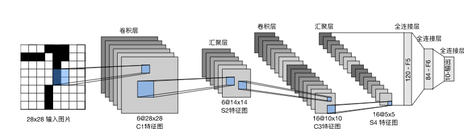

示意图

```python
import torch
from torch import nn
from d2l import torch as d2l

net = nn.Sequential(
    nn.Conv2d(1, 6, kernel_size=5, padding=2), nn.Sigmoid(),
    nn.AvgPool2d(kernel_size=2, stride=2),
    nn.Conv2d(6, 16, kernel_size=5), nn.Sigmoid(),
    nn.AvgPool2d(kernel_size=2, stride=2),
    nn.Flatten(),
    nn.Linear(16 * 5 * 5, 120), nn.Sigmoid(),
    nn.Linear(120, 84), nn.Sigmoid(),
    nn.Linear(84, 10))
```

网络构建		nn.Flatten()把网络拉直用于全连接


<div><br class="Apple-interchange-newline">layer in net:  </div>

```python
X = torch.rand(size=(1, 1, 28, 28), dtype=torch.float32)
for layer in net:
    X = layer(X)
    print(layer.__class__.__name__,'output shape: \t',X.shape)

```

输出

```python
Conv2d output shape: 	 torch.Size([1, 6, 28, 28])
Sigmoid output shape: 	 torch.Size([1, 6, 28, 28])
AvgPool2d output shape: 	 torch.Size([1, 6, 14, 14])
Conv2d output shape: 	 torch.Size([1, 16, 10, 10])
Sigmoid output shape: 	 torch.Size([1, 16, 10, 10])
AvgPool2d output shape: 	 torch.Size([1, 16, 5, 5])
Flatten output shape: 	 torch.Size([1, 400])
Linear output shape: 	 torch.Size([1, 120])
Sigmoid output shape: 	 torch.Size([1, 120])
Linear output shape: 	 torch.Size([1, 84])
Sigmoid output shape: 	 torch.Size([1, 84])
Linear output shape: 	 torch.Size([1, 10])
```

因为是nn.Sequential()构造的,所以可以通过for layer in net()对每一层进行迭代,将X通过拿出来的层进行运算

刚开始的卷积形状没有改变:padding一下,避免边缘信息丢失


```
batch_size = 256
train_iter, test_iter = d2l.load_data_fashion_mnist(batch_size=batch_size)
```

设置batch_size, 读取train_iter, test_iter数据

```python
def evaluate_accuracy_gpu(net, data_iter, device=None): #@save
    """使用GPU计算模型在数据集上的精度"""
    if isinstance(net, nn.Module):
        net.eval()  # 设置为评估模式
        if not device:
            device = next(iter(net.parameters())).device
    # 正确预测的数量，总预测的数量
    metric = d2l.Accumulator(2)
    with torch.no_grad():
        for X, y in data_iter:
            if isinstance(X, list):
                # BERT微调所需的（之后将介绍）
                X = [x.to(device) for x in X]
            else:
                X = X.to(device)
            y = y.to(device)
            metric.add(d2l.accuracy(net(X), y), y.numel())
    return metric[0] / metric[1]
```

net.eval() ,使用评估模式,在此模式下会固定模型(参数不变),用于验证acc等参数

```python
#@save
def train_ch6(net, train_iter, test_iter, num_epochs, lr, device):
    """用GPU训练模型(在第六章定义)"""
    def init_weights(m):
        if type(m) == nn.Linear or type(m) == nn.Conv2d:
            nn.init.xavier_uniform_(m.weight)
    net.apply(init_weights)
    print('training on', device)
    net.to(device)
    optimizer = torch.optim.SGD(net.parameters(), lr=lr)
    loss = nn.CrossEntropyLoss()
    animator = d2l.Animator(xlabel='epoch', xlim=[1, num_epochs],
                            legend=['train loss', 'train acc', 'test acc'])
    timer, num_batches = d2l.Timer(), len(train_iter)
    for epoch in range(num_epochs):
        # 训练损失之和，训练准确率之和，样本数
        metric = d2l.Accumulator(3)
        net.train()
        for i, (X, y) in enumerate(train_iter):
            timer.start()
            optimizer.zero_grad()
            X, y = X.to(device), y.to(device)
            y_hat = net(X)
            l = loss(y_hat, y)
            l.backward()
            optimizer.step()
            #至此已经训练完毕了,下面是精度验证以及输出图片的部分
            
            
            with torch.no_grad():
                metric.add(l * X.shape[0], d2l.accuracy(y_hat, y), X.shape[0])
            timer.stop()
            train_l = metric[0] / metric[2]
            train_acc = metric[1] / metric[2]
            if (i + 1) % (num_batches // 5) == 0 or i == num_batches - 1:
                animator.add(epoch + (i + 1) / num_batches,
                             (train_l, train_acc, None))
        test_acc = evaluate_accuracy_gpu(net, test_iter)
        animator.add(epoch + 1, (None, None, test_acc))
    print(f'loss {train_l:.3f}, train acc {train_acc:.3f}, '
          f'test acc {test_acc:.3f}')
    print(f'{metric[2] * num_epochs / timer.sum():.1f} examples/sec '
          f'on {str(device)}')
```

reshape一般比view更好,不过可能慢一点(reshape自动选择要不要改变内存存储方式(一般是改变的)，而view不能改变)

#### 

在AlexNet之前,核方法很受重视(因为数据量暴增)

SVM被广泛使用(鲁棒性强,不怎么需要调参),现在也蛮好用的

凸优化:可以简单理解为有漂亮显式解的优化(几何学内容)

特征工程:SIFT,SURF

在深度学习以前,以上三者对结果提升非常大,反而是模型结构不受重视 

核方法:数据多,研究数据得信息

神经网络:计算资源多,用算力换信息


#### AlexNet

优点:使用了**dropout,ReLu,Max Pooling以及数据增强(换色,平移,局部放大,增减亮度)**

本质上就是一个更深(更多次卷积核池化)更大(大输入,大输出,多通道)的LeNet,使用了如上的层进行改进

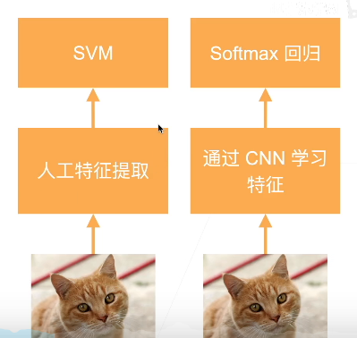

左边是经典机器学习,右边是deep learning的做法

人工特征提取得到计算机能理解的特征,再通过SVM进行运算

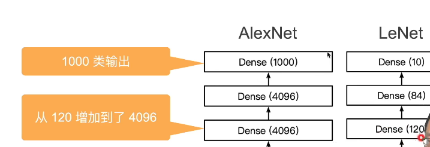

简单对比一下传递的参数量

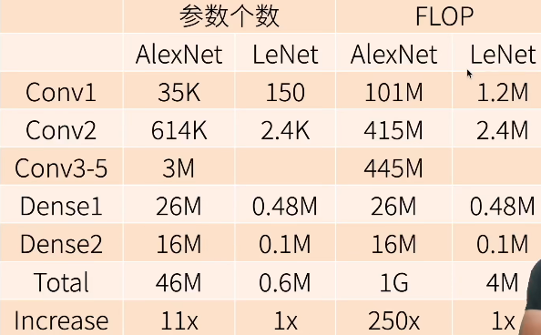

 

10x参数,250x计算复杂度

代码实现:

```python
import torch
from torch import nn
from d2l import torch as d2l

net = nn.Sequential(
    # 这里，我们使用一个11*11的更大窗口来捕捉对象。
    # 同时，步幅为4，以减少输出的高度和宽度。
    # 另外，输出通道的数目远大于LeNet
    nn.Conv2d(1, 96, kernel_size=11, stride=4, padding=1), nn.ReLU(),
    nn.MaxPool2d(kernel_size=3, stride=2),
    # 减小卷积窗口，使用填充为2来使得输入与输出的高和宽一致，且增大输出通道数
    nn.Conv2d(96, 256, kernel_size=5, padding=2), nn.ReLU(),
    nn.MaxPool2d(kernel_size=3, stride=2),
    # 使用三个连续的卷积层和较小的卷积窗口。
    # 除了最后的卷积层，输出通道的数量进一步增加。
    # 在前两个卷积层之后，汇聚层不用于减少输入的高度和宽度
    nn.Conv2d(256, 384, kernel_size=3, padding=1), nn.ReLU(),
    nn.Conv2d(384, 384, kernel_size=3, padding=1), nn.ReLU(),
    nn.Conv2d(384, 256, kernel_size=3, padding=1), nn.ReLU(),
    nn.MaxPool2d(kernel_size=3, stride=2),
    nn.Flatten(),
    # 这里，全连接层的输出数量是LeNet中的好几倍。使用dropout层来减轻过拟合
    nn.Linear(6400, 4096), nn.ReLU(),
    nn.Dropout(p=0.5),
    nn.Linear(4096, 4096), nn.ReLU(),
    nn.Dropout(p=0.5),
    # 最后是输出层。由于这里使用Fashion-MNIST，所以用类别数为10，而非论文中的1000
    nn.Linear(4096, 10))
```

构建网络结构 


```python
X = torch.randn(1, 1, 224, 224)
for layer in net:
    X=layer(X)
    print(layer.__class__.__name__,'output shape:\t',X.shape)
```

查看各个网络结构的输出


```python
batch_size = 128
train_iter, test_iter = d2l.load_data_fashion_mnist(batch_size, resize=224)

lr, num_epochs = 0.01, 10
d2l.train_ch6(net, train_iter, test_iter, num_epochs, lr, d2l.try_gpu())
```

因为我们的数据不是十分理想(数据核网络的输入不一致),所以需要resize=224(一般不可能这么做就是了,我们都是模型匹配数据的),其余的也就是之前的部分


有不少Normalization是有用的,也有不少是后来证明没有效果,需要我们自己鉴别

增强了反而有更差的效果是非常正常的,增强类似于添加噪音,不一定能降低误差 


#### VGG 使用块的网络 

比ALexNet更深更大

1. more 全连接(太贵啦)

2. more 卷积

3. **卷积层组合成块**

为什么堆卷积层为块:

相同视野情况下,多个小窗口效果比单个大(宽)窗口好(实验证明)


代码

```python
import torch
from torch import nn
from d2l import torch as d2l


def vgg_block(num_convs, in_channels, out_channels):
    layers = []
    for _ in range(num_convs):
        layers.append(nn.Conv2d(in_channels, out_channels,
                                kernel_size=3, padding=1))
        layers.append(nn.ReLU())
        in_channels = out_channels
    layers.append(nn.MaxPool2d(kernel_size=2,stride=2))
    return nn.Sequential(*layers)

```

 构建VGG块


```python
conv_arch = ((1, 64), (1, 128), (2, 256), (2, 512), (2, 512))
#定义卷积

def vgg(conv_arch):
    conv_blks = []
    in_channels = 1
    # 卷积层部分
    for (num_convs, out_channels) in conv_arch:
        conv_blks.append(vgg_block(num_convs, in_channels, out_channels))
        in_channels = out_channels

    return nn.Sequential(
        *conv_blks, nn.Flatten(),
        # 全连接层部分
        nn.Linear(out_channels * 7 * 7, 4096), nn.ReLU(), nn.Dropout(0.5),
        nn.Linear(4096, 4096), nn.ReLU(), nn.Dropout(0.5),
        nn.Linear(4096, 10))

net = vgg(conv_arch)

X = torch.randn(size=(1, 1, 224, 224))
for blk in net:
    X = blk(X)
    print(blk.__class__.__name__,'output shape:\t',X.shape)
```

  构建网络结构 ,随机产生一个X看看网络结构


```python
ratio = 4		#所有通道数/4,以减少通道数,加快训练
small_conv_arch = [(pair[0], pair[1] // ratio) for pair in conv_arch]
net = vgg(small_conv_arch)

lr, num_epochs, batch_size = 0.05, 10, 128
train_iter, test_iter = d2l.load_data_fashion_mnist(batch_size, resize=224)
d2l.train_ch6(net, train_iter, test_iter, num_epochs, lr, d2l.try_gpu())
```

[**由于VGG-11比AlexNet计算量更大，因此我们构建了一个通道数较少的网络**]，足够用于训练Fashion-MNIST数据集。

除了使用略高的学习率外，[**模型训练**]过程与 :numref:`sec_alexnet`中的AlexNet类似。


### NiN Network In Network


全连接层最大的问题:需要大量的参数,大量参数带来庞大的计算量,

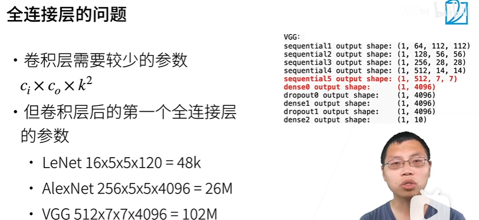

举个例子如上


1*1卷积代替全连接层,参数少(共用参数) 


和VGG对比一下


对比一下可发现,使用NiN block取消了全连接大量减少参数和计算,使得网络得以向更深处发展

1. (NiN使用卷积层+两个1*1卷积层 (对每个像素增加了非线性性)

2. 使用全局平均池化层代替全连接,不容易过拟合(同时也意味着不容易拟合)


代码:

```
import torch
from torch import nn
from d2l import torch as d2l


def nin_block(in_channels, out_channels, kernel_size, strides, padding):
    return nn.Sequential(
        nn.Conv2d(in_channels, out_channels, kernel_size, strides, padding),
        nn.ReLU(),
        nn.Conv2d(out_channels, out_channels, kernel_size=1), nn.ReLU(),
        nn.Conv2d(out_channels, out_channels, kernel_size=1), nn.ReLU())
```

卷积,ReLU,1* 1卷积*2	简单组装成NiN块

```python
net = nn.Sequential(
    nin_block(1, 96, kernel_size=11, strides=4, padding=0),
    nn.MaxPool2d(3, stride=2),
    nin_block(96, 256, kernel_size=5, strides=1, padding=2),
    nn.MaxPool2d(3, stride=2),
    nin_block(256, 384, kernel_size=3, strides=1, padding=1),
    nn.MaxPool2d(3, stride=2),
    nn.Dropout(0.5),	#防过拟合
    # 标签类别数是10
    nin_block(384, 10, kernel_size=3, strides=1, padding=1),
    nn.AdaptiveAvgPool2d((1, 1)),	#通道全局平均池化将宽高变成(1,1)
    # 将四维的输出转成二维的输出，其形状为(批量大小,10)
    nn.Flatten())
```

(bn, 10, 1, 1)--flatten--(bn, 10)


```python
X = torch.rand(size=(1, 1, 224, 224))
for layer in net:
    X = layer(X)
    print(layer.__class__.__name__,'output shape:\t', X.shape)
```


输出

```python
Sequential output shape:	 torch.Size([1, 96, 54, 54])
MaxPool2d output shape:	 torch.Size([1, 96, 26, 26])
Sequential output shape:	 torch.Size([1, 256, 26, 26])
MaxPool2d output shape:	 torch.Size([1, 256, 12, 12])
Sequential output shape:	 torch.Size([1, 384, 12, 12])
MaxPool2d output shape:	 torch.Size([1, 384, 5, 5])
Dropout output shape:	 torch.Size([1, 384, 5, 5])
Sequential output shape:	 torch.Size([1, 10, 5, 5])
AdaptiveAvgPool2d output shape:	 torch.Size([1, 10, 1, 1])
Flatten output shape:	 torch.Size([1, 10])
```

用1个单通道224*224的随机数看看模型结构

softmax卸载training的loss函数中,而不是放在网络里面

```python
lr, num_epochs, batch_size = 0.1, 10, 128
train_iter, test_iter = d2l.load_data_fashion_mnist(batch_size, resize=224)
d2l.train_ch6(net, train_iter, test_iter, num_epochs, lr, d2l.try_gpu())
```

老规矩跑一下


1. 超大的单隐藏层NLP效果不一定差,但是很容易过拟合

2.  torchscript可以将torch模型转到c++,但是过于复杂的模型可能会失败

3. 全局池化层可以**不改变通道数**的同时**压低高宽,降低输入参数且不需要训练**,且有助于**提升泛化性**,坏处则是**降低收敛速度**,这个就只能增加epoch了
4. pytorch网络构建的参数会自动初始化


### GoogLeNet

超级大超级深，多个网络并行

Inception块：


结合了多个常用的做法(成本高)，直接在输出的通道数channal上做合并

蓝色部分为抽取信息部分，橙色为通道数 

**和单纯的3*3或5*5卷积比，Inception块参数更少，计算复杂度更低**，输出结果也是通道数加倍


 


组成 

Inception有各种后续变种
 • Inception-BN （v2）-使用 batch normalization （后面介绍）
 ♦ lnception-V3-修改了Inception块
  • 替换5x5为多个3x3卷积层
  • 替换5x5为1x7和7x1卷积层
  • 替换3x3为1x3和3x1卷积层
  • 更深
 • lnception-V4-使用残差连接（后面介绍）

  

- nception块相当于一个有4条路径的子网络。它通过不同窗口形状的卷积层和最大汇聚层来并行抽取信息，并使用1×11×1卷积层减少每像素级别上的通道维数从而降低模型复杂度。 
- GoogLeNet将多个设计精细的Inception块与其他层（卷积层、全连接层）串联起来。其中Inception块的通道数分配之比是在ImageNet数据集上通过大量的实验得来的。
- GoogLeNet和它的后继者们一度是ImageNet上最有效的模型之一：它以较低的计算复杂度提供了类似的测试精度。

全连接容易拟合，多通道容易拟合，而且全连接对算力要求高，所以适量通道(1024最多)能防止过拟合


trick:不改变模型,仅改变一些超参数(lr,数据初始化等等),就可以让acc有很大的提升


### 批量归一化	batch normalization

尤其是在深网络的效果特别好

批量归一化
•损失出现在最后，后面的层训练较快
数据在最底部
  • 底部的层训练较慢
  • 底部层一变化，所有都得跟着变
  • 最后的那些层需要重新学习多次
  • 导致收敛变慢
•我们可以在学习底部层的时候避免变 化顶部层吗？


底部拟合慢(上面的参数传不到下面,导致下面训练缓慢)

固定小批量里面的均值和方差


（x-均值μ_B)/σ _B(方差)		γ和β是可学习的参数(当然,γ和β位于一定区间内)

・可学习的参数γ和β
・作用在
	 •**全连接层和卷积层输出上，激活函数前**
 	•全连接层和卷积层输入上
**•对全连接层，作用在特征维(宽和高)
•对于卷积层，作用在通道维(channal)**

重点：对于卷积层，作用在通道维

μ_B,σ _B等价于噪音,控制了模型复杂度(和dropout相同效果)(因为随机抽小批量出来算，随机就随机在了抽取这步上)


总结:

•批量归一化固定小批量中的均值和方差，然 后学习出适合的偏移和缩放
•可以**加速收敛速度(可以用大lr,少epoch就可以做到多epoch的效果)**，但一般**不改变模型精度**		(不改精度还加速收敛,很好了已经)


```python
net = nn.Sequential(
    nn.Conv2d(1, 6, kernel_size=5), nn.BatchNorm2d(6), nn.Sigmoid(),
    nn.AvgPool2d(kernel_size=2, stride=2),
    nn.Conv2d(6, 16, kernel_size=5), nn.BatchNorm2d(16), nn.Sigmoid(),
    nn.AvgPool2d(kernel_size=2, stride=2), nn.Flatten(),
    nn.Linear(256, 120), nn.BatchNorm1d(120), nn.Sigmoid(),
    nn.Linear(120, 84), nn.BatchNorm1d(84), nn.Sigmoid(),
    nn.Linear(84, 10))
```

直接在liner和sigmoid的输出之间添加nn.BatchNorm1d(),参数为输出大小

Conv2d卷积和sigmoid的输出之间添加nn.BatchNorm2d(),参数为输出大小

上面的代码是对LeNet添加batch Norm的演示,可以自己对比一下

μ_B,σ _B这两个参数自动更新


xavier是参数的归一化，batch_normal是数据的归一化

BN里的均值和方差都和输入有关的，严格意义上不是线性变换


layernorm	

instance normalization 


## ResNet

加深训练不一定能带来t_acc的提高

F不是值域，是函数空间。nn就是函数拟合，F1~6表示6个可选择函数的集合。模型表达能力的强弱体现在网络可拟合的函数的数量


如左图,虽然函数空间F_i越来越大,但是理最佳值f*越来越远

但是如果像右图,**函数空间F_i层层嵌套(nested),则F_i+1严格(至少不会变差)比F_i更接近最优值f***

残差块
 ・串联一个层改变函数类，我们希望能扩大函数类
 ・残差块加入快速通道(右边)来得到
/(x) =x + g(x)的结构

/(x) =x + g(x),从而使得F_i+1的覆盖范围严格大于F_i,使得F_i+1梯度训练时可得的最优解必然严格比F_i好(至少不会比F_i差)

前馈补偿，使得梯度不容易消失


使用1*1的卷积,使得通道数和残差相同,从而可以加回去(避免通道数不统一，相加出错)


残差块的出现使得网络可以很深很深也不过拟合


```python
import torch
from torch import nn
from torch.nn import functional as F
from d2l import torch as d2l


class Residual(nn.Module):  #@save
    def __init__(self, input_channels, num_channels,
                 use_1x1conv=False, strides=1):
        super().__init__()
        self.conv1 = nn.Conv2d(input_channels, num_channels,
                               kernel_size=3, padding=1, stride=strides)
        self.conv2 = nn.Conv2d(num_channels, num_channels,
                               kernel_size=3, padding=1)
        if use_1x1conv:
            self.conv3 = nn.Conv2d(input_channels, num_channels,
                                   kernel_size=1, stride=strides)
            #使用1*1的卷积使得通道加倍,要不要就看自己需求
        else:
            self.conv3 = None
        self.bn1 = nn.BatchNorm2d(num_channels)
        self.bn2 = nn.BatchNorm2d(num_channels)

    def forward(self, X):
        Y = F.relu(self.bn1(self.conv1(X)))
        Y = self.bn2(self.conv2(Y))
        if self.conv3:
            X = self.conv3(X)
        Y += X
        return F.relu(Y)
```

建立残差块


下面我们来查看[**输入和输出形状一致**]的情况

```python
blk = Residual(3,3)
X = torch.rand(4, 3, 6, 6)
Y = blk(X)
Y.shape
```

输出

```
torch.Size([4, 3, 6, 6])
```


我们也可以在**[增加输出通道数的同时，减半输出的高和宽]**。

```python
blk = Residual(3,6, use_1x1conv=True, strides=2)
blk(X).shape

```


torch.Size([4, 6, 3, 3])


下面真正实现一个**ResNet模型**


```python
b1 = nn.Sequential(nn.Conv2d(1, 64, kernel_size=7, stride=2, padding=3),
                   nn.BatchNorm2d(64), nn.ReLU(),
                   nn.MaxPool2d(kernel_size=3, stride=2, padding=1))
```

对b1块做特殊处理( 第一个模块的通道数同输入通道数一致。 由于之前已经使用了步幅为2的最大汇聚层，所以无须减小高和宽。 之后的每个模块在第一个残差块里将上一个模块的通道数翻倍，并将高和宽减半。)当然使用之前定义的残差块函数也是可以的

```python
def resnet_block(input_channels, num_channels, num_residuals,
                 first_block=False):
    blk = []
    for i in range(num_residuals):
        if i == 0 and not first_block:
            blk.append(Residual(input_channels, num_channels,
                                use_1x1conv=True, strides=2))
        else:
            blk.append(Residual(num_channels, num_channels))
    return blk

b2 = nn.Sequential(*resnet_block(64, 64, 2, first_block=True))
b3 = nn.Sequential(*resnet_block(64, 128, 2))
b4 = nn.Sequential(*resnet_block(128, 256, 2))
b5 = nn.Sequential(*resnet_block(256, 512, 2))
```

仅输入输出channal和卷积次数不同的模块用函数定义,*解包后 nn.Sequential构建层

```python
net = nn.Sequential(b1, b2, b3, b4, b5,
                    nn.AdaptiveAvgPool2d((1,1)),
                    nn.Flatten(), nn.Linear(512, 10))
```

nn.Sequential()将封装好的层合并,再加上平均pooling层,拉长然后全连接(512channal入10channal出  )


batch size太小训练时间非常长,太大则泛化能力差(容易过拟合),所以相对小的batch是比较有利的


红色:固定学习率	蓝色:衰减学习率	绿色:cos学习率(取cos函数的一部分)


每个conv有自己的bn,每个bn有自己的参数需要学习,因此每个块中要定义num_residuals个bn

test_acc大于train_acc是正常的,train_acc会存在dropout,data argument等噪音


非残差训练时,因为上层训练的比较好,导致上层的loss小,所以链式法则得到的下层的loss变小了,导致下层的参数不能及时更新(特别是上层使用全连接等比较强性能的层时)


残差块避免了链式法则导致的梯度消失以及梯度爆炸(其中一个原因)


QA:

学习率可以让靠近输出的小一些，靠近输入的大一些，这样可以缓解梯度消失的问题,(如greedy layer-wise pre-training (逐层贪婪预训练))


### 数据增广（数据增强）

此处课程为书本第13章的内容,代码在这里

http://localhost:8888/notebooks/d2l-zh%20(1)/pytorch/chapter_computer-vision/image-augmentation.ipynb

变色(色调,饱和度,明亮度)切割,翻转(左右翻转多,上下翻转比较少)这些都属于数据增强(如imgaug，albumentations等，都可以看看)


一张图得多张图

代码:导入图片和包先跳过

```python
def apply(img, aug, num_rows=2, num_cols=4, scale=1.5):
    Y = [aug(img) for _ in range(num_rows * num_cols)]
    d2l.show_images(Y, num_rows, num_cols, scale=scale)
```

传入图片,增广方法等参数,展示增广后的图片

```python
apply(img, torchvision.transforms.RandomHorizontalFlip())
```

水平方向随机翻转

```python
apply(img, torchvision.transforms.RandomVerticalFlip())
```

垂直方向随机翻转


```python
shape_aug = torchvision.transforms.RandomResizedCrop(
    (200, 200), scale=(0.1, 1), ratio=(0.5, 2))
apply(img, shape_aug)
```

缩放	(200, 200)输出形状	scale=(0.1, 1)放大倍数	 ratio=(0.5, 2)高宽比 


```python
apply(img, torchvision.transforms.ColorJitter(
    brightness=0.5, contrast=0, saturation=0, hue=0))
```

[**随机更改图像的亮度**]，随机值为原始图像的50%（1−0.5）到150%（1+0.5）之间。


```python
apply(img, torchvision.transforms.ColorJitter(
    brightness=0, contrast=0, saturation=0, hue=0.5))
```

同样，我们可以[**随机更改图像的色调**]。


```python
color_aug = torchvision.transforms.ColorJitter(
    brightness=0.5, contrast=0.5, saturation=0.5, hue=0.5)
apply(img, color_aug)
```

创建一个`RandomColorJitter`实例color_aug，并设置如何同时[**随机更改图像的亮度（`brightness`）、对比度（`contrast`）、饱和度（`saturation`）和色调（`hue`）**]。


```python
augs = torchvision.transforms.Compose([
    torchvision.transforms.RandomHorizontalFlip(), color_aug, shape_aug])
apply(img, augs)
```

用torchvision.transforms.Compose对刚刚的两个操作进行合并


```python
augs = torchvision.transforms.Compose([
    torchvision.transforms.RandomHorizontalFlip(), color_aug, shape_aug])
apply(img, augs)
```

合并刚刚实例化了的操作

训练前先保存增强的training数据,再进行

#### 小结

- 图像增广基于现有的训练数据生成随机图像，来提高模型的泛化能力。
- 为了在预测过程中得到确切的结果，我们通常对训练样本只进行图像增广，而在预测过程中不使用带随机操作的图像增广。
- 深度学习框架提供了许多不同的图像增广方法，这些方法可以被同时应用。


理论上数据够多就不用做增广,但是实际很难说数据真的够多了**因为数据多不一定多样性够好**

对于极度偏斜预测(正确or错误样本占总比非常非常少),可以对正样本采用数据增强

图片增广是不影响训练集的分布的, 

 mixup:一种不错的增广方式,测试图片线性叠加,标签页叠加(按线性比例,比如用one-hot就好表示了)

 增量学习，incremental learning

增广不改变均值,但是让方差变大了

增广一般不会减少类间差异

 


### 微调	fine-tuning

http://localhost:8888/notebooks/d2l-zh%20(1)/pytorch/chapter_computer-vision/fine-tuning.ipynb

在已有的模型基础上，仅需要少量信息即可做到不错的效果(迁移学习的一部分)

正常而言,提取特征的层仍然是可用的(学习一下效果就不错了),但是最后的输出(softmax层)要重新构建

训练时,使用更小的lr,更少的数据迭代

重用分类器权重
・源数据集可能也有目标数 据中的部分标号
・可以使用预训练好模型分 类器中对应标号对应的向 量来做初始化


固定一些层
・神经网络通常学习有层次的特征表示
 	•低层次的特征更加通用
 	•高层次的特征则更跟数据集相关
・可以固定底部一些层的参数，不参与更新
	 •更强的正则


##### 总结

・ 微调通过使用在大数据上得到的预训练好 的模型来初始化模型权重来完成提升精度
・ 预训练模型质量很重要
・ 微调通常速度更快、精度更高


代码:

在训练期间，我们首先从图像中裁切随机大小和随机长宽比的区域，然后将该区域缩放为224×224输入图像。 在测试过程中，我们将图像的高度和宽度都缩放到256像素，然后裁剪中央224×224区域作为输入。 此外，对于RGB（红、绿和蓝）颜色通道，我们分别*标准化*每个通道。 具体而言，该通道的每个值减去该通道的平均值，然后将结果除以该通道的标准差。		**即数据增广**

```python
# 使用RGB通道的均值和标准差，以标准化每个通道(这里的均值和方差来自数据集本身)
normalize = torchvision.transforms.Normalize(
    [0.485, 0.456, 0.406], [0.229, 0.224, 0.225])

train_augs = torchvision.transforms.Compose([
    torchvision.transforms.RandomResizedCrop(224),
    torchvision.transforms.RandomHorizontalFlip(),
    torchvision.transforms.ToTensor(),
    normalize])

test_augs = torchvision.transforms.Compose([
    torchvision.transforms.Resize(256),
    torchvision.transforms.CenterCrop(224),
    torchvision.transforms.ToTensor(),
    normalize])
```


模型部分:

```python
pretrained_net = torchvision.models.resnet18(pretrained=True)
finetune_net.fc = nn.Linear(finetune_net.fc.in_features, 2)
nn.init.xavier_uniform_(finetune_net.fc.weight)#只对最后一层做随机初始化
```

pretrained=True使用模型本身的参数	finetune_net.fc:full connect全连接层初始化为输出类别为2		

```python
# 如果param_group=True，输出层中的模型参数将使用十倍的学习率
def train_fine_tuning(net, learning_rate, batch_size=128, num_epochs=5,
                      param_group=True):
    train_iter = torch.utils.data.DataLoader(torchvision.datasets.ImageFolder(
        os.path.join(data_dir, 'train'), transform=train_augs),
        batch_size=batch_size, shuffle=True)
    test_iter = torch.utils.data.DataLoader(torchvision.datasets.ImageFolder(
        os.path.join(data_dir, 'test'), transform=test_augs),
        batch_size=batch_size)
    devices = d2l.try_all_gpus()
    loss = nn.CrossEntropyLoss(reduction="none")
    if param_group:
        params_1x = [param for name, param in net.named_parameters()
             if name not in ["fc.weight", "fc.bias"]]
        trainer = torch.optim.SGD([{'params': params_1x},
                                   {'params': net.fc.parameters(),
                                    'lr': learning_rate * 10}],
                                lr=learning_rate, weight_decay=0.001)
    else:
        trainer = torch.optim.SGD(net.parameters(), lr=learning_rate,
                                  weight_decay=0.001)
    d2l.train_ch13(net, train_iter, test_iter, loss, trainer, num_epochs,
                   devices)
```

if param_group部分:param_group=True,则最后一层的学习率是前面层的10倍,否则和前面一样


QA:

数据不平衡导致的主要是标号的不平衡(上层抽象层),对特征提取器影响不大

原数据集和新数据集对于同一种类的名称可能不一样,还得做一个语义匹配

原数据集和目标数据集最好有相似部分

关于“重用分类器权重”，对于一个80类的数据集，只想选用其中5 类，加上另外的4类，方法只有手动提取,或者直接训练输出层

固定一些层可以看作是一种正则化(拟合度降低),哪些固定哪些改学习率看实际情况

基本上,底层和特征有关的层大都对其他模型有帮助,上层抽象化的特征组合重新训练也是一种好选择


### 目标检测和边界框

目标检测和图片分类区别:

1. 目标检测需要在图片中找出所有感兴趣的目标(先找位置再识别,而且不止一个)

   图片分类只需要识别图片中含有的元素

​	框一般用中心点坐标(x,y),宽高(h,r)或者左上右下的(x,y)


#### 锚框

采集图片区域, 判断这些区域中是否包含我们感兴趣的目标，并调整区域边界从而更准确地预测目标的*真实边界框*（ground-truth bounding box）。 不同的模型使用的区域采样方法可能不同。 这里我们介绍其中的一种方法：以每个像素为中心，生成多个缩放比和宽高比（aspect ratio）不同的边界框。 这些边界框被称为*锚框*（anchor box）


对于数据集标记,一般手动标记100个样本,然后迁移学习+半监督学习将剩下的标号搞定

•一类目标检测算法是基于锚框
 • 提出多个被称为锚框的区域 边缘框）
 • 预测每个锚框里是否含有关注的物体(是或不是)
 • 如果是，预测从这个锚框到真实边缘框的偏移(loss)

##### IOU交并比

计算两个框的相似度

示意图 

###### 对于锚框而言

• 每个锚框是一个训练样本
• 将每个锚框，要么标注成背景(被抛弃)，要么 关联上一个真实边缘框(可以计算loss了)
• 我们可能会生成大量的锚框：这导致大量的负类样本

###### 锚框随机生成,因此数量一般远大于边缘框(一张图的边缘框个数有上限)。对相框找和自己IOU最高的那个锚框

•在每一个物体分配一个锚框后 剩下的锚框还会再根据设定的阈值分配一次，这一步会过滤掉很多锚框，但是也有一些锚框会被分配给真实框

###### 然后使用非极大值抑制（NMS）输出

•每个锚框预测一个边缘框
• NMS可以合并相似的预测
  • 选中是非背景类的最大预测值
  • 去掉所有其它锚框和这个边缘框loU值大于θ的预测
  • 重复上述过程直到所有锚框要么被选中，要么被去掉(被NMS去掉或当作背景去掉)

一类目标检测算法基于锚框来预测
•首先生成大量锚框，并赋予标号，每个 锚框作为一个样本进行训练
•在预测时，使用NMS来去掉冗余的预测


代码：

size锚框大小  ratio高宽比

锚框的宽和高分别为ws√r和hs/√r

```python
#@save
def multibox_prior(data, sizes, ratios):
    """生成以每个像素为中心具有不同形状的锚框"""
    in_height, in_width = data.shape[-2:]
    device, num_sizes, num_ratios = data.device, len(sizes), len(ratios)
    boxes_per_pixel = (num_sizes + num_ratios - 1)
    size_tensor = torch.tensor(sizes, device=device)
    ratio_tensor = torch.tensor(ratios, device=device)

    # 为了将锚点移动到像素的中心，需要设置偏移量。
    # 因为一个像素的的高为1且宽为1，我们选择偏移我们的中心0.5
    offset_h, offset_w = 0.5, 0.5
    steps_h = 1.0 / in_height  # 在y轴上缩放步长
    steps_w = 1.0 / in_width  # 在x轴上缩放步长

    # 生成锚框的所有中心点
    center_h = (torch.arange(in_height, device=device) + offset_h) * steps_h
    center_w = (torch.arange(in_width, device=device) + offset_w) * steps_w
    shift_y, shift_x = torch.meshgrid(center_h, center_w)
    shift_y, shift_x = shift_y.reshape(-1), shift_x.reshape(-1)

    # 生成“boxes_per_pixel”个高和宽，
    # 之后用于创建锚框的四角坐标(xmin,xmax,ymin,ymax)
    w = torch.cat((size_tensor * torch.sqrt(ratio_tensor[0]),
                   sizes[0] * torch.sqrt(ratio_tensor[1:])))\
                   * in_height / in_width  # 处理矩形输入
    h = torch.cat((size_tensor / torch.sqrt(ratio_tensor[0]),
                   sizes[0] / torch.sqrt(ratio_tensor[1:])))
    # 除以2来获得半高和半宽
    anchor_manipulations = torch.stack((-w, -h, w, h)).T.repeat(
                                        in_height * in_width, 1) / 2

    # 每个中心点都将有“boxes_per_pixel”个锚框，
    # 所以生成含所有锚框中心的网格，重复了“boxes_per_pixel”次
    out_grid = torch.stack([shift_x, shift_y, shift_x, shift_y],
                dim=1).repeat_interleave(boxes_per_pixel, dim=0)
    output = out_grid + anchor_manipulations
    return output.unsqueeze(0)
```

创建函数,自动生成锚框

```python
img = d2l.plt.imread('../img/catdog.jpg')
h, w = img.shape[:2]

print(h, w)
X = torch.rand(size=(1, 3, h, w))
Y = multibox_prior(X, sizes=[0.75, 0.5, 0.25], ratios=[1, 2, 0.5])
Y.shape

boxes = Y.reshape(h, w, 5, 4)
boxes[250, 250, 0, :]
```

实例化一下,输出如下

```python
561 728
torch.Size([1, 2042040, 4])	#生成了两百万个锚框

tensor([0.06, 0.07, 0.63, 0.82])	#第一个锚框的左下右上相对坐标
```


IOU

```python
#@save
def box_iou(boxes1, boxes2):
    """计算两个锚框或边界框列表中成对的交并比"""
    box_area = lambda boxes: ((boxes[:, 2] - boxes[:, 0]) *
                              (boxes[:, 3] - boxes[:, 1]))
    # boxes1,boxes2,areas1,areas2的形状:
    # boxes1：(boxes1的数量,4),
    # boxes2：(boxes2的数量,4),
    # areas1：(boxes1的数量,),
    # areas2：(boxes2的数量,)
    areas1 = box_area(boxes1)
    areas2 = box_area(boxes2)
    # inter_upperlefts,inter_lowerrights,inters的形状:
    # (boxes1的数量,boxes2的数量,2)
    inter_upperlefts = torch.max(boxes1[:, None, :2], boxes2[:, :2])  #交集
    inter_lowerrights = torch.min(boxes1[:, None, 2:], boxes2[:, 2:])
    inters = (inter_lowerrights - inter_upperlefts).clamp(min=0)
    # inter_areasandunion_areas的形状:(boxes1的数量,boxes2的数量)
    inter_areas = inters[:, :, 0] * inters[:, :, 1]
    union_areas = areas1[:, None] + areas2 - inter_areas #并集=box1+box2-交集
    return inter_areas / union_areas
```


  ```python
  inter_upperlefts = torch.max(boxes1[:, None, :2], boxes2[:, :2])
  ```

None借助广播令两个list创建了新的维度


部分代码的理解参考以下网址

https://blog.csdn.net/qq_36136196/article/details/118862685


```python
#输入真实gt边界框[n1,4],生成的锚框[n2,4],device设备,分配给锚框是非背景的阈值,输出值为每个anchor对应的真实gt边界框的索引[n2]
def assign_anchor_to_bbox(ground_truth,anchors,device,iou_threshold=0.5):
    """给每一个锚框分配最接近的真实边界框（或者背景）"""
    # 锚框的数量anchor[n1],真实边界框的数量[n2]
    num_anchors,num_gt_boxes = anchors.shape[0],ground_truth[0]
    # 计算每个锚框与每个真实边界框的iou值，[n1,n2]
    jaccard = box_iou(anchors,ground_truth)
    # 建一个tensor当作map，用来放对每个锚框所对应的真实边界框，默认为-1,[n1]
    anchors_bbox_map = torch.full((num_anchors,),-1,dtype=torch.long,device=device)
    # 得到每行的最大值，即对于每个锚框来说，iou最大的那个真实边界框，返回iou值和对应真实边界框索引值[n1],[n1]
    max_ious,indices = torch.max(jaccard,dim=1)
    # 根据阈值得到锚框不为背景的相应的索引值[<=n1]
    anc_i = torch.nonzero(max_ious>=iou_threshold).reshape(-1)
    # 根据阈值得到锚框不为背景的真实边界框索引值[<=n1]，与anc_i一一对应的
    box_j = indices[max_ious>=iou_threshold]
    # 挑出>=iou_threshold的值,重新赋值，也就是对每个锚框，得到大于给定阈值的匹配的真实gt边界框的对应索引
    anchors_bbox_map[anc_i] = box_j
    #行，列的默认值[n1],[n2]
    col_discard = torch.full((num_anchors,),-1)
    row_discard = torch.full((num_gt_boxes,),-1)

    # 以下对每个真实边界框重新分配给的锚框，所以，循环次数是gt box的个数。防止在最大值赋值时，某几个锚框对应同一个真实边界框
    for _ in range(num_gt_boxes):
        #取得该矩形中最大值的索引，是按reshape(-1)得到的索引 0-(n1*n2-1)
        max_idx = torch.argmax(jaccard)
        # 得到矩阵最大值所在的列，就是对应的真实gt边界框的索引
        box_idx = (max_idx%num_gt_boxes).long()
        # 得到矩阵最大值所在的行，是对应的锚框的索引
        anc_idx = (max_idx/num_gt_boxes).long()
        # 重新赋值，就是矩阵最大iou值中锚框与其对应的真实gt边界框
        anchors_bbox_map[anc_idx] = box_idx
        # 将最大值所在该行置为-1
        jaccard[:,box_idx] = col_discard
        # 将最大值所在该列置为-1
        jaccard[anc_idx,:] = row_discard
    # 返回值是每个anchor对应的真实gt边界框的索引(其实是list)
    return anchors_bbox_map

```

  jaccard(代指IOU)

```python
for _ in range(num_gt_boxes):
    max_idx = torch.argmax(jaccard)
    box_idx = (max_idx % num_gt_boxes).long()
    anc_idx = (max_idx / num_gt_boxes).long()
    anchors_bbox_map[anc_idx] = box_idx
    jaccard[:, box_idx] = col_discard
    jaccard[anc_idx, :] = row_discard
```

找到最大值,删除最大值所在的行和列除自己以外所有的值,示意图如下


现在我们可以为每个锚框标记类别和偏移量了。 假设一个锚框A被分配了一个真实边界框B。 一方面，锚框AA的类别将被标记为与B相同。 另一方面，锚框A的偏移量将根据B和A中心坐标的相对位置以及这两个框的相对大小进行标记。 鉴于数据集内不同的框的位置和大小不同，我们可以对那些相对位置和大小应用变换，使其获得分布更均匀且易于拟合的偏移量。 在这里，我们介绍一种常见的变换。 给定框A和B，中心坐标分别为(xa,ya)(xa,ya)和(xb,yb)(xb,yb)，宽度分别为wa和wb，高度分别为ha和hb。 我们可以将AA的偏移量标记为：


14:04,锚框偏移量

```python
def offset_boxes(anchors, assigned_bb, eps=1e-6):
    """对锚框偏移量的转换"""
    c_anc = d2l.box_corner_to_center(anchors)
    c_assigned_bb = d2l.box_corner_to_center(assigned_bb)
    offset_xy = 10 * (c_assigned_bb[:, :2] - c_anc[:, :2]) / c_anc[:, 2:]
    offset_wh = 5 * torch.log(eps + c_assigned_bb[:, 2:] / c_anc[:, 2:])
    offset = torch.cat([offset_xy, offset_wh], axis=1)
    return offset
```

其中常量的默认值为 𝜇𝑥=𝜇𝑦=𝜇𝑤=𝜇ℎ=0,𝜎𝑥=𝜎𝑦=0.1， 𝜎𝑤=𝜎ℎ=0.2。 这种转换在下面的 `offset_boxes` 函数中实现。

```python
#@save
def multibox_target(anchors, labels):
    """使用真实边界框标记锚框"""
    batch_size, anchors = labels.shape[0], anchors.squeeze(0)
    batch_offset, batch_mask, batch_class_labels = [], [], []
    device, num_anchors = anchors.device, anchors.shape[0]
    for i in range(batch_size):
        label = labels[i, :, :]
        anchors_bbox_map = assign_anchor_to_bbox(
            label[:, 1:], anchors, device)
        bbox_mask = ((anchors_bbox_map >= 0).float().unsqueeze(-1)).repeat(
            1, 4)
        # 将类标签和分配的边界框坐标初始化为零
        class_labels = torch.zeros(num_anchors, dtype=torch.long,
                                   device=device)
        assigned_bb = torch.zeros((num_anchors, 4), dtype=torch.float32,
                                  device=device)
        # 使用真实边界框来标记锚框的类别。
        # 如果一个锚框没有被分配，我们标记其为背景（值为零）
        indices_true = torch.nonzero(anchors_bbox_map >= 0)
        bb_idx = anchors_bbox_map[indices_true]
        class_labels[indices_true] = label[bb_idx, 0].long() + 1
        assigned_bb[indices_true] = label[bb_idx, 1:]
        # 偏移量转换
        offset = offset_boxes(anchors, assigned_bb) * bbox_mask
        batch_offset.append(offset.reshape(-1))
        batch_mask.append(bbox_mask.reshape(-1))
        batch_class_labels.append(class_labels)
    bbox_offset = torch.stack(batch_offset)
    bbox_mask = torch.stack(batch_mask)
    class_labels = torch.stack(batch_class_labels)
    return (bbox_offset, bbox_mask, class_labels)
```

这个函数bbox_offset:anchor到标注(lablel)的offset		

bbox_mask:0指背景,1则有对应的边缘框

class_labels:锚框对应的类的标号 


#### 一个例子[¶](http://localhost:8888/notebooks/d2l-zh (1)/pytorch/chapter_computer-vision/anchor.ipynb#一个例子)

举个例子,随便新建几个锚框,同时还得把真实框选出来

```python
ground_truth = torch.tensor([[0, 0.1, 0.08, 0.52, 0.92],
                         [1, 0.55, 0.2, 0.9, 0.88]])
anchors = torch.tensor([[0, 0.1, 0.2, 0.3], [0.15, 0.2, 0.4, 0.4],
                    [0.63, 0.05, 0.88, 0.98], [0.66, 0.45, 0.8, 0.8],
                    [0.57, 0.3, 0.92, 0.9]])

fig = d2l.plt.imshow(img)
show_bboxes(fig.axes, ground_truth[:, 1:] * bbox_scale, ['dog', 'cat'], 'k')
show_bboxes(fig.axes, anchors * bbox_scale, ['0', '1', '2', '3', '4']);
```

IoU大于阈值为正类,否则为背景


```python
labels = multibox_target(anchors.unsqueeze(dim=0),
                         ground_truth.unsqueeze(dim=0))

labels[2]
labels[1]
```

labels[2]是对应的类		labels[1]是mask(1有对应的类,0为背景,4个一组)		

labels[0]包含了为每个锚框标记的四个偏移值。 请注意，负类锚框的偏移量被标记为零。


#### 使用非极大值抑制预 测边界框[¶](http://localhost:8888/notebooks/d2l-zh (1)/pytorch/chapter_computer-vision/anchor.ipynb#使用非极大值抑制预测边界框)

在预测时，我们先为图像生成多个锚框，再为这些锚框一一预测类别和偏移量。 一个“预测好的边界框”则根据其中某个带有预测偏移量的锚框而生成。 下面我们实现了`offset_inverse`函数，该函数将锚框和偏移量预测作为输入，并[**应用逆偏移变换来返回预测的边界框坐标**]。

```python
def offset_inverse(anchors, offset_preds):
    """根据带有预测偏移量的锚框来预测边界框"""
    anc = d2l.box_corner_to_center(anchors)
    pred_bbox_xy = (offset_preds[:, :2] * anc[:, 2:] / 10) + anc[:, :2]
    pred_bbox_wh = torch.exp(offset_preds[:, 2:] / 5) * anc[:, 2:]
    pred_bbox = torch.cat((pred_bbox_xy, pred_bbox_wh), axis=1)
    predicted_bbox = d2l.box_center_to_corner(pred_bbox)
    return predicted_bbox
```


[**以下`nms`函数按降序对置信度进行排序并返回其索引**]。

```python
def nms(boxes, scores, iou_threshold):
    """对预测边界框的置信度进行排序"""
    B = torch.argsort(scores, dim=-1, descending=True)
    keep = []  # 保留预测边界框的指标
    while B.numel() > 0:
        i = B[0]
        keep.append(i)
        if B.numel() == 1: break
        iou = box_iou(boxes[i, :].reshape(-1, 4),
                      boxes[B[1:], :].reshape(-1, 4)).reshape(-1)
        inds = torch.nonzero(iou <= iou_threshold).reshape(-1)
        B = B[inds + 1]
    return torch.tensor(keep, device=boxes.device)
```


nms(极大值抑制),将non_keep(置信度不是最高的)标签所有项设为背景

```python
def multibox_detection(cls_probs, offset_preds, anchors, nms_threshold=0.5,
                       pos_threshold=0.009999999):
    """使用非极大值抑制来预测边界框"""
    device, batch_size = cls_probs.device, cls_probs.shape[0]
    anchors = anchors.squeeze(0)
    num_classes, num_anchors = cls_probs.shape[1], cls_probs.shape[2]
    out = []
    for i in range(batch_size):
        cls_prob, offset_pred = cls_probs[i], offset_preds[i].reshape(-1, 4)
        conf, class_id = torch.max(cls_prob[1:], 0)
        predicted_bb = offset_inverse(anchors, offset_pred)
        keep = nms(predicted_bb, conf, nms_threshold)

        # 找到所有的non_keep索引，并将类设置为背景
        all_idx = torch.arange(num_anchors, dtype=torch.long, device=device)
        combined = torch.cat((keep, all_idx))
        uniques, counts = combined.unique(return_counts=True)
        non_keep = uniques[counts == 1]
        all_id_sorted = torch.cat((keep, non_keep))
        class_id[non_keep] = -1
        class_id = class_id[all_id_sorted]
        conf, predicted_bb = conf[all_id_sorted], predicted_bb[all_id_sorted]
        # pos_threshold是一个用于非背景预测的阈值
        below_min_idx = (conf < pos_threshold)
        class_id[below_min_idx] = -1
        conf[below_min_idx] = 1 - conf[below_min_idx]
        pred_info = torch.cat((class_id.unsqueeze(1),
                               conf.unsqueeze(1),
                               predicted_bb), dim=1)
        out.append(pred_info)
    return torch.stack(out)
```


QA:追求性能考虑C++,但是python迁移性好

​	一个anchor对应一个真实框

​	最大的预测值，指的是分类的置信度(class的置信度);锚框是一个回归问题,回归没有置信度

nms有两种做法:1.只针对相同类别做循环过滤去除	2.对不同类别做过滤去除

 注意,这里我们只是讲了锚框的应用和处理(nsm等),画锚框的算法下面讲


### 比赛总结2:

技术分析:

对于数据增强,多次使用稍弱的增强然后取平均

使用多个模型预测,然后加权平均 

##### 数据分析:

手动去除重复图片

•有重复图片，可以手动去除 

•图片背景较多，而且树叶没有方向性，可以做更多增强 

​	・随机旋转，更大的剪裁

•跨图片增强： 

​	Mixup：随机叠加两张图片 

​	CutMix：随机组合来自不同图片的块

模型方面
 •模型多为ResNet变种
  ・ DenseNet, ResNeXt, ResNeSt,...
  ・ EfficientNet
 •优化算法多为Adam(不怎么调参效果也不错(下限高上限低))或其变种
 ・学习率一般是Cosine或者训练不动时往下调(反正每一个点都做一个check point,也不怕过拟合啥的)

#### AutoGluon

https://www.kaggle.com/zhreshold/autogluon-vision-0-96-with-15-lines

这里是一个AutoGluon训练的模型,无需调参,自动构建模型,精度不高但是非常简单


总结

•提升精度思路：根据数据挑选增强，使用新模型、新优化 算法，多个模型融合，测试时使用增强
■数据相对简单，排名有相对随机性
•在工业界应用中：(数据获取较为简单,数据持续改变(获取))
	 •少使用模型融合和测试时增强，计算代价过高
	 •通常固定模型超参数，
 	 而将精力主要花在提升数据质量

学术:固定数据调模型			工业:固定模型调数据(优化数据质量)


#### 区域卷积神经网络（R-CNN）

• 使用启发式搜索算法来选择锚框
• 使用预训练模型(CNN等)来对**每个锚框抽取特征**
• 训练一个SVM来对类别分类
• 训练一个线性回归模型来预测边缘框偏移


RoI(region of interest)池化层	兴趣区域	

•给定一个锚框, 均匀分割成n x m块，输出每块里的最大值
・不管锚框多大,总是输出n*m个值(方便做batch)

示意图,从左到右经历了一个2*2的 RoI Pooling层


#### Fast RCNN

•使用CNN对**整张图片**抽取特征
•使用启发式搜索(selectice search)寻找锚框
•使用Rol池化层对每个锚框生成固定长度 特征


#### Fastr RCNN

使用区域提议网络(RPN)代替启发式搜索来得到更好的锚框


#### Mask RCNN

如果有像素级的标号,用FCN(Fully convolutional network)来利用这些信息

RoI align:可能做RoI池化的时候像素级标号随着训练导致出错,所以选用


类似这样的分类方法,连续式地池化后再按weight分配最大值回去


##### 总结

•R-CNN是最早、也是最有名的一类基于锚 框和CNN的目标检测算法
• Fast/FasterR-CNN持续提升性能
• Faster R-CNN 和 Mask R—CNN是在最求高精度场景下的常用算法


### 

如图,一般而言,对于每个像素点,生成n个预设高宽比的锚框


### SSD单发多框检测


·—个基础网络来抽取特征，然后多个卷积层块来减半高宽
·底部段来拟合小物体,
·顶部段来拟合大物体
·对每个锚框预测类别和边缘框

·对于下面的层,分辨率高,锚框多,圈小物体
·上层卷积减半高宽以后,锚框大小不变(或变小一点点),所以可以预测大物体

现在已经不咋用的(出现的太早,没有怎么修正)

##### 总结

·SSD通过单神经网络来检测模型

·以每个像素为中心的产 生多个锚框

·在多个段的输出上进行多尺度的检测

#### 代码：[¶](http://localhost:8888/notebooks/d2l-zh (1)/pytorch/chapter_computer-vision/ssd.ipynb#单发多框检测（SSD）)


#### [**类别预测层**] 

```python
%matplotlib inline
import torch
import torchvision
from torch import nn
from torch.nn import functional as F
from d2l import torch as d2l


def cls_predictor(num_inputs, num_anchors, num_classes):
    return nn.Conv2d(num_inputs, num_anchors * (num_classes + 1),
                     kernel_size=3, padding=1)
```

num_classes + 1	加一个背景类

kernel_size=3, padding=1	不改变高宽,只改变通道

特征图**每个像素**对应a锚框,每个锚框对应q个分类,单个像素就要a*(q+1)个预测信息，这个信息，通过卷积核的多个通道来存储, 所以这里进行卷积操作。图像分类,只预测分类情况,所以接全连接层,这里单个像素的预测结果太多,就用多个通道来存


#### **边界框预测层**

```python
def bbox_predictor(num_inputs, num_anchors):
    return nn.Conv2d(num_inputs,
                     num_anchors * 4,
                     kernel_size=3, 
                     padding=1)
```

里需要为每个锚框预测4个偏移量，而不是q+1个类别。


#### [**连结多尺度的预测**]

```python
def forward(x, block):
    return block(x)

Y1 = forward(torch.zeros((2, 8, 20, 20)), cls_predictor(8, 5, 10))
Y2 = forward(torch.zeros((2, 16, 10, 10)), cls_predictor(16, 3, 10))
Y1.shape, Y2.shape
```

forward(torch.zeros((2, 8, 20, 20))	feature map的参数	8对应channal数(前面的8),5是每个像素生成的锚框数,10是类别数,不同的feature map在卷积层中得到

输出

```
(torch.Size([2, 55, 20, 20]), torch.Size([2, 33, 10, 10]))
```

55=5*(10+1),后面的高宽不变,Y2同理


```python
def flatten_pred(pred):
    return torch.flatten(pred.permute(0, 2, 3, 1), start_dim=1)

def concat_preds(preds):
    return torch.cat([flatten_pred(p) for p in preds], dim=1)

concat_preds([Y1, Y2]).shape
```

flatten_pred()函数:调整通道数,这里把通道数挪到了最后,

start_dim=1,从第二维度开始展开,从而变为2d矩阵,第一维是batch大小,后面则是h *w *channal,channal放最后使得h和w在list上连续


输出:

```python
torch.Size([2, 25300])
```

将所有的预测结果都放在同一个维度


#### [**高和宽减半块**]

```python
def down_sample_blk(in_channels, out_channels):
    blk = []
    for _ in range(2):
        blk.append(nn.Conv2d(in_channels, out_channels,
                             kernel_size=3, padding=1))
        blk.append(nn.BatchNorm2d(out_channels))
        blk.append(nn.ReLU())
        in_channels = out_channels
    blk.append(nn.MaxPool2d(2))
    return nn.Sequential(*blk)
```

定义一个CNN网络,每次h和w减半(池化层),参数为输入channal和输出channal(卷积层)

```python
forward(torch.zeros((2, 3, 20, 20))
down_sample_blk(3, 10)).shape
```

输入channal3,输出channal10


```python
def base_net():
    blk = []
    num_filters = [3, 16, 32, 64]
    for i in range(len(num_filters) - 1):
        blk.append(down_sample_blk(num_filters[i], num_filters[i+1]))
    return nn.Sequential(*blk)

forward(torch.zeros((2, 3, 256, 256)), base_net()).shape
```

通道数从3->16->32->64	,每次高宽减少一半(即1/8),共计三个down_sample_blk


```python
def get_blk(i):
    if i == 0:
        blk = base_net()
    elif i == 1:
        blk = down_sample_blk(64, 128)
    elif i == 4:
        blk = nn.AdaptiveMaxPool2d((1,1))
    else:
        blk = down_sample_blk(128, 128)
    return blk
```

到最后将网络用MaxPool2d压成1*1的

数据集不大复杂,所以仅仅是卷积到128个channal就算了

 第一个是基本网络块，第二个到第四个是高和宽减半块，最后一个模块使用全局最大池将高度和宽度都降到1。从技术上讲，第二到第五个区块都是 :numref:`fig_ssd`中的多尺度特征块。


```python
def blk_forward(X, blk, size, ratio, cls_predictor, bbox_predictor):
    Y = blk(X)
    anchors = d2l.multibox_prior(Y, sizes=size, ratios=ratio)
    cls_preds = cls_predictor(Y)
    bbox_preds = bbox_predictor(Y)
    return (Y, anchors, cls_preds, bbox_preds)
```

X输入	blk块	size ratio锚框的大小和高宽比

d2l.multibox_prior()生成锚框的相关数据

cls_preds = cls_predictor(Y),这里传入了feature map,锚框在前向传播时不需要传入,cls_preds 仅仅只是对每个锚框的类型的预测

bbox_preds:锚框到真实边缘框的offset偏移 的预测


##### 超参数: 

```python
sizes = [[0.2, 0.272], [0.37, 0.447], [0.54, 0.619], [0.71, 0.79],
         [0.88, 0.961]]
ratios = [[1, 2, 0.5]] * 5
num_anchors = len(sizes[0]) + len(ratios[0]) - 1
```

超参数:size的[] [1]是指标准框(高宽比例和图片相同)占图片的边长的比

[0.2, 0.272],一个框占图片面积的4%,后面同理

0.2和1.05之间的区间被均匀分成五个部分，以确定五个模块的在不同尺度下的较小值：0.2、0.37、0.54、0.71和0.88。 之后，他们较大的值由√(0.2×0.37)=0.272,

√(0.37×0.54)=0.447等给出

ratios = [[1, 2, 0.5]] * 5 :因为这个模型定义5层，每层的ratios都是[1, 2, 0.5]


```python
class TinySSD(nn.Module):
    def __init__(self, num_classes, **kwargs):
        super(TinySSD, self).__init__(**kwargs)
        self.num_classes = num_classes
        idx_to_in_channels = [64, 128, 128, 128, 128]
        for i in range(5):
            # 即赋值语句self.blk_i=get_blk(i)
            setattr(self, f'blk_{i}', get_blk(i))
            setattr(self, f'cls_{i}', cls_predictor(idx_to_in_channels[i],
                                                    num_anchors, num_classes))
            setattr(self, f'bbox_{i}', bbox_predictor(idx_to_in_channels[i],
                                                      num_anchors))

    def forward(self, X):
        anchors, cls_preds, bbox_preds = [None] * 5, [None] * 5, [None] * 5
        for i in range(5):
            # getattr(self,'blk_%d'%i)即访问self.blk_i
            X, anchors[i], cls_preds[i], bbox_preds[i] = blk_forward(
                X, getattr(self, f'blk_{i}'), sizes[i], ratios[i],
                getattr(self, f'cls_{i}'), getattr(self, f'bbox_{i}'))
        anchors = torch.cat(anchors, dim=1)
        cls_preds = concat_preds(cls_preds)
        cls_preds = cls_preds.reshape(
            cls_preds.shape[0], -1, self.num_classes + 1)
        bbox_preds = concat_preds(bbox_preds)
        return anchors, cls_preds, bbox_preds
```

迷你版的SSD(简单数据集用不了这么复杂 )


idx_to_in_channels = [64, 128, 128, 128, 128]	看上面层的定义,128后面就不再变了,所以除了基础网络层以外,

一共是5层 (for i in range(5):	之前是咋定义的:对于每个channal都有对应的bbox

setattr定义属性值，setattr(object, ‘name’, value)

**getattr()** 函数用于返回一个对象属性值,getattr(object, name)

即通过setattr()定义一个block,再在forward里面通过getattr()取出

torch.cat:将anchors在第一维进行拼接(所有anchor变成一个列表)

cls_preds的reshape使得最后的softmax比较方便(预测num_classes + 1个类)

bbox_preds对anchors的预测,这才是我们要的


**创建一个模型实例，然后使用它**对一个256×256像素的小批量图像`X`(**执行前向传播**)。

```python
net = TinySSD(num_classes=1)
X = torch.zeros((32, 3, 256, 256))
anchors, cls_preds, bbox_preds = net(X)

print('output anchors:', anchors.shape)
print('output class preds:', cls_preds.shape)
print('output bbox preds:', bbox_preds.shape)
```


输出

```
output anchors: torch.Size([1, 5444, 4])
output class preds: torch.Size([32, 5444, 2])
output bbox preds: torch.Size([32, 21776])
```

anchors	第一个一定是1,第二个是anchor数	,第三个是anchor的属性

class preds	batch=32	5444个锚框	2个分类(num_classes=1)

bbox preds		21776=5444*4	对每个锚框和真实值做4个偏移


```python
batch_size = 32
train_iter, _ = d2l.load_data_bananas(batch_size)
device, net = d2l.try_gpu(), TinySSD(num_classes=1)
trainer = torch.optim.SGD(net.parameters(), lr=0.2, weight_decay=5e-4)

```

读取香蕉数据集,**初始化其参数并定义优化算法**

```python
cls_loss = nn.CrossEntropyLoss(reduction='none')
bbox_loss = nn.L1Loss(reduction='none')

def calc_loss(cls_preds, cls_labels, bbox_preds, bbox_labels, bbox_masks):
    batch_size, num_classes = cls_preds.shape[0], cls_preds.shape[2]
    cls = cls_loss(cls_preds.reshape(-1, num_classes),
                   cls_labels.reshape(-1)).reshape(batch_size, -1).mean(dim=1)
    bbox = bbox_loss(bbox_preds * bbox_masks,
                     bbox_labels * bbox_masks).mean(dim=1)
    return cls + bbox
```

预测偏移量是一个回归问题,这里使用𝐿1范数损失，即预测值和真实值之差的绝对值。 掩码变量`bbox_masks`令负类锚框和填充锚框不参与损失的计算。 最后，我们将锚框类别和偏移量的损失相加，以获得模型的最终损失函数。

使用L1loss,使得在偏差过大时,不至于有过大的loss使得难以收敛

bbox_preds * bbox_masks	这部分*mask,在标注为背景时直接=0,仅修正非背景锚框的错误

```python
def cls_eval(cls_preds, cls_labels):
    # 由于类别预测结果放在最后一维，argmax需要指定最后一维。
    return float((cls_preds.argmax(dim=-1).type(
        cls_labels.dtype) == cls_labels).sum())

def bbox_eval(bbox_preds, bbox_labels, bbox_masks):
    return float((torch.abs((bbox_labels - bbox_preds) * bbox_masks)).sum())
```

我们可以沿用准确率评价分类结果。 由于偏移量使用了𝐿1L1范数损失，我们使用*平均绝对误差*来评价边界框的预测结果。这些预测结果是从生成的锚框及其预测偏移量中获得的。

即做了一个分类问题(锚框分类)和一个回归问题(非背景锚框与物体框间距离的回归)

  return cls + bbox	返回值直接将两个loss相加


```python
num_epochs, timer = 20, d2l.Timer()
animator = d2l.Animator(xlabel='epoch', xlim=[1, num_epochs],
                        legend=['class error', 'bbox mae'])
net = net.to(device)
for epoch in range(num_epochs):
    # 训练精确度的和，训练精确度的和中的示例数
    # 绝对误差的和，绝对误差的和中的示例数
    metric = d2l.Accumulator(4)
    net.train()
    for features, target in train_iter:
        timer.start()
        trainer.zero_grad()
        X, Y = features.to(device), target.to(device)
        # 生成多尺度的锚框，为每个锚框预测类别和偏移量
        anchors, cls_preds, bbox_preds = net(X)
        # 为每个锚框标注类别和偏移量
        bbox_labels, bbox_masks, cls_labels = d2l.multibox_target(anchors, Y)
        # 根据类别和偏移量的预测和标注值计算损失函数
        l = calc_loss(cls_preds, cls_labels, bbox_preds, bbox_labels,
                      bbox_masks)
        l.mean().backward()
        trainer.step()
        #至此训练结束,后面都是print函数
        metric.add(cls_eval(cls_preds, cls_labels), cls_labels.numel(),
                   bbox_eval(bbox_preds, bbox_labels, bbox_masks),
                   bbox_labels.numel())
    cls_err, bbox_mae = 1 - metric[0] / metric[1], metric[2] / metric[3]
    animator.add(epoch + 1, (cls_err, bbox_mae))
print(f'class err {cls_err:.2e}, bbox mae {bbox_mae:.2e}')
print(f'{len(train_iter.dataset) / timer.stop():.1f} examples/sec on '
      f'{str(device)}')
```


##### [**预测目标**]

在预测阶段，我们希望能把图像里面所有我们感兴趣的目标检测出来。在下面，我们读取并调整测试图像的大小，然后将其转成卷积层需要的四维格式。

```
X = torchvision.io.read_image('../img/banana.jpg').unsqueeze(0).float()
img = X.squeeze(0).permute(1, 2, 0).long()
```

读图

```python
def predict(X):
    net.eval()	#使用验证模式
    anchors, cls_preds, bbox_preds = net(X.to(device))
    cls_probs = F.softmax(cls_preds, dim=2).permute(0, 2, 1)
    output = d2l.multibox_detection(cls_probs, bbox_preds, anchors)
    idx = [i for i, row in enumerate(output[0]) if row[0] != -1]
    return output[0, idx]

output = predict(X)
```

F.softmax:把cls_preds变成预测的概率

 d2l.multibox_detection	:根据锚框及其预测偏移量得到预测边界框。然后，通过非极大值抑制来移除相似的预测边界框。

训练的时候用猫框和损失训练整个图，不过是按照框内的做优化损失。

以上实现了一个简单的SSD算法,但是速度和准确度都不大尽人意,使用一些目标识别的小技巧能非常大地提升其效率和准确度


## YOLO

. SSD中锚框大量重叠，因此浪费了很多计算
·YOLO将图片均匀分成S×S个锚框·每个锚框预测B个边缘框
·后续版本(V2,V3,V4...)有持续改进

使用一些trick,性能提升很高而且速度也很快


##### QA

数据增强的平均:一般在概率上做平均,在softmax层上做平均

多模型融合对精度要求高的情况下比较好,但是这个工作没啥创新型

ROI会使图片发生变形(高宽比变了),但是这个变形是可以接受的

对于YOLO和SSD,训练的是预选框和实际框间的偏移值

CNN更关注局部细节，而transformer更关注全局信息


#### 多尺度目标检测

```python
%matplotlib inline
import torch
from d2l import torch as d2l

img = d2l.plt.imread('../img/catdog.jpg')
h, w = img.shape[:2]
h, w
```

读图,不解释了

```python
def display_anchors(fmap_w, fmap_h, s):
    d2l.set_figsize()
    # 前两个维度上的值不影响输出
    fmap = torch.zeros((1, 10, fmap_h, fmap_w))
    anchors = d2l.multibox_prior(fmap, sizes=s, ratios=[1, 2, 0.5])
    bbox_scale = torch.tensor((w, h, w, h))
    d2l.show_bboxes(d2l.plt.imshow(img).axes,
                    anchors[0] * bbox_scale)
```

fmap_w, fmap_h	为横向以及纵向的中心点数	s为锚框面积	ratios为高宽比


```python
display_anchors(fmap_w=4, fmap_h=4, s=[0.15])
display_anchors(fmap_w=2, fmap_h=2, s=[0.4])
display_anchors(fmap_w=1, fmap_h=1, s=[0.8])
```

第一行侦测小特征,所以使用大w,h小s 

第二行侦测大特征,w和h减半,使用小w,h大s 


QA:

上一节课举了例子，为了较少数量，所以取成对的size和ratio的时候，只取第一个size和所有ratio、第一个ratio和所有size的搭配，也就是总共r+s-1个搭配

对于大尺寸的图片,SSD会导致过多的anchor,此时不大适合;使用mask-fast-RCNN降锚框数会比较好;当然YOLO也挺好

对于有特殊形状的物体(电线杆:特别细长等),调整ratios(高宽比)就行

每一层的锚框不共享参数,但共享特征

loss特别大的锚框通常没什么用,毕竟我直接选个loss小的就好了(最后要用的anchor也就几个),使用L1对锚框做loss就等于对loss大的锚框弃疗了 

 CrossEntropy loss和L1 loss的取值范围一样吗？更广泛的一个问 题，多个loss直接相加，会不会导致一个Loss dominate整个损失函数，其 他的loss根本没什么用？

会,所以一般而言会对各个loss进行一个加权处理,使得两个loss差不多大

各种算法怎么在GPU上跑得快,可以去搜一下相关论文

 锚框的卷积都是3*3，不同通道下长宽和大小不同，connect层和卷积层来体现

目标检测的fine-tune：cls_predictor和bbox_predictor重新训练,图片分类部分做fine-tune,predictor等都要随机初始化

介绍了一些开源的目标检测算法https://zhuanlan.zhihu.com/p/96931265

mmdetection参数少一点

Detectron2参数太多,对researcher来说好用

对于同一个模型,保存重新加载后acc不一样原因:

1. 随机数的seed变了
2. .evl(),测试模式有开吗

每个像素做anchor,实际上是对feature map的像素做锚框

对于置信度计算,同样会使用nms进行计算

loss=预测loss+锚框偏移量	并加权	,因为回传只能有一个值用以回传,所以两个加起来

严重数据不平衡:加大少量数据的权重,

