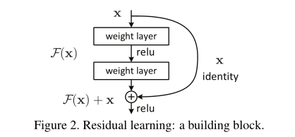
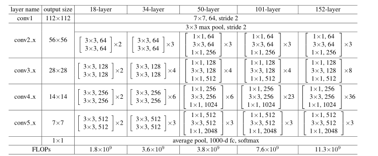

# 读论文三个阶段

1. title 标题

2. abstract 摘要
3. intro 导言
4. method 相关工作或者算法
5. exp 实验
6. conclusion 结论

三遍了解论文：

pass1: 1,2,6	通过标题，摘要和结论快速了解论文想讲什么,瞄两眼4和5的图表看看讲啥了,以此判断是否继续读

pass2：过一遍文章,可以忽略部分细节(公式 ,证明等),但是图表一定要明白(4里面的算法图长啥样,5里面图表讲了个啥,和其他方法的对比优点在哪里(时间短?算力低?模型小?效果好?),这些信息容易看而且信息量大)

重点是要大概了解文章在讲啥(可以不了解原理,但是起码知道人家讲了个啥吧)

如果完全读不懂(比如原理都没搞懂),可以去看看引用的文献,之前的工作门槛应该会低一点,看完再回来读

而这次读完再判断是否要进行pass3(方向不一样可以考虑到此结束,了解即可)

pass3：提出什么问题，用什么方法来解决这个问题。实验是怎么做的。合上文章，回忆每一个部分在讲什么。

即**海选,精选,重点读 **


一些小名词

SGD:随机梯度下降

GD:梯度下降

# AlexNet

开山之作

1.开头表示了模型效果非常好，比以前的好老多了

7.discussion 直接选用了监督学习而非以前的做法：先进行无监督学习(unsupervise)进行预热再进行监督学习

将深度学习代入监督学习的领域(以往都是无监督学习为主)，当然近些年来GAN等又带回到了无监督领域

第八页左图可以看出,识别效果有好有不好;右图则证明真的把相似的东西放到了一起(分离效果好)

第六页图表看出效果好(error阵地很低)

第6页图表展示了在图片中学习到的特征

第5页的原理图说明分开了两块GPU进行训练,讲述了训练原理和过程 

pass2: 1.讲了使用的模型:CNN,为什么用CNN,效果怎么样

注意:论文最重要的是创新——用了什么新技术,创新了模型得到更好的结果,简单的融合旧的成果得到的好结果意义不大

```
Our network contains
a number of new and unusual features which improve its performance and reduce its training time,
which are detailed in Section 3. The size of our network made overfitting a significant problem, even
with 1.2 million labeled training examples, so we used several effective techniques for preventing
overfitting, which are described in Section 4.
```

此处是原文,描述了创新点在哪里

```
ImageNet consists of variable-resolution images, while our system requires a constant input dimen-
sionality. Therefore, we down-sampled the images to a fixed resolution of256×256. Given a
rectangular image, we first rescaled the image such that the shorter side was of length 256, and then
cropped out the central256×256patch from the resulting image. We did not pre-process the images
in any other way, except for subtracting the mean activity over the training set from each pixel. So
we trained our network on the (centered) raw RGB values of the pixels.
```

没有对图片进行预处理(如sift抽特征),直接将裁剪后的图片输入模型,即end-end(端到端)

3.ReLU

使用了新函数ReLU( non-saturating nonlinearities非饱和(取值在0~1)非线性),而不是传统的sigmoid或者tanh( saturating nonlinearities饱和(取值在0~1)非线性),训练速度更快(原理引向了另外一篇文章)

对于一些工程上的细节的描述,完全可以跳过忽视掉(毕竟方向不在那边),筛选得到重要的信息才是重点,工程细节可以在复现的时候再去考虑 

而且ReLU也不需要input normalization来避免过饱和(不怕梯度消失),因为表示饱和函数,不需要输入归一化,当然做一些也挺好

## 注意:

工程部分更多讲实操而非原理,搞不懂可以搜一下看看别人的解释

4.1Data Augmentation数据增强(不多赘述)

4.2dropout每一次随机的把部分神经元权重设成0(等价于一个L2的正则项)

而且在设计模型时,两个4096的全连接(太大了 )和dropout导致了性能瓶颈

5.details 使用sgd优化模型,噪声对模型泛化性有好处(目前主流优化算法)

momentun:冲量,前部分的梯度对现在也有影响,避免落入局部最小值

weight decay:权重衰减,用于避免梯度无法下降的情况

初始化权重:均值为0,方差为0.01的高斯随机变量.

即使是非常非常大的网络也就用了0.02,所以0.01是一个不错的值

.assets/image-20220222161316803-16455175996341.png)

主流方法:学习率线性上升(学习预热),再用cos或者其他函数下降至0


# Resnet

残差网络

### 1.Introduction

使得更深层的训练仍然能更容易训练且不易出现过拟合

1.非常深的网络很容易出现梯度爆炸或者梯度消失的情况——适当的初始化,中间层加入batch_normalization

2.非常深的网络反而比浅层网络的性能差——并不是由于过拟合导致的,而是训练误差和测试误差产生的(下原文)

```resnet原文
Unexpectedly,
such degradation isnot caused by overfitting, and adding
more layers to a suitably deep model leads tohigher train-
ing error, as reported in [11,42] and thoroughly verified by
our experiments. Fig.1shows a typical example.
```

 3.原则上,深层的网络上部分层和浅层网络一样,后半部分做identity mapping(自我映射,即f(x)=x,那深层的网络效果也至少等于浅层的网络,然而实际并非如此.


但是实验表明，我们目前的求解器(如SGD)无法找到比构造解决方案更好的解决方案(即使它显然是理论上存在的)

```
But experiments show that our current solvers on hand are unable to find solutions that are comparably good or better than the constructed solution
```


（训练精度的降低）表明并非所有系统都类似地易于优化。让我们考虑一个较浅的架构及其更深的对应架构，在其上添加更多图层。对于更深的模型存在一个解决方案：添加的层是同一性映射，其他层是从学习的较浅模型复制的。这种构造解决方案的存在表明，较深的模型不应该产生比较浅的模型更高的训练误差。

```
The degradation (of training accuracy) indicates that not
all systems are similarly easy to optimize. Let us consider a
shallower architecture and its deeper counterpart that adds
more layers onto it. There exists a solutionby construction
to the deeper model: the added layers areidentitymapping,
and the other layers are copied from the learned shallower
model. The existence of this constructed solution indicates
that a deeper model should produce no higher training error
than its shallower counterpart. 
```


如下图,F(x)=H(x)-x,我们通过引入深度残差学习框架来解决退化问题。我们不希望每个堆叠层直接适合所需的基础映射，而是明确地让这些层适合**残差映射**。

```
we address the degradation problem by introducing a deep residual learningframework. Instead of hoping each few stacked layers directly fit a desired underlying mapping, we explicitly let these layers fit a residual mapping.
```




优点:1.不增加参数	2.计算简单(+法而已)

假设理论
一个假设是, 若干个 non-linear layers 可以渐进地逼近于 一个复杂的函数H(x). 那么同理, 我们也可以让这些 layers 只学习残差函数,
residual function F ( x ) = H ( x ) − x, 所以学习的任务由 H(x) 变成了 F(x), 学习难度也会有变化.
后续模块的输入依旧是 F ( x ) + x


问题来了,怎么把形状不相等的x和F(x)相加呢

我们考虑两个选项：（A）快捷方式仍执行身份映射，并填充额外的零条目以增加尺寸。此选项不引入额外参数；(填0)（B） 等式中的投影快捷方式。用于匹配尺寸（由1×1卷积完成）。对于这两个选项，当快捷方式穿过两种大小的要素图时，它们的步长为2。(步长为2的1*1卷积)

和（C）所有捷径都是投影。

```
we consider two options: (A) The shortcut still performs identity mapping, with extra zero entries padded for increasing dimensions. This option introduces no extra parameter; (B) The projection shortcut in Eqn.(2) is used to match dimensions (done by 1×1 convolutions). For both options, when the shortcuts go across feature maps of two sizes, they are performed with a stride of 2.
and (C) all shortcuts are projections.
```

.assets/image-20220222211123594.png)

B和C差不多,当然都比A好一点(好的不多),然而C会带来非常大的复杂度,所以还是用B吧

3.4则具体讲了详细操作(比如短边随机的裁剪成[256,480]的随机长度),做了一些简单的操作(改亮度对比度,翻转图像,卷积和激活前后归一化等) 

没有dropout(没有全连接层dropout也没啥用)

#### bottleneck design(瓶颈设计)

.assets/image-20220222212209381.png)

如上图

左边是正常的64层的卷积,然而通道数增加时剧增,不如像右边那样卷积多一次 (降一次维) 减少通道数

(肯定是会损失信息的,但是减少了很多参数量(想想2048个通道参数有多少))



所以此图50-layer及以上的卷积层都有三次卷积(原理展示)


由于残差连接的存在如果后加的层学到的东西使得准确率下降了,那么残差学到的参数几乎为0

则使得层数加深不容易导致误差影响变大

.assets/image-20220222215115014.png)

由此处可知,残差网络避免了梯度消失问题,使得模型不会训练不动(因为固定步长的SGD不保证数学优化上的收敛性,有可能只是单纯学不动了而已)

ResNet的residual(残差)主要体现在feature上, Gradient  Boosting(梯度提升,和树有关)是在标号上


## Attention Is All Y ou Need(Transformer)

继NLP，CNN，RNN后第四大类模型 

有的时候作者名字后面带奇怪符号的，可以去第一页最下面看看有没有注释


主要的序列转录模型基于复杂的递归或卷积神经网络，包括编码器(encoder)和解码器(decoder)。 

```
The dominant sequence transduction models are based on complex recurrent or convolutional neural networks that include an encoder and a decoder.
```

序列转录模型:输入一个序列,输出一个序列。如英文翻译为中文就是序列转录


性能最好的模型还通过注意机制连接编码器和解码器。 

```
The best performing models also connect the encoder and decoder through an attention mechanism.
```


所以作者希望得到一个简单的模型,Transformer,完全基于注意力机制，**无需重复和卷积 **,训练时间更少,并行度好

```
We propose a new simple network architecture, the Transformer,based solely on attention mechanisms, dispensing with recurrence and convolutions
entirely
```


传统的RNN将信息记录在序列ht和ht-1里面,序列要按顺序输入,并行度较差

Transformer并行度高,效果也更好

卷积对于较远距离(序列上的远距离)的元素效果一般,但可以输出多个通道 

注意力机制(attention)一次性看完整个序列,远距离的关联性仍然有保证

Multi-Head Attention多头注意力机制,以此得到类似卷积的多通道输出效果 


**Transformer 是第一个完全依赖自注意力来计算其输入encode和输出decode表示的转换模型，而不使用序列对齐的 RNN 或卷积**


编码器encode:f(x_1......x_n)=(z1, ..., zn)	输入n个单词,输出n个向量,**一 一对应**

解码器decode:g(z_1......z_n)=(y1, ..., ym)	输入n个向量,一次生成一个元素地输出m个单词,**不一 一对应**,在每一步，模型都是**自回归的**，在**生成下一个符号时**将*先前生成的符号作为* **附加输入**


Transformer 遵循这种整体架构，对编码器和解码器使用**堆叠的自注意和逐点全连接层**